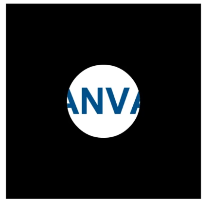

# Canvas

```html
<canvas width="600" height="400" id="mycanvas"></canvas>
```

```js
var mycanvas = document.getElementById('mycanvas')
// 获取canvas的2D上下文
var ctx = mycanvas.getContext('2d')
```

## 兼容性处理

+ 当浏览器不支持canvas时，中间的文字节点将被显示

  ```html
  <canvas id="mycanvas" width="1024" height="768">
      当前浏览器不支持canvas，请更换浏览器
  </canvas>
  ```

+ 利用js判断

  ```js
  if ( mycanvas.getContext('2d') ) {
      var ctx = canvas.getContext('2d')；
  } else {
      alert('当前浏览器不支持canvas')；
  }
  ```

## API

#### 绘制矩形

```js
ctx.rect(x, y, w, h)
```

#### 填充矩形

```js
// fill: 填充 rectangle: 矩形
ctx.fillRect(x, y, w, h)
```

#### 笔触(描边)

```js
// 矩形笔触
ctx.strokeStyle = 'red'
ctx.strokeRect(x, y, w, h)
```

#### 画线

```js
cxt.beginPath();	// 开始绘制路径
ctx.moveTo(x, y);	// 移动到某个位置
ctx.lineWidth = 5;	// 线的宽度
ctx.lineJoin = 'miter'/'round'/'bevel';	//设置线条与线条连接点的样式
ctx.lineCap = 'butt/round/square'; // 设置线条开始结束端的样式 
ctx.lineTo(x, y);	
ctx.lineTO(x,y);
...
ctx.closePath();	// 封闭
// -------------描边------------------
ctx.strokeStyle = 'red';
ctx.stroke();	// 画线(以上画线均为抽象)
// -------------填充------------------
ctx.fillStyle = 'blue';
ctx.fill()；
// 这里需要注意fill和stroke的顺序。 先stroke后fill可能边框会被盖住一部分
```

#### 弧和圆形

+ ctx.arc(x, y, radius, startAngle, endAngle, anticlockwise)

  1. x,y 圆心
  2. radius 半径
  3. 从starAngle到endAngle 为弧度制
  4. anticlockwise 顺逆时针

  ```js
  ctx.beginPath();
  ctx.arc( )
  ```

+ ctx.arcTo(x1, y1, x2, y2, radius) 

  1. x0 y0 默认存在， 为当前点的位置
  2. x1 y1 控制点1
  3. x2 y2 控制点2
  4. radius 半径
  5. 寻找两个切点绘制圆弧

  

  ```js
  ctx.beginPath();
  ctx.moveTo(150, 150); // x0 y0 
  ctx.artTo(650, 150, 650, 650, 300)
  ctx.strokeStyle = 'red';
  ctx.stroke();
  ```


#### 贝塞尔曲线(三次)

http://blogs.sitepointstatic.com/examples/tech/canvas-curves/quadratic-curve.html

```js
ctx.beginPath()
ctx.moveTo(x, y)
// cx1, cy1, cx2, cy2 控制点
// x, y 结束点
ctx.bezierCurveTo(cx1, cy1, cx2, cy2, x, y)
ctx.stroke()
```

#### 贝塞尔曲线(二次)

```js
ctx.beginPath()
ctx.moveTo(x, y)
// cx, cy控制点
// x, y 结束点
ctx.quadraticCurveTo(cx, cy, x, y)
ctx.stroke()
```

#### 运动

机制：上屏幕的元素，立即被像素化，也就是说上频的元素将得不到这个“对象”。所以只能   清屏 --> 重绘 --> 清屏 --> 重绘

```js
ctx.clearRect(x,y,w,h); // 清除一个矩形区域
ctx.textAlign = 'center'; // 文字居中
ctx.fillText('文字', x, y)
```

#### 使用图片

```js
var image = new Image();
image.src = 'images/dogandcat.jpg';
image.onload = function () {
   	//  五参： xy 坐标 wh 图片宽高
   	ctx.drawImage(image(图片对象), x, y, w, h)
	//	九参： 前四个关于切片 后四个关于图片
    ctx.drawImage(image(图片对象), x, y, w, h, x1, y1, w1, h1)
}
```

#### 图形变换

```js
// 1.原点变换
ctx.translate(x, y); 
// translate 会叠加，所以要使用完后要复原
ctx.translate(x, y);
// dosometing...
ctx.translate(-x, -y);

// 另一种解决叠加的方案
ctx.save();
// todosometing...
ctx.restore();

// 2.旋转
ctx.rotate(deg)

// 3.缩放
// 缩放会同时缩放其它数值属性
ctx.scale(sx, sy)
```

#### 变换矩阵


```js
ctx.transform(a, b, c, d, e, f);
ctx.setTransform(a, b, c, d, e, f); // 让之前的transform都失效，用此前设置的transform
```

#### fillStyle(同样适用于strokestyle)

+ createLinearGradient 线性渐变

  ```js
  // 步骤1： var grd = ctx.createLinearGradient(xstart, ystart, xend, yend); 四参决定方向和坐标
  // 步骤2：grd.addColorStop(stop, color); stop:浮点值0~1 表示位置
  var linearGrad = ctx.createLinearGradient(0, 0, 800, 800);
  linearGrad.addColorStop(0.0, '#fff');
  linearGrad.addColorStop(1.0, '#000');
  ctx.fillStyle = linearGrad;
  ctx.fillRect(0, 0, 800, 800);
  ```

+ createRadialGradient 径向渐变

  ```js
  // 步骤1： var grd = ctx.createRadialGradient(x0, y0, r0, x1, y1, r1);定义了两个圆  径向渐变将发生在这两个圆之间
  // 步骤2：grd.addColorStop(stop, color);
  var radialGrad = ctx.createRadialGradient(400, 400, 100, 400, 400, 500);
  radialGrad.addColorStop(0.0, 'white');
  radialGrad.addColorStop(0.25, 'yellow');
  radialGrad.addColorStop(1.0, 'black');
  ctx.fillStyle = radialGrad;
  ctx.fillRect(0, 0, 800, 800);
  ```

+ createPattern 使用图片

  1. 语法： createPattern(img, repeat-style)

     语法2：createPattern(canvas, repeat-style)

     语法3： createPattern(video, repeat-style)

  2. 参数：

     + img 图片
     + canvas 一个canvas元素
     +  repeat-style 定义重复的方式 no-repeat / repeat-x / repeat-y / repeat

  ```js
  // img 
  var bgImg = new Image();
  bgImg.src = "brick-s.jpg";
  bgImg.onload = function () {
      var pattern = ctx.createPattern(bgImg, 'no-repeat')
      ctx.fillStyle = pattern;
      ctx.fillRect(0, 0, 800, 800);
  }
  // canvas
  var backCanvas = createBackgroundCanvas();
  var pattern = ctx.createPattern(backCanvas, 'repeat');
  ctx.fillStyle = pattern;
  ctx.fillRect(0, 0, 800, 800);
  
  function createBackgroundCanvas () {
      var backCanvas = document.createElement('canvas');
      backCanvas.width = 100;
      backCanvas.height = 100;
      var backCanvasContext = backCanvas.getContext('2d');
      drawStar(backCanvasContext, 50, 50, 50, 0);
      return backCanvas
  }
  
  function drawStar(ctx, x, y, R, rot) {
      ctx.save();
      ctx.translate(x, y);
      ctx.rotate( rot / 180 * Math.PI );
      ctx.scale(R, R);
      starPath(ctx);
      ctx.fillStyle = '#fb3';
      ctx.fill();
      ctx.restore();
  }
  
  function starPath(ctx) {
      ctx.beginPath();
      for (var i = 0; i < 5; i++) {
          ctx.lineTo( Math.cos( (18 + i *72 ) / 180 * Math.PI ) * 0.5, -Math.sin( (18 + i * 72) / 180 * Math.PI )  );
          ctx.lineTo( Math.cos( ( 54 + i * 72) / 180 * Math.PI ) * 0.5 );
      }
      ctx.closePath();
  }
      
  ```

#### 文字渲染

+ 基础

  ```js
  ctx.font = 'bold 40px Arial';
  ctx.fillStyle = '#058'; //fillStyle 可以使用颜色 渐变等。。
  // ctx.fillText(string, x, y, [maxlen]) maxlen可选 最长宽度px 效果：文字过长将被压缩
  // ctx.strokeText(string, x, y, [maxlen])
  ctx.fillText('欢迎大家...', 40, 100);
  ```

+ ctx.textAlign = "left / center / right" 水平对齐方式

+ ctx.textBaseLine = "top / middle / bottom / alphabetic(默认) / ideographic / hanging" 垂直对齐方式

+ ctx.measureTest(string).width 文本的度量

+ ctx.font = "font-style  font-variant font-weight font-size font-family"

  1. 默认值 "20px sans-serif"  
  2. font-style  "normal(默认) italic(斜体) oblique(倾斜字体)"
  3. font-variant  "normal(默认) samll-caps"
  4. font-weight  "lighter normal(默认) bold bolder 数值100-900"
  5. font-size  "20px(默认) 百分比 em"
  6. font-family  同css。可设置多种字体备选，支持@font-face


#### 阴影

+ ctx.shadowColor 阴影颜色

+ ctx.shadowOffsetX 阴影的x轴位移值

+ ctx.shadowOffsetY 阴影的y轴位移值

+ ctx.shadowBlur 模糊程度 越大越模糊

  ```js
  ctx.fillStyle = '#058';
  ctx.shadowColor = 'gray';
  ctx.shadowOffsetX = 20;
  ctx.shadowOffsetY = 20;
  ctx.shadowBlur = 5;
  ctx.fillRect(200, 200, 400, 400);
  ```

  

## 全局

+ ctx.globalAlpha = 1(默认)   全局透明度
+ globalCompositeOperation = "source-over(默认)"
  1. source-over 后绘制的图像在上
  2. source-atop
  3. source-in
  4. source-out
  5. destination-over 先绘制的在上
  6. destination-atop
  7. destination-in
  8. destination-out
  9. lighter
  10. copy
  11. xor

## 剪辑区域

​	ctx.clip()

```js
// 填充背景
ctx.beginPath();
ctx.fillRect(0, 0, canvas.width, canvas.height);
ctx.fillRect(0, 0, canvas.width, canvas.height)

ctx.beginPath();
ctx.arc(400, 400, 150, 0, Math.PI *2);
ctx.fillStyle = '#fff';
ctx.fill();
ctx.clip();

ctx.font = 'bold 150px Arial';
ctx.textAlign = 'center';
ctx.textBaseline = 'middle';
ctx.fillStyle = '#058';
ctx.fillText('CANVAS', canvas.width / 2, canvas.height / 20);
```



## 点击检测

ctx.isPointInPath(x, y)


## Canvas标准

https://www.w3.org/TR/2dcontext/

https://html.spec.whatwg.org/

## 扩展Canvas的context

``` js
CanvasRenderingContext2D.prototype.fillStar = function () {
    // todo someting
}
// 使用
ctx.fillStar()
```

