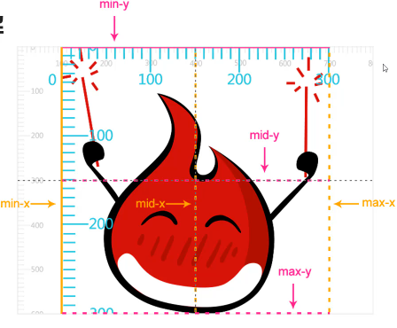

## SVG

### 定义

+ 可伸缩矢量图形( Scalable Vector Graphics )
+ SVG 使用XML格式定义图形

### 优势

+ SVG图像中的文本是可选的， 同时也是可搜索的(适合制作地图)
+ SVG 与 JPEG / GIF 图像比起来， 尺寸更小， 且可压缩性更强
+ 可伸缩，不失真

### viewport 视口

+ 定义：SVG可见区域的大小，画布大小

```html
<!-- 默认单位px -->
<svg width="800" height="600"></svg>
```

### viewBox 视区盒子

+ 定义：视口中视图区域

+ 语法：viewBox=“x, y, w, h”

```html
<svg width="800" height="600" viewBox="0 0 80 60"></svg>
```

+ 注意：
  1. viewBox与viewport宽高比为一定比例时会撑满 viewport
  2. preserveAspectRatio属性：让viewBox保持宽高比
+ demo  1.html

#### preserveAspectRatio

+ 语法： preserveAspectRatio=[defer]<align><metOrSlice>

  + defer：可选，仅在image元素上应用

  + align：必选，控制viewBox是否强制进行均匀缩放

    + 取值： 

      1. xMin  viewBox的最小X值对齐viewport的左边部
      2. xMid  viewBox的X轴中点对齐viewport的X轴中点
      3. xMax viewBox的最大X值对齐viewport的右边部
      4. YMin  viewBox的最小Y值对齐viewport的顶边
      5. YMid  viewBox的Y轴中点对齐viewport的Y轴中点
      6. Y Max viewBox的最大Y值对齐viewport的底边

      

  + metOrSlice：控制viewBox缩放的方式

    + 取值：
      1. meet(默认)： 保持宽高比缩放，相当于background-size: container
      2. slice： 保持宽高比缩放并将超出部分裁剪，相当于background-size:  conver
      3. none：不保持宽高比，缩放图像适合整个viewBox，图像可能变形

  ```html
  <svg 
       width="800" 
       height="600" 
       viewBox="0 0 80 60"
       preserveAspectRatio="xMidYmid meet"
  ></svg>
  ```

+ demo  2.html

### SVG 坐标系统

+ 世界坐标系统

+ 最初最表系统

+ 用户最表系统

+ 嵌套坐标系统

+ 转换坐标系统

  1. SVG transform属性

     + 定义：缩放、移动、倾斜、旋转。类似于css transform转换
     + 语法：
       + transform=“translate(<tx> [<ty>])”
         1. tx 代表x轴上的translation值；ty表示y轴上的translation值
         2. ty值是可选的，默认为0
         3. 不包含单位
       + transform="rotate(<rotate-angle> [<cx> <cy>])"
         1. rotate-angle  旋转角度，不写单位，默认单位为deg
         2. 可选cx和cy值代表无单位的旋转中心点
         3. 如cx和cy未设置， 旋转点未当前用户坐标系原点
       + transform="scale(<sx> [<sy>])"
         1. sx 代表沿x轴的缩放值
         2. sy代表y轴缩放值，可选， 如省略默认值等于sx
         3. 特别说明：HTML元素缩放是以自己为中心点，SVG元素的缩放是相对SVG的左上角， ***当SVG元素缩放时， 整个坐标系被缩放，导致元素在视口中重新定位***
       + transform="skewX(<skew-angle>)"  transform="skewY(<skew-angle>)"
         1. 

     ```html
     <!-- 取值: translate/rotate/scale/skew/matrix -->
     <svg width="800" height="600">
     	<rect x="200" y="100" width="400" height="200" transform="translate(100)" ></rect>
     </svg>
     ```

     + 也可以使用css transform用于SVG元素，但IE不支持
     + 两者不同之处： 
       1. ***css transform是相对于自身元素  SVG是相对于画布***
       2. SVG transform只支持二维变换

### SVG 形状

+ 矩形
  1. <rect x="x" y="y" rx="rx" ry="ry" width="width" height="height" />
  2. 参数说明
     + rx 可选，圆角的x半径，默认为0 
     + ry 可选， 圆角的y半径，默认为0
  
+ 圆形
  1. <circle cx="cx" cy="cy" r="r" />
  2. 参数说明
     + r 圆的半径
     + cx 圆心的坐标
     + cy 圆心坐标 
  
+ 椭圆
  1. <ellipse cx="cx" cy="cy" rx="rx" ry="ry" />
  2. 参数说明
     + rx/ry 椭圆的x/y半径
     + cx/cy 椭圆中心点的x/y坐标
  
+ 线
  1. <line x1="x1" y1="y1" x2="x2" y2="y2" />
  2. 参数说明
     + x1/x2 起点/终点的x坐标
     + y1/y2 起点/终点的y坐标
  
+ 折线

  1. <polyline points="x1 y1 x2 y2 x3 y3 ...." />
  2. 参数说明
     + 参数为xy坐标，可以无限
  3. 注意：路径绘制完成后会闭合图形，形成一个闭合的多边形(可以不用回到原点)

+ 多边形

  1. <polygon points="x1 y1 x2 y2 x3 y3 ...." />
  2. 参数说明
     + 参数为xy坐标，可以无限
  3. 和折线很像，polygon的路径在最后一个点处自动回到第一个点

+ 路径

  1. <path />

  2. path元素的形状通过属性d定义，d是一个点集数列以及其它关于如何绘制路径的信息，值是一个“命令+参数”的序列

  3. 属性命令

     每个命令都用一个关键字目表示，例：M 表示 moveTo命令，每个命令有两种表示方式，大写字母表示绝对定位；小写字母表示相对定位。属性d采用用户坐标系统，所以不需标明单位

     + 直线命令

       <path d="M x  y  L x  y  H x  V y  Z" stroke="#f00" fill="transparent" />

       <path d="m dx dy l dx dy h dx v dy z" stroke="#f00" fill="transparent" />

       1. M x y (m dx dy)
          + 定义： moveTo命令， 移动画笔而不画
          + M x y 表示将画笔移动到坐标x, y
          + m dx dy 表示将画笔向右移动dx像素, 向下移动dy像素
       2. L x y (l dx dy)
          + 定义： lineTo命令， 在当前位置到新的位置画一条线段
          + L x y 表示从L命令之前的点到x，y
          + l dx dy表示从l命令之前的点到相对向右dx像素向下dy像素的点之间画一条线段
       3. H x(h dx)
          + 定义：绘制水平线
          + H x 表示绘制到x轴上的x点位置
          + h dx表示向右绘制dx像素
       4. V y (v dy)
          + 定义： 绘制垂直线
          + V y 表示绘制到y轴上的y点的位置
          + v dy 表示向下绘制dy像素
       5. Z(z)
          + 定义：闭合路径命令。不区分大小写

     + 曲线命令

       1. 分类： 贝赛尔曲线 和 弧形

       2. 贝赛尔曲线

          + path元素中存在两种贝赛尔曲线： 三次贝赛尔曲线C 和 二次贝赛尔曲线Q

          + 三次贝赛尔曲线

            1. C x1 y1, x2 y2, x y(c dx1 dy1, dx2 dy2, dx dy)
            2. x1 y1 起点控制点
            3. x2 y2 终点控制点
            4. x y 曲线终点

            ```html
            <path d="M10 10 C 20 20, 40 20, 50 10" stroke="#f00" fill="transparent" />
            ```

          + C命令的对称命令 S命令

            1. S x2 y2, x y(s dx2 dy2, dx dy)

            2. S命令用于将若干个贝赛尔曲线连起来，从而创建出一条很长的平滑曲线

            3. S命令跟C命令或另一个S命令后面。它第一个控制点会被假设成前一个控制点的对称点

            4. S命令单独使用，它的两个控制点就会被假设为用一个点

               ```html
               <path d="M10 80 C 40 10, 65 10, 95 80 S 150 150, 180 80" stroke="#f00" fill="transparent" />
               ```

               

          + 二次贝塞尔曲线

            1. Q x1 y1, x y(q dx1 dy1, dx dy) 只需要一个控制点，确定起点和终点的曲线斜率

            2. x1 y1 控制点

            3. x y 曲线终点

               ```html
               <path d="M10 40 Q 95 10 180 40" stroke="#f00" fill="transparent" />
               ```

          + Q命令的对称命令T命令

            1. T x y (t dx dy)
            2. 类似于S命令，用于将若干个贝赛尔曲线连起来，创建出一条很长的平滑曲线
            3. 通过前一个控制点，腿短出一个新的控制点
            4. T命令单独使用，控制点和终点会是同一个点， 画出来的将是一条直线

     + 弧形

       A rx ry x-axis-rotation large-arc-flag sweep-flag x y

       a rx ry x-axis-rotation large-arc-flag sweep-flag dx dy

       1. 参数说明

          + rx ry 分别是椭圆的x轴半径和y轴半径
          + x-axis-rotation控制椭圆的旋转角度，默认角度deg，正方向为顺时针
          + large-arc-flag决定弧线是大于还是小于180度。 0表示小角度弧，1表示大角度弧
          + sweep-flag表示弧线的方向，0表逆时针，1顺时针
          + x y 表示弧形的终点

          ```html
          <path
                d="M 10 315
                   L 110 215
                   A 30 50 0 0 1 162.55 162.45
                   L 172.55 152.45
                   A 30 50 -45 0 1 215.1 109.9
                   L 315 10"
                stroke="#f00"
                fill="green"
          />
          ```

          
