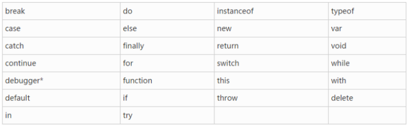
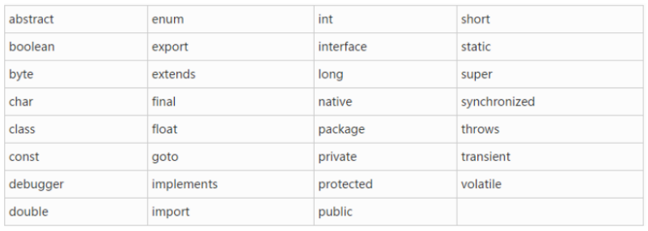
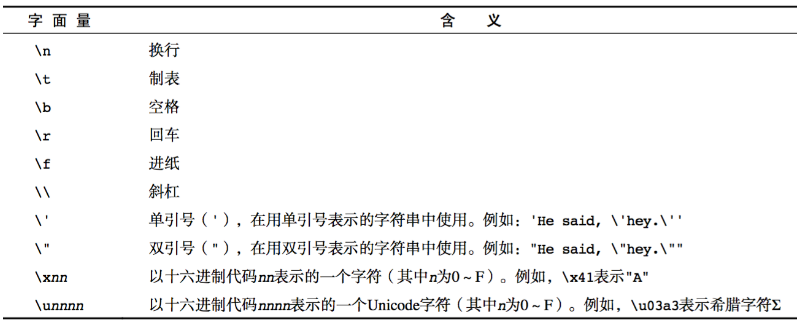

[TOC]

# 一、JavaScript介绍

javascript是一种运行在***客户端***的***脚本语言***

+ js注释

  1. 单行注释： //
  2. 多行注释： /*开头 */结尾
  3. 文档注释：/** 在js中一般用于给函数做说明

+ js常见的输入输出语句

  ```js
  // 1.弹出一个提示框
  alert("hello world");
  // 2.弹出一个确认弹窗
  confirm("我帅吗？");
  // 3.弹出一个文本输入框
  prompt("请输入你的真是年龄");
  // 4.在网页上添加一段内容
  document.write("<h1>hello world</h1>");
  // 5.控制台输出日志
  console.log("hello word");
  ```

+ js组成

  1. ECMAscript----->javascript语言标准
  2. Dom----->操作界面元素的一套方法
  3. Bom----->操作浏览器功能的一套方法


# 二、变量

+ 声明： 使用var声明

+ 使用：

  1. 声明变量的同时进行赋值

     ```js
     var name = '小马哥';
     ```

  2. 先声明，后赋值

     ```js
     var name;
     name = '小马哥'
     ```

  3. 不声明直接赋值(不建议)

     ```js
     height = 100;
     ```

  4. 同时声明多个变量

     ```js
     var age = 10,name= 'zs' 
     ```

  5. 有些特殊变量可以不声明不赋值，直接使用

     ```js
     console.log(name);
     console.log(top); // top不允许修改，无法赋值
     ```

+ 变量的命名规范(使用名词)

  1. 变量由**字母**、**数字**、**下划线**、**$符号**组成

  2. 不能以数字开头

  3. 燕哥区分大小写

  4. 不能使用中横线(会识别为减号)

  5. 不能使用关键字和保留字

     + 关键字：对于js来说有特殊意义的一些单词

       

     + 保留字：js保留了一些单词，这些单词现在不用，但是以后要用。

       


# 三、数据类型

+ 基本数据类型(简单数据类型、原始数据类型、值类型)

  1. number 数值类型

     + 八进制：一0开头的数值：var a = 0120，十进制为80。注意：比如079并非八进制，因八进制数字为0-70

     + 十六进制： 以0x开头

     + 浮点数：存在精度丢失问题，由小数的二进制的表示方式产生的，解决方式为尽量避免使用浮点数

     + 数值范围

       ```js
       // 1.最小值(最小正数)
       Number.MIN_VALUE
       // 2.最大值
       Number.MAX_VALUE
       // 3.正无穷
       Infinity
       // 4.负无穷
       -Infinity
       ```

     + 数值判断NaN

       ```js
       // 1. 意为not a number
       // 2. NaN是数值类型
       // 3. NaN不等于任何值，包括自身
       // 4. 运算不出结果，js不报错，返回NaN
       // 5. isNaN判断一个值不是数字，返回true 不是一个数字。返回false是一个数字
       
       ```

  2. string 字符串类型(特俗：不可变性)

     + 转义符

       

     + 字符串长度(length)

       ```js
       var a = '您好';
       console.log(a.length);
       ```

     + 字符串拼接(+)

       ```js
       // 1. 两边只要有一个为字符串，那么+就是字符串拼接
       // 2. 两边为数字，为算术功能
       ```

  3. boolean 布尔类型

     + true false 区分大小写
     + 计算机内部存储true为1 false 为0
     + false： 0 “” false undefined null NaN

  4. undefined 未定义

     + undefined表示一个声明了但没有赋值的变量，值默认为undefined
     + 如果一个函数没有明确的返回值，那么此函数的返回值为undefined
     + 如果访问一个对象不存在的属性，这个属性的值即为undefined

  5. null

     + null便是一个不存在的对象

  ```js
  // 打印数据类型(type of 只能获取基本数据类型)
  type of a
  typeof(a)
  typeof(null) // 返回值是object
  ```

+ 引用数据类型(复杂数据类型)

  1. 数组Array
  2. 函数function

+ 共同点

  1. 基本数据类型保存的是值本身，赋值、传递时都是值本身

     ```js
     var a = 23;
     var b = a; // 赋值时赋值的是23这个值，赋值值本身
     a = 24; // 此时修改a的值，b值还是23没有变化
     ```

  2. 引用数据类型保存的是地址

     ```js
     var a = [1,2,3,4];
     var b = a;	// 赋值时赋值的是地址
     a.push(5);	// a添加改变数组，此时b也改变，a改变的是内存里的数据，b访问时访问的是改变后的数据
     ```


# 四、数据类型转换

+ 转行成字符串

  1. 调用方法tostring可将数值、布尔值转换为字符串(不适用于undefined和null)

     ```js
     var a = 12;
     a.tostring();
     ```

  2. 调用函数String()可将数值、布尔值、undefined和null转换成字符串

     ```js
     var b = 12;
     String(b);
     ```

  3. 使用字符串拼接(+)

+ 转换成数字

  1. 使用parseInt()将字符串转换成数字

     ```js
     // parseInt parseFloat 会对字符串逐个转换，遇到非数字停止转换
     var a = '123';
     parseInt(a);	// 只会取整数，舍弃小数
     ```

  2. 使用parseFloat()将字符串转换为小数

     ```js
     var b = '456';
     parseFloat(b);	// 只会保留小数
     ```

  3. 使用Number()函数将字符串转换成数字

     特点：整体转换。如果字符串有转换不了的非数字，则报错NaN

  4. 让字符串和数字作除了加法的其它运算

     ```js
     var d = "345";
     var num;
     num = d - 0;
     num = d / 1;
     num = d * 1;
     ```

  5. 在字符串前使用正号(常用)负号

     ```js
     var a = '456';
     var num;
     num = +a;
     ```

  6. a.toFixed(num)  保留num位小数

+ 转换成布尔值

  1. 使用*Boolean*()函数转换

     + 数字转换成布尔值，只有0和NaN会被转换成false

     + 如果字符串转换为boolean值，只有空字符串会为false

     + undefined、null会被转为false

     + 总结：0、NaN、‘’、undefined、null、false会被转换为false，其它皆为true

  2. 使用!!转换

     ```js
     var x = 12;
     console.log(!!x);	// 结果为true
     ```


# 五、操作符

+ 运算操作符(一般用于数值类型)

  1. \+ 加
2. \- 减 
  
  3. \* 乘
4. / 除
  5. % 取余(取模运算 a模于b)

  注意：如果让字符串做算术运算，除了加法会把数字转化为字符串，其它都是将字符串转化为数字，加法意为拼接。

+ 赋值运算符

  1. = 等号
  2. +=
  3. -=
  4. *=
  5. /=
  6. %=

+ 一元运算符

  1. a++ 

     后自增运算符，先赋值，后自增

  2. ++a

     先自增运算符，先自增，后赋值

+ 逻辑运算符

  1. &&	逻辑与运算(并且的意思)

     + 定义：同时满足条件为true，如有一条件不成立为false(遇到false后，后面不执行)。

     + 取值：

       ①、false时找第一个false的值

       ②、全true时，找最后true取值

  2. ||    逻辑或运算

     + 定义：只要有一个条件成立即为true，所有条件都不成立为false(只要遇到true，即为true，不免不再运算)。

     + 取值：

       ①、当算术中有true时，取第一个true值为返回值

       ②、当全false时，取最后一个false值为返回值

  3. !    逻辑非运算(取反)

  4. 比较运算符(返回布尔值)

     + \>	大于

     + <    小于

       ①、两个字符串进行比较时，会按照ASCII编码顺序进行比较

       ②、如果字符串和数字比，会将字符串转换为数字再比较

     +  ==(!=)    只比较内容，不比较数据类型

       相等的比较规则(相等：内容会把操作数隐式转换，转换为同一类型再比较)：

       ①、NaN与任何值不相等，包括自己

       ②、null与任何值不相等，除了null和undefined

       ③、undefined与任何值不相等，除了null和undefined

       ④、如果操作数中有数字或者布尔类型，操作数都会转换成数值比较

       ​		false转数值----> 0			[]转数值----> 0

       ​		true转数值----> 1			[有内容]----> 1

       ⑤、如果操作数中有字符串，操作数转换为字符串进行比较

       ⑥、如果操作数中有复杂数据类型，比较的是地址

     + ===(!==)    不仅比较内容，同时比较数据类型

  5. 运算符的优先级

     | 顺序 | 属名             | 备注                 |
     | ---- | ---------------- | -------------------- |
     | 1    | ()               |                      |
     | 2    | 一元运算符       | ++、 --、 !          |
     | 3    | 算术运算符       | 先*、 /、 % 后 +、 - |
     | 4    | 关系(比较)运算符 | >、>=、 <、 <=       |
     | 5    | 相等运算符       | ==、 !=、 ===、 !==  |
     | 6    | 逻辑运算符       | 先&&后               |
     | 7    | 赋值运算符       | =                    |


# 六、表达式和语句

表达式：由运算符连接的式子

+ ***表达式肯定会有一个明确的结果***
+ 表达式不能出现在等号的左边


# 七、流程控制

+ 判断语句：if...else

  ```js
  if (判断条件) {
      执行代码
  } else if (判断条件) {
      执行代码
  } else {
      执行代码
  }
  ```

+ switch...case 语句(如果是判断一个值正好等于某一个值(具体值得判断)时使用)

  ```js
  // 注意：switch...case中使用===比较运算
  var a = prompt('请输入0-6的数字');
  switch(+a) {
      case 0: 
          alert('周日');
          break;
      case 1:
          alert('周一');
          break;
      default:
          alert('别闹');
  }
  ```

+ 三元(三目)表达式(只能替代if...else，只有两种情况时才可替换使用)

  ```js
  // 结构：判断条件 ? 条件满足时执行的语句 : 条件不满足时的语句
  var max = num1 > num2 ? num1 : num2;
  ```


# 八、循环语句

+ while：条件成立时执行

  ```js
  while (判断条件) {
  	// do something...
  }
  ```

+ do...while： 不管条件成立不成立，都会执行一次(do先执行)

  ```js
  do {
      // do something...
  } while (判断条件)
  ```

+ for

  ```js
  // 一下序号为顺序执行
  for (1.初始化语句; 2.判断条件; 4.循环条件执行结束后的代码) {
      // 3.循环体代码
  }
  ```

+ continue、break

  1. continue：只能用于循环语句，用于结束本次循环，转入下轮循环
  2. break：在循环语句里代表结束整个循环，结束当前循环

+ 总结

  1. 不明循环次数时，使用while循环
  2. 当无论如何都要执行一次时，用do...while循环
  3. 使用最多的是for循环


# 九、数组

+ 使用构造函数new Array()创建数组

  ```js
  // 1.创建一个空数组
  var arr1 = new Array();
  // 2.创建一个空数组，长度为5(当Array()里只有一个数字时，表长度)
  var arr2 = new Array(5);
  // 3.创建一个空数组里面放元素
  var arr3 = new Array(5, 6, 'hello');
  ```

+ 使用字面量创建数组

  ```js
  var arr4 = [];
  var arr5 = [3, 4, 7];
  ```

+ 数组的长度和下标

  1. 获取长度 arr.length
  2. 下标
     + 数组的下标从0开始计算
     + 获取下标元素：如 arr[3] 表示获取第4个元素
     + 入味查到由此下标，则返回值为undefined
  3. 数组末尾增添元素
     + arr.push()
     + arr[arr.length] = 值

+ 数组的遍历

  ```js
  var arr = [2, 3, 4];
  for (let i = 0; i < arr.length; i++) {
      console.log(arr[i]);
  }
  
  arr.forEach(function (item, index, array) {
      // item：当前遍历的元素
      // index：当前遍历元素的下标(可略)
      // array：遍历的数组(可略)
  })
  ```


# 十、函数(数据类型:funtion型)

+ 定义：将一段相对独立具有特定功能的代码块封装起来，想成一个独立体。

+ 函数声明

  ```js
  // 1.函数声明
  function 函数名(形参) {
      // 函数体
  }
  // 2.函数表达式
  var fn = function (形参) {
      // 函数体
  }
  ```

+ 函数命名规范

  1. 函数名一般使用“动词+名词”
  2. 其它规范类似参数命名规范

+ 函数参数注意

  1. 形参、实参的概念
  2. 如果实参的个数小于形参的个数不会报错，不够的参数默认为undefined
  3. 如果参数个数>形参个数，多余的实参会被“舍弃”

+ arguments的使用：类数组/类数组---->对象

  ​		可以访问遍历，但无法使用push等。所有函数都内置有arguments对象，arguments对象中存储了传递的所有的参数。arguments为一个伪数组，用于保存所有的实参。

+ 函数的返回值：return

  1. 函数体中遇到return表示函数结束并返回


# 十一、函数高级

+ 函数调用函数

+ 递归函数：直接或间接调用自己的函数

+ 匿名函数

  ```js
// 定义：用于分隔变量的作用域，防止全局变量污染
  (function () {
    // 函数体
  })();
  ```
```
  
  1. 变量接受匿名函数
  
   ```js
     var fn = function () {};
```

  2. 匿名函数作为参数
  
     ```js
      function test() {};
     test(function () {});
     ```
   ```
  
  3. 匿名函数作为返回值
  
     ```js
     function test() {
       return function () {};
     }
   ```

+ 回调 callback

  函数当作另一个函数的参数传递过去(回调)

+ 闭包

  在函数里再返回一个函数！+访问自己的变量


# 十二、作用域

只有函数才可以分隔作用域(ES5适用，ES6有块级作用域的概念)

+ 全局作用域

  此时声明的变量：全局变量

+ 函数作用域(局部作用域)

  此时声明变量：局部变量

+ 词法作用域(js使用)

  1. 规则

     ①、函数内允许函数外的数据

     ②、只有函数可以分隔作用域

     ③、先访问函数内，如果函数内没有，再反问函数外

  2. 注意

     ```js
     // 隐式全局变量(避免)
     // 1.函数内未声明，全局未声明就形成隐式全局变量，此时这个b在函数外依旧可以访问
     // 2.隐式全局变量只有在函数调用时才生效，如未调用，在全局页面打印无效
     function foo(sum) {
         b = 30;
     }
     ```

+ 作用域链


# 十三、预解析

在js代码运行之前，浏览器会对js代码作预解析

+ 规则

  1. 将变量的声明提升到当前作用域的前面。只会提升声明，不会提升赋值
  2. 把函数的声明提升到当前作用域的前面。只会提升声明，不会提升调用
  3. 先提升var，再提升function
     + 如果两个函数重名，后者会覆盖前者
     + 如果var声明的变量名和函数声明的名称相同，则会覆盖var变量名，留下函数

+ 注意

  对于函数表达式来说，它的调用只能放在函数表达式的后面，否则会报错


# 十四、对象

+ 特性

  1. 对象是***无序***的***键-值对***集合

+ 创建对象

  1. 使用Object构造函数创建对象

     ```js
     // 声明
     var person = new Object();
     // 加特性(属性)
     person.name = '大大';
     person.age = 18
     // 加行为
     person.playGame = function () {
         console.log('大大在送人头')
     }
     ```

  2. 使用对象字面量创建对象

     ```js
      var person = {};
     var person1 = {
         name: 'xxg',
         age: 18,
         study: function () {}
     }
     ```

  3. 使用自定义构造函数创建对象

     命名规则：

     ​	①、函数名为动词，而不是动词+名词

     ​	②、函数名的首字母大写

     ​	③、函数没有返回值

     ```js
     var dog = new Dog('哈士奇', 18);
     function Dog (name, age) {
         this.name = name;
         this.age = age;
     }
     ```

+ 访问对象里的属性

  1. 点语法：对象名.属性名(键) ---> 可查看，可修改

     ```js
     console.log(person.name);
     person.name = 'xxh;'
     ```

  2. 使用中括号：对象名[属性名]

     ```js
     person['name'];
     ```

  3. 注意：如果想要通过一个变量来获取到对应的属性值，只能使用中括号，不能使用点语法

+ 遍历对象

  1. for... in 遍历的是key

     ```js
     for (var key in student) {
         // 打印属性名
         console.log(key);
         // 打印属性名对应的值
         console.log(student[key]);
     }
   // in的其它用法：判断属性是否在对象里
     if ('name' in obj) {}
     ```
   ```
  
  2. for...of 遍历的是元素(整个元素) 适用于iterable、map、array、set
   ```
  
+ 删除对象属性 delete

  ```js
  // delete操作符有返回值(结果)，返回值为Boolean值  
  // ture 删除成功
  // false 删除失败：不能删除的属性为false
delete person.age;
  ```
  
+ 使用工厂函数批量创建对象(工厂设计模式)

  ```js
  function createStudent(age, name) {
      // 1.创建对象
      var student = new Object();
      // 2.创建属性赋值
      student.age = age;
      student.name = name;
      // 3.返回新对象
      return student
  }
  ```

+ 获取对象中所有的属性

  Object.keys(对象)----->返回一个arr数组


# 十五、typeof g关键字(获取数据类型)

+ 一般用于判断基本数据类型

+ 如果typeof用于复杂数据类型，一般情况下都会返回object

  ```js
  // 例如
  typeof([2, 3, 4]);  // 数组返回object
  // 特别
  typeof(function () {}); // 函数返回function
  typeof(null); // null返回object
  typeof(undefined); // undefined返回undefined
  
  // 拓展：instanceof 判断数据类型 例如：
  arr instanceof Array; // 返回布尔值
  
  // 获取数据类型
  student.constructor.name; // object
  arr.constructor.name; // Array
  ```

+ typeof 和 instanceof 的区别
  + typeof 用于判断简单数据类型，无法正确判断复杂数据类型
  + instanceof 通过原型链的方式来判断数据类型，用于判断复杂数据类型，无法正确判断简单数据类型


# 十六、关键字new

+ 一
  1. 申请一段内存空间，并初始化清空
  2. 调用构造函数
  3. 把构造函数里的this指向申请好的内存
  4. 把创建好的对象返回
+ 二
  1. 创建了一个空对象
  2. 将this指向这个空对象，让空对象有了属性
  3. 执行这个构造函数：实例化属性(添加属性值和方法)
  4. 返回创建好的对象


# 十七、关键字this

+ 在构造函数里：this指的是申请好的内存空间
+ 在一个对象的方法里，this指的是调用这个方法的对象
+ 在普通函数里，this指的是window
+ 其它情况：谁调用，this指向的就是谁


# 十八、Math对象

+ 属性

  ```js
  Math.PI
  ```

+ 方法

  1. Math.random()：生成一个[0, 1)的随机小数

     ```js
     // 生成n~m的随机数
     // [0, 1)不包含1，所以 + 1
     Math.random() * (m - n + 1) + n
     // 保留几个小数
     num.toFixed(2)
     ```

  2.  Math.floor(x)

     ```js
     // 作用：向下取整
     // 参数:一个数字
     Math.floor(23.98); // 23
     Math.floor(-23.98); // -24
     ```

  3. Math.ceil(x)

     ```js
     // 作用：向上取整 
     Math.ceil(23.23); // 24
     Math.ceil(-23.98); // 23
     ```

  4. Math.round(x) 四舍五入

  5. Math.abs(x) 取绝对值

  6. Math.max() 取一堆数据里的最大值

  7. Math.min() 取一堆数据里的最小值

  8. Math.sin()  参数需要传入弧度

  9. Math.cos()  余弦

  10. Math.tan()  正切

  11. Math.pow(n, m); 求n的m次方

  12. Math.sqrt(n); 求n的平方根


# 十九、Date对象

Date是一个构造函数，使用时需要创建对象

```js
var date =  new Date();
// 外国时间
date();
// 本地时间
date.toLocaleString();
// 获取
date.getFullYear();     // 年份
date.getMonth();        // 月份 从0~11
date.getDay();          // 星期
date.getDate();         // 日期
date.getHours();        // 小时
date.getMinutes();      // 分
date.getSeconds();      // 秒
date.getMilliseconds(); // 毫秒
// 日期格式化
date.toLocaleString();      // 2018/7/26 下午6:22:27
date.toLocaleDateString();  // 2018/7/26
date.toLocaleTimeString();  // 下午6:22:27
// 时间戳：从1970年1月1日0时0分0秒到现在的总毫秒数
var date = +new Date();
// new Date()传参
// 1.new Date(时间戳)
// 2.new Date(时间字符串)
new Date('2018-10-12 16:00'); // ios不支持
new Date('2018/10/12 16:00');
// 3.new Date(年，月，日，时，分，秒)
```


# 二十、Array对象

+ 使用Array构造函数创建对象

  ```js
  var arr = new Array();
  // 数组的操作
  // 1.判断是否是数组
  Array.isArray(arr); // 返回布尔值
  arr instanceof Array; // 返回布尔值
  // 2.数组添加元素(往数组后面添加元素一个或者多个)。返回值：新的数组的长度
  arr.push();
  // 3.数组删除元素(在最后删除)，不需要参数，删除数组最后一个元素。返回值：被删除的元素
  arr.pop();
  // 4.数组最前面插入一个或者多个元素, 需要参数。返回值：新数组的长度
  arr.unshift();
  // 5.数组最前面删除，不需要参数。返回值：被删除的元素
  arr.shift();
  // 6.Array.from() 方法从一个类似数组或可迭代对象中创建一个新的，浅拷贝的数组实例。
  Array.from();
  ```

+ 数组反转翻转

  1. 数组翻转

     ```js
     /**
      * 参数：无
      * 返回值：返回翻转后的数组
      * 注意：在原有数组上翻转
      */
     arr.reverse();
     ```

  2. 数组排序

     ```js
     /**
      * 参数：无参：按字符串排序
      * 参数：function (a, b) {}
      * 返回值：返回排序后的数组
      */
     arr.sort();
     // 用于数字排序
     // 1.升序
     arr.sort(function (a, b) {
         return a - b;
     })
     // 2.降序
     arr.sort(function (a, b) {
         return b - a;
     })
     ```

  3. 数组的拼接与截取

     ```js
     // 1.合并
     /** 
      * 作用：将两个或者多个数组合并
      * 参数：一个或者多个数组
      * 返回值：拼接后的新数组，不会影响原有的数组，会生成一个新数组
      */
     arr.concat();
     
     
     // 2.截取 slice & splice
     /**
      * 作用：从数组里复制(不改变原数组)一段元素生成一个新的数组
      * 参数：1.无参：把原有的数组复制一份，一成不变。返回值：新的数组，原有数组不变
      *      2.一个数字参数num1：复制num1到结束的元素。返回值：同上
      *      3.两个参数：复制[num1~num2)元素。返回值：同上
      */
     arr.slice();
     
     /** 
      * 作用：从数组里截取(改变原数组)一段元素，生成一个新数组(删除或新增)
      * 参数： 1.一个参数num1：截取[num1~结束元素]
      *        2.两个参数num1, num2：截取[num1开始，截取num2的长度]
      *        3.多个参数num1, num2, '您好', 'hello'：从[num1开始截取，截取num2个，将后面的参数('您好'，'hello')从num1处插入原数组]
      */
     arr.splice();
     
     ```

  4. 数组查找元素

     ```js
     /** arr.indexOf(元素1)
      * 作用：查找指定元素所在的位置(顺序查找)
      * 参数：需要查找的元素
      * 返回值：返回所查找元素所在的位置。如果所查元素不存在，返回-1
      * 注意：查到即结束
      * arr.indexOf(元素, fromIndex); 查找元素，从fromIndex处开始查
      * arr.lastIndexOf(); 查找指定元素所在的位置(倒序查找)
      */
     arr.indexOf()
     ```

  5. 数组转换成字符串

     ```js
     /**
      * 作用：将数组转为字符串，并用分隔符连接
      * 参数： 1.无参：代表分隔符默认使用','分隔
      *        2.有参：代表分隔符
      * 返回值：数组转换成字符串后的结果
      */
     arr.join()
     ```

  6. 清空数组

     ```js
     // 1.空数组赋值
     arr = [];
     // 2.将数组长度变为0
     arr.length = 0;
     // 3.剪切数组，从0开始，剪切arr.length个
     arr.splice(0, arr.length);
     // 4.
     arr = null;
     ```

  7. 数组去重

  8. 数组迭代

     ```js
     arr.map(function (item, index) {
       // 会提前准备一个数组，会将每次遍历的结果追加到数组中
       // 返回每次遍历的结果组成的数组
     })
     
     arr.forEach(function (item, index) {
       // 遍历。没有返回值
     })
     
     arr.filter(function (item, index) {
       // 给定一个函数，如果该函数返回true，则此元素会被添加到一个新数组中，最后返回这个数组
     })
     
     arr.every(function (item, index) {
       // 给定一个函数，每次函数返回的结果为true，才返回true
     })
     
     arr.some(function (item, index) {
       // 给定一个函数，只要有一个函数返回true, 则返回true
     })
     ```


# 二十一、Sting对象

***字符串所有的方法都不会改变原有的字符串***

+ str.indexOf(‘a’);	查找第一次出现的a

  str.lastIndexOf('a');	查找最后一次出现的a

  注意：如果查找的字符串不存在，返回-1。否则返回下标位置

+ str.trim();   去除两边空格

  ```js
  /**
   * 去除两边空格
   * 参数：无
   * 返回值：返回去除两边空格的新字符串
   */
  str.trim()
  ```

+ 转换大小写

  ```js
  str.toUpperCase(); // 转大写
  str.toLowerCase(); // 转小写
  ```

+ 字符串拼接

  ```js
  str.concat(str2); // 等效于+，+更方便
  ```

+ 字符串截取(复制)

  ```js
  /**
   * 从str第2下标开始复制，复制3个
   * 参数1个：从num1开始到最后全复制
   * 参数2个：从num1开始复制，复制num2个长度
   * 无参：全部复制
   */
  str.substr(2, 3);
  
  
  /**
   * 从start开始到end，并且拿不到end---> [start, end)
   */
  str.substring(start, end);
  str.slice(start, end);
  ```

+ 字符串切割(字符串转换为数组)

  ```js
  var str = 'hello,hi,您好';
  str.split(','); // ['hello', 'hi', '您好']
  ```

+ 字符串替换

  ```js
  str.replace('a', 'b'); // 将字符串中的a替换成b，只能替换一个
  str.repeat(/a/g, 'b'); // 将字符串中的a替换成b，全部
  ```

+ 查找指定位置的字符串

  ```js
  /**
   * 参数：字符串下标
   * 返回值：指定下标的字符，如果没有找到返回空字符串
   */
  str.charAt()
  ```

+ ES6新增

  ```js
  /**
   * 参1：字符串
   * 参2：表示开始搜索的位置
   * 注意：endsWith的行为与其它两个方法有所不同，它针对前N个字符，而其它两个方法针对从N个位置直到原字符串结束
   */
  str.startsWith(); // 返回布尔值，表示参数字符串是否在原字符串的头部
  str.endsWith(); // 返回布尔值，表示参数字符串是否在原字符串的尾部
  str.includes(); // 返回布尔值，表示是否找到了参数字符串
  ```


# 二十二、Number 对象

```js
var num = 10;
/**
 * 参数：保留n位小数
 * 注意：不改变原来数，返回修改后的数，并且是字符串类型
 */
num.toFixed(n);


/**
 * 无参
 * 转换成字符串
 */
num.toString();
```


# 二十三、Boolean 对象

```js
var bool = true;
/**
 * 转换为字符串
 */
bool.toString();
```


# 二十四、Object对象

+ Object.keys()

  接受一个对象作为参数，返回一个包含所有可枚举属性的字符串数组

+ *Object*.getOwnPropertyNames()

  得到所有梳理属性，无论它是否可枚举

+ *Object*.defineProperty()

  ```js
  /**
   * 参数1：属性所在对象
   * 参数2：属性名字
   * 参数3：描述对象
   *        1. configurable: true 表能否修改、delete、配置
   *        2. enumerable: true 是否可遍历
   *        3. writable：true  能否修改属性值
   *        4. value: undefined 属性的值
   *        5. get () {}    1 2 5 6 访问器属性
   *        6. set () {}    1 2 3 4 数据属性
   */
  Object.defineProperty(obj, 'name', {
    configurable:true,
    enumerable:true,
    writable: true,
    value: 'xxh'
  })
  ```

+ *Object*.getOwnPropertyDescriptor()

  ```js
  /**
   * 作用：取得给定属性的描述符
   * 参数1: 对象
   * 参数2：属性
   */
  Object.getOwnPropertyDescriptor(obj, 'name');
  ```

  