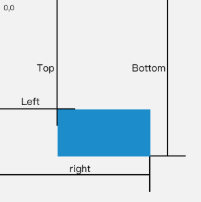
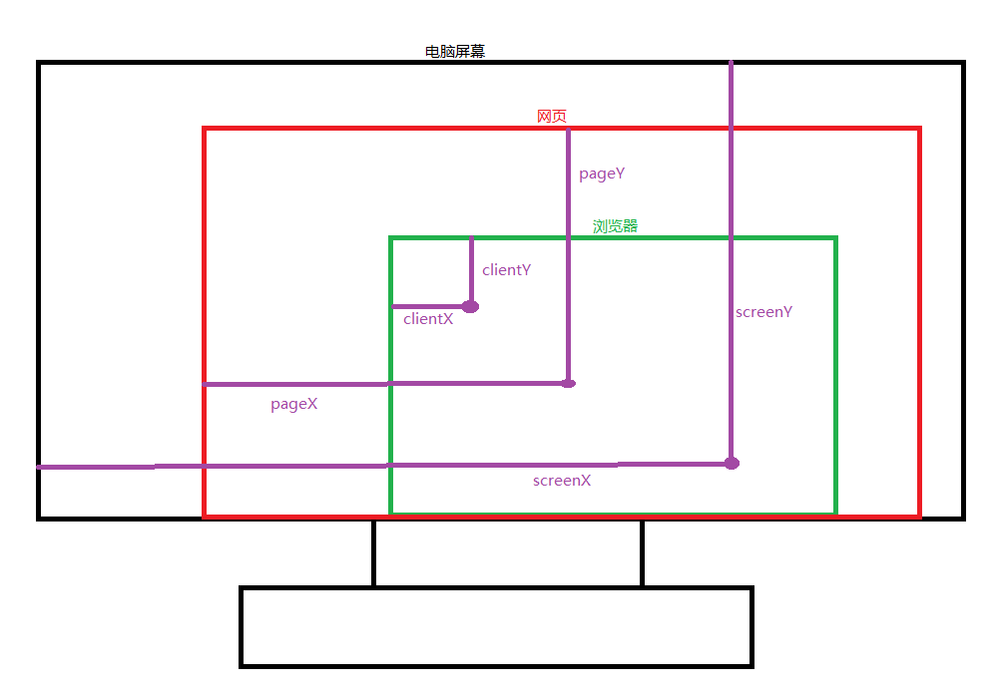

JaveScript

+ ECMAScript 标准：JS 的基本语法

+ DOM：Document Object Model 文档对象模型(操作页面元素)

+ BOM：Browser Object Model 浏览器对象模型(操作浏览器)

  DOM BOM ---> webApi

# DOM


## 一、API

API：是一些预先定义好的方法，这些方法能够实现某些特定的功能

webAPI：一套操作网页的API

DOM 中常见的概念

1. 文档 document(<font color=red> 页面中的顶级对象 </font>)：一个网页可以称为文档
2. 节点 node：网页中所有的内容(标签、属性、文本)
3. 元素 element：网页中的标签节点


> `getElementById()`

+ 功能：通过 ID 值，获取对应的元素标签
+ 返回值：
  + 存在：返回标签元素(对象)
  + 不存在：返回 null

> `getElementByTagName()`

+ 特点：<font color=red> 动态获取 </font>

+ 功能：通过标签名获取元素
+ TagName：标签名称
+ 返回值：数组(伪数组)：一般只作遍历用

> `getElementByName()`

+ 功能：通过 Name 属性值获取标签元素(主要用于表单标签)

> `getElementByClassName()`

+ 功能：根据类样式的名字来获取元素(H5方法)

> querySelector()

+ 功能：根据选择器的方式获取元素(H5)
+ 返回值：为一个元素
+ 说明：css 的 style 怎么用，这个参数就怎么给

> `querySelectorAll()`

+ 返回值：返回多个(伪数组)
+ 特点：<font color=red> 静态获取 </font>

> document 直接获取 html 标签

1. 获取 body 标签：`document.body`
2. 获取 html 标签：`document.documentElement` (特殊)
3. 获取 head 标签：`document.head`
4. 获取 title 标签：`document.title` 获取到的是 title 里的文本

## 二、事件

事件：触发 ----> 相应机制 JavaScript 基于事件

事件三要素

+ 事件源：给谁注册事件(给按钮注册事件)
+ 事件名称：注册什么事件(点击事件)
+ 事件处理函数：点击事件要执行什么函数


### 2.1 事件合集

> 鼠标事件

| 事件名                        | 说明         | 备注                                                         |
| ----------------------------- | :----------- | ------------------------------------------------------------ |
| onclick                       | 鼠标点击事件 |                                                              |
| ①onmouseover  / ②onmouseenter | 鼠标进入事件 | ①系列：不论是父元素还是子元素都会触发，因为事件冒泡，频繁触发事件，降低网页性能 ②系列：只会在当前元素自身触发 |
| ①onmouseout / ②onmouseleave   | 鼠标离开事件 |                                                              |
| ondblclick                    | 鼠标双击事件 |                                                              |
| onmousedown                   | 鼠标按下事件 |                                                              |
| onmousemove                   | 鼠标移动事件 |                                                              |
| onmouseup                     | 鼠标松开事件 |                                                              |

> 键盘事件

| 事件名     | 说明         | 备注 |
| ---------- | ------------ | ---- |
| onkeydown  | 键盘按下事件 |      |
| onkeypress | 键盘按住时   |      |
| onkeyup    | 键盘弹起事件 |      |

> 其它事件

| 事件名   | 说明         | 备注                                               |
| -------- | ------------ | -------------------------------------------------- |
| onchange |              | 一般用于表单(当表单改变时触发)完成改变时触发(延迟) |
| oninput  |              | 当用户输入时触发(H5新增、实时)                     |
| onfocus  | 获取焦点事件 |                                                    |
| onblur   | 失去焦点事件 |                                                    |
| onscroll | 滚动事件     |                                                    |
| onresize | 调整窗口事件 |                                                    |
| onload   |              | 会在窗体加载完成后执行                             |

### 2.2 为同一元素绑多个相同事件

+ `div.addEventListener(事件类型, 事件处理函数， Boolean值 / 对象)` IE8 不支持

  + 参数1：事件类型(事件名字)没有on，例 click

  + 参数2：事件处理函数

  + 参数3：默认 false，冒泡阶段。true 为捕获

    + 布尔类型 capture 指定事件是否在捕获或者冒泡阶段执行

    + 对象：

      ```js
      {
          // capture 指定事件是否在捕获或者冒泡阶段执行
          capture: true,
          // 表示当前事件只执行一次
          once: true,
          // 表示listener永远不会调用prventDefault()，如果还是调用了会报错
          passive: true
      }
      ```

      

  ```js
  // 第一个
  div.addEventListener('click', function(e) {
      // 事件委托
      if (e.target.nodeName === 'LI') {}
  }, false)
  // 第二个
  div.addEventListener('click', function(e) {
      // 事件委托
      if (e.target.nodeName === 'LI') {}
  }, false)
  // 第N个 此时的点击事件全部都会执行，只不过此方法IE8不支持
  ```

+ `div.attachEvent(事件类型, 事件处理函数)`

  + 参数1：事件类型，有on，例 onclick
  + 参数2：事件处理函数
  + 此方法只有 IE8 支持

+ 不同点

  + `对象.addEventListener` 中的 this 指向的是对象
  + `对象.attachEvent` 中的 this 指向 window
  + 参数不同
  + onclick 和 click 不同

### 2.3 解绑事件

+ `div.onclick=null` 解绑单个事件

  用什么方式绑定事件，就应该用对应的方式解绑事件

+ `div.addEventListener(type, fn, false)`

  此方式在定义绑定事件的时候，函数要用命名函数。因为解绑的时候使用 `div.removeEventListener(type, fn, false)`，参数与绑定时相同

+ `div.attachEvent('onclick', fn)`

  此方式解绑 `div.detachEvent('onclick', fn)` 此时同样要使用命名函数

+ 总结：用什么方式绑定的事件就用对应的方式解绑，需要解绑在定义之前就应使用命名函数

### 2.4 事件冒泡(避免)

+ 定义：当触发了子元素的某个事件后，父元素(祖先)的事件也会触发

+ 定义：多个元素，有嵌套层级关系。这些元素都注册了相同事件，如果里面的事件触发了，那么外面元素的事件也自动触发

+ 阻止事件冒泡

  ```js
  // 写在事件处理函数中，不传参数。IE特有的，谷歌支持，火狐不支持
  window.event.cancelBubble = true; // 属性
  
  // 写在事件处理函数中，传参e。谷歌和火狐支持，ie不支持
  e.stopPropagation(); // 方法
  
  // 事件参数对象e在IE8的浏览器不存在，此时用 window.event 来代替
  window.event.stopPropagation()
  ```

### 2.5 事件阶段

按执行顺序

1. 事件捕获阶段：从外向内 ---> 1

2. 事件目标阶段：最开始选择的那个 ---> 2

3. 事件冒泡阶段：从里向外 ---> 3(较少使用)

   ```js
   // 参数1：没有on的事件类型
   // 参数2：事件处理函数
   // 参数3：控制事件阶段 true ---> 事件捕获阶段  false ---> 事件冒泡阶段
   div.addEventListener('click', function (e) {
      e.eventPhase; // 可以获取当前时间阶段
   }, true)
   ```

   


## 三、属性

+ 普通标签属性：title、src、id、class、href...等

+ 表单属性：type、checked、selected、value、maxlength

  disabled：true ---> 禁用 false ---> 解禁

  readonly：true ---> 只读 false

  checked：true(checked) ---> 默认选中 false

  selected：true(selected) ---> 默认选中 false

+ 自定义属性

  ```html
  <div xixi="xixi">
      
  </div>
  ```

  + 注意：自定义属性通过标签和对象方式设置，互不相认(标签设置的对象取不到，对象(对象设置有时候还是重要的，自设自取时)设置的标签取不到)，<font color=red> 通过标签和对象均能设置，只是互不相认 </font>

  + 获取：`attribute 方式(js)` <font color=red> 这个方式与 HTML 标签想通与 BOM 不通 </font>

  + 操作

    ```js
    // 设置属性
    对象.setAttribute(属性名, 属性值)
    // 获取属性：可获取标签、对象、Attribute 增加的自定义属性
    对象.getAttribute(属性名)
    // 删除属性
    对象.removeAttribute(属性名)
    // 还可以移除自带属性
    div1.removeAttribute('class')
    ```

    

## 四、textContent 和 innerText

+ 作用：设置标签中的文本内容

+ textContent：谷歌、火狐支持，IE8不支持

+ innerText：谷歌、火狐、IE8 全支持

+ 兼容代码

  ```js
  // 1.设置任意标签中间的任意文本
  function setInnerText(el, text) {
      if (typeof el.textContent == 'undefined') {
          el.innerText = text
      } else {
          el.textContent = text
      }
  }
  
  // 2.获取任意标签中间的文本内容
  function getInnerText(el) {
      if (typeof el.textContent == 'undefined') {
          return el.innerText
      } else {
          return el.textContent
      }
  }
  ```


## 五、innerHTML

+ `innerHTML` 可以设置标签里的内容
+ 主要作用：在标签中设置新的 HTML 标签，有标签效果
+ 获取问题：
  + `innerText` `textContent` 获取标签中的<font color=red> 文本 </font>(相对于文本)
  + `innerHTML` 获取标签中的所有<font color=red> 内容 </font>，包含<font color=red> 标签 </font>(相对于此标签所有)
+ 总结：设置标签里的文本内容，使用 `innerHTML` `innerText` `textContent` 皆可。推荐使用 `innerText`，因为它无兼容性问题


## 六、节点 node

> 节点属性

+ nodetype (节点类型)

  1 ---> 标签

  2 ---> 属性(废弃)

  3 ---> 文本

  8 ---> 注释节点 comment

+ nodename (节点名字)

  大写的标签名字 ---> 标签节点

  小写的属性名字 ---> 属性节点

  #text ---> 文本节点

+ nodevalue (节点的值)

  null ---> 标签节点

  属性值 ---> 属性节点

  文本内容 ---> 文本节点

> 节点查找

```html
<div id="div"></div>
```

```js
var div = doument.getElementById('div')
```

+ 父级

  ```js
  // div标签的父级节点 √
  div.parentNode
  // div标签的父级元素
  div.parentElement
  ```

+ 子集

  ```js
  // div子节点
  div.childNodes
  // div子元素 √
  div.children
  // div第一个子节点
  div.firstChild
  // div第一个子元素(IE8无效) √
  div.firstElementChild
  // div最后一个子节点
  div.lastChild
  // div最后一个子元素(IE8无效) √
  div.lastElementChild
  ```

+ 兄弟级

  ```js
  // div的前一个兄弟节点
  div.previousSibling
  // div的前一个兄弟元素(IE8无效) √
  div.previousElementSibling
  // div的后一个兄弟节点
  div.nextSibling
  // div的后一个兄弟元素(IE8无效) √
  div.nextElementSibling
  ```

> 克隆节点

```js
// 参数：deep：是否深复制 true/false
// 返回值：克隆的新节点 深复制/浅复制
节点.cloneNode(deep)

```


## 七、创建元素

+ `document.write()`

  页面加载完成后创建元素，页面中的内容会被覆盖

+ `对象.innerHTML = '标签代码以及内容'`

+ `document.createElement(标签名)`

  ```js
  // 1.创建：返回对象
  var p = document.createElement('p')
  // 2.进入：在div中追加一个p标签，appendChild有剪切的功能
  div.appendChild(p)
  // 3.其它加入方法
  
  // insertBefore插入在...之前，p为要插入的元素，div.firstElementChild在div的第一个元素之前
  div.insertBefore(p, div.firstElementChild)
  // 参数1替换参照元素
  div.replaceChild(p, 参照元素)
  // 注意有坑
  div.removeChild(参数1)
  // 插入到最后
  div.insertBefore(p, null)
  ```


## 八、类名操作

+ div.className = '...' 可获取和设置

+ classList：以数组的形式获取类名

  div.classList.add('dd')：add()相当于 jquery 的 addClass()


## 九、JS 中的 style 属性

+ style 属性是一个对象(一系列的键值对)

+ JS 中的 `.style` 属于行内式的样式

+ 注意行内样式的优先级

+ 属性带 `-` 号要遵守 JS 中的驼峰命名法和命名规范

+ 另 cssText / css文本

  .style.cssText = 'width: 200px;...'


# BOM

+ 浏览器中的顶级对象 <font color=red> window </font>(全局对象)

+ 浏览器包含多个线程
  1. 执行 JS 的主线程
  2. 事件循环线程
  3. UI 渲染线程

+ 进程和线程
  + 进程：每个应用程序都是一个独立的进程，进程之间相互隔离
  + 线程：一个进程可以有多个线程，线程之间的数据可共享

## 一、location 对象

```js
location.ancestorOrigins: DOMStringList {length: 0}
location.origin: "http://localhost:9999"
// 协议
location.protocol: "http:"
// 主机及端口号
location.host: "localhost:9999"
// 主机名
location.hostname: "localhost"
// 端口号
location.port: "9999"
// 文件路径
location.pathname: "/TodoDetail"
// 搜索的内容
location.search: ""
// 地址栏#后面的内容(哈希值，其实锚点)
location.hash: ""


// 设置跳转的页面地址，可后退
location.href = "http://localhost:9999/TodoDetail"; // 属性
// 设置跳转的页面地址(同上)，可后退
location.assign = "http://localhost:9999/TodoDetail"; // 方法
// 重新加载(刷新)
location.reload();
// 设置跳转的地址，不可后退
location.replace('https://...')
```


## 二、onload 事件

```js
// 会在窗体加载完成后执行
window.onload = function () {
    
}
```


## 三、history 对象

```js
// 后退
history.back()
// 前进
history.forward()
// 能前进(整数+1) 能后退(负数-1)
history.go()
```


## 四、screen 对象

```js
// 屏幕宽度
screen.width
// 屏幕高度
screen.height
// 浏览器可占用的宽度(有效的宽度)
screen.availWidth
// 浏览器可占用的高度(有效的高度)
screen.availHeight
```


## 五、navigator 对象

```js
// 可以判断浏览器所在的系统平台类型
navigator.platform
// 可以判断浏览器的类型
navigator.userAgent
```


## 六、open close

+ `var newW = window.open(参数1, 参数2, 参数3)`

  + 参数1：url 地址
  + 参数2：窗口名称.target 属性.\_black/\_self
  + 参数3：窗口的属性
  + 返回值：窗口的名称

+ `newW.close()`

  关闭 newW 窗口

+ `window.close()`


## 七、定时器

BOM 中有两个定时器

> Interval 定时器

+ `window.setInterval(参数1, 参数2)`
  + 参数1：回调函数
  + 参数2：时间(毫秒) 1000mm = 1s
  + 返回值：定时器的 ID 值
  + 过程：页面加载完毕后，过了一秒(参数2)，执行一次函数(参数1)代码
  + 注意：此间 this 指向 window
+ `window.clearInterval(timeId)`
  + 参数：要清理的定时器的 ID 值

> Timeout 延时器(一次性的定时器)

可以延迟一定时间执行

+ `window.setTimeout(参数1，参数2)`
  + 参数1：回调函数
  + 参数2：延时的事件，以毫秒为单位
  + 返回值：此延时器的 ID
  + 注意：此间 this 指向 window
+ `window.clearTimeout(timeId)`


## 八、offset 系列

用于获取元素自身的大小和位置(width/height/left/top)，<font color=red> 获取到的是整数 </font>，<font color=red> `.style` 只能获取行内样式设置的 </font>

+ `offsetWidth`
  + 定义：获取元素<font color=red> 真实 </font>(不包含border、padding)的宽度
  + 返回：获取到的是数值类型(方便计算)
  + 注意：
    1. 只能获取不能设置
    2. `style.width` `style.height` 获取的是行内样式属性，一般不用于获取，用于设置
+ `offsetHeight`
  + 定义：获取元素<font color=red> 真实 </font>(不包含border、padding)的高度
+ `offsetParent`
  + 定义：最近的定位元素，如果祖先元素没有定位就为 body
+ `offsetLeft` 和 `offsetTop`
  + `offsetLeft` 获取元素自身左侧到 `offsetParent` 左侧的距离
  + `offsetTop` 获取元素自身顶部到 `offsetParent`  顶部的距离
  + 获取的是数值类型(方便计算)


## 九、client 系列(可视区域)

```js
// 引出可视区域的宽高

// 现代
window.innerWidth
window.innerHeight
// 老版本
document.documentElement.clientWidth
document.documentElement.clientHeight
document.body.clientWidth
document.body.clientHeight
// 兼容
const width = window.innerWidth || document.documentElement.clientWidth || document.body.clientWidth
```


+ `clientWidth`
  + 定义：可视区域的宽(没有边框)，边框内部
+ `clientHeight`
  + 定义：可视区域的高(没有边框)，边框内部
+ `clientLeft`
  + 定义：左边边距的宽度
+ `clientTop` 
  + 定义：上边距的宽度


## 十、scroll 系列

+ `scrollWidth`

  元素中文本的宽(当文本没有溢出时或无文本时)，此时的宽为实际的宽(不含边框，含padding)

+ `scrollHeight`

  元素中文本内容的高(当文本没有溢出或无文本时)，此时的高为实际的高(不含边框，含padding)

+ `scrollTo`

  + 定义：向上卷曲出去的距离

+ `scrollLeft`

  + 定义：向左卷曲出去的距离

```js
// 不同浏览器获取卷曲距离的方式不同
// 1.现代浏览器 ---> 卷曲出去的宽高
window.pageXOffset	// 只读
window.pageYOffset	// 只读
// 2.老浏览器
document.documentElement.scrollLeft
// 3.更老
document.body.scrollLeft

// 兼容
window.onscroll = function () {
      const top = window.pageYOffset || document.documentElement.scrollTop || document.body.scrollTop
      const left = window.pageXOffset || document.documentElement.scrollLeft || document.body.scrollLeft
}

```


## 十一、获取 css 样式属性值

计算后的样式，真正在元素身上起作用的样式

+ `window.getComputedStyle(el, pseudoClass)`
  + el：需要获取的元素
  + pseudoClass：获取元素的伪类样式： `::after` `::before`，如不需要获取元素伪类的样式写 `null`
  + 返回值：el 对象的样式集合(样式对象)

<font color=red> 通过 `.style` 获取和设置的是行内样式  </font>

```js
// IE 不支持
window.getComputedStyle(element, null).left
// 谷歌火狐不支持
element.currentStyle.left
```

+ `Element.getBoundingClientRect()` 方法返回元素的大小及其相对于视口的位置。

  ```js
  const child = document.getElementById('child')
  child.getBoundingClientRect()
  {
      // 自身的宽高
      width: 100,
      height: 100,
      left: 209, // 距离视口左边的位置
      top: 209, // 距离视口右边的位置
      right: 309,
      bottom: 309,
      x: 209,	// 相对于视口的坐标
      y: 209,
  }
  ```

   除了width 和 height 以外的属性是相对于视图窗口的左上角来计算的。

  


## 十二、事件对象

+ 定义：在触发某个事件时，都会产生一个事件对象 `e`

  如：鼠标事件触发时，事件对象 `e` 中包含鼠标的位置信息

  如：键盘事件触发时，事件对象 `e` 中包含按下键的相关信息

  ```js
  window.onclick = function (e) {
      // window.event ---> IE678
      console.log(e || window.event)
  }
  ```

+ 记录鼠标位置信息相关属性

  +  `e.clientX` ***光标***相对于可视区域***左上角的水平位置***(推荐，相对于可视区域)
  + `e.clientY` ***光标***相对于可视区域***左上角的垂直位置***(推荐，相对于可视区域)
  + `e.screenX` ***光标***相对于屏幕***左上角的水平位置***(相对于电脑屏幕)
  + `e.screenY` ***光标***相对于屏幕***左上角的垂直位置***(相对于电脑屏幕)
  + `e.pageX` ***光标***相对于 网页(文档document)内容***左上角的水平位置***(推荐，相对于网页)
  + `e.pageY` ***光标***相对于 网页(文档document)内容***左上角的垂直位置***(推荐，相对于网页)
  + IE8 不支持可用 `scrollTop + clientY`



+ 键盘码的属性

  `e.keycode` 键盘按下的那个键的键盘码

+ 滚动条滚动时避免选中文字

  ```js
  window.getSelection().removeAllRanges()
  // 或者
  document.selection.empty()
  ```

  