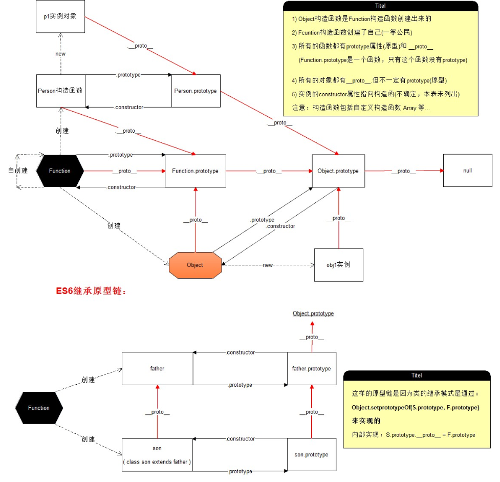

  # 一、属性和方法

对象：特指某个事物，具有属性和方法。一组无序的属性集合

+ 属性(property)

  对象的状态

+ 方法(method)

  对象的行为


# 二、编程思想

JS：基于对象的语言，<font color=red> 模拟面向对象 </font>

面向对象的特性：

+ 封装：将一些重用的内容进行封装，需要的时候直接使用
+ 继承：类与类之间的关系(JS 中没有类的概念)，JS 中有构造函数的概念是可以有继承的，是基于原型的
+ 多态(抽象性)：同一个行为针对不同的对象产生了不同的效果(基于继承)


# 三、实例与构造函数的关系

+ 实例对象是通过构造函数来创建的，创建的过程叫实例化

+ 判断实例对象的数据类型

  + 通过构造器(构造函数)

    ```js
    // 实例对象.构造器 == 构造函数的名字 
    per1.constructor == Person; // true / false
    ```

  + 实例对象(尽量使用)

    ```js
    // instanceof 构造函数名
    per1 instanceof Person
    ```


# 三、原型

## 3.1 介绍

+ 作用：<font color=red> 共享数据，节省内存空间 </font>

  ```js
  // 1.构造函数
  function Person(name, age) {
      this.name = name
      this.age = age
  }
  // 2.通过原型来添加方法，解决数据共享，节省内存空间
  Person.prototype.eat = function () {
      console.log('吃')
  }
  var p1 = new Person('小明', 20)
  var p2 = new Person('小红', 18)
  // 此时
  p1.eat == p2.eat
  ```

+ 实例

  属性 `__proto__` 也是对象，叫原型。不是标准属性，浏览器使用

+ 构造函数

  属性 `prototype` 也是对象，叫原型。是标准属性，程序员使用

+ 总结

  1. 构造函数 ---> 实例化对象
  2. 构造函数中有一个属性叫 `prototype` ，是构造函数的原型对象
  3. 构造函数的原型对象 `prototype` 中有一个 `constructor` 构造器，这个构造器指向自己所在的原型对象所在的构造函数
  4. 实例对象的原型对象 `__proto__` 指向该构造函数的原型对象
  5. 构造函数的原型对象 `prototype` 中的方法是可以被实例对象直接访问的

+ `__proto__`

  1. 任何对象都有 `__proto__` 属性，指向狗杂函数的 `prototype` 属性，就是原型对象
  2. 私有属性，不标准属性，存在兼容性问题(IE 不支持，所以不推荐)，如果要修改和访问原型对象通过构造函数的 `prototype` 属性来完成
  3. 使用：一般在本地开发阶段使用

+ `prototype`

  1. 任何函数都有 `prototype` 属性
  2. 函数的 `prototype` 的值时一个对象，这个对象叫做原型(原型对象)
  3. 通过构造函数创建的实例对象，可以直接访问构造函数的原型

+ `constructor` 属性

  原型中默认的属性，指向了当前的构造函数

## 3.2 原型链图



## 3.3 属性查找原则

1. 在原型链上向上找，找到即返回
2. 知道找到 `Object.prototype`， 没有则返回 `undefined`


# 四、深浅拷贝

+ 浅拷贝：复杂对象的属性和值，但只赋值对象的一层属性。如果有属性还是对象，此时复制的是地址。这样赋值的对象和源对象没有完全隔离，会互相影响

+ 深拷贝：复制对象的所有层次，如果属性中还有对象，继续拷贝

  ```js
  function cloneDeep(obj) {
      var newObj = {}
      for (var key in obj) {
          newObj[key] = typeof obj[key] === 'object' ? cloneDeep(obj[key]) : obj[key]
      }
      return newObj
  }
  // 利用 JSON.stringify() / JSON.parse() 进行深拷贝
  // 缺点：会忽略为function的值
  var newObj = JSON.parse(JSON.stringify(obj))
  ```


# 五、`Object.prototype` 成员

任何对象都可以访问到 `Object.prototype` 

## 5.1 成员介绍

+ `constructor`

  指向构造函数 `Object`

+ `hasOwnProperty`

  + 作用：判断指定的属性是否是自身拥有的
  + 语法：`对象.hasOwnProperty(属性名)` ---> 返回 true / false
  + 场景：for...in 中

+ `propertyIsEnumerable`

  + 作用：判断属性是否可遍历
  + 语法：`对象.propertyIsEnumerable(属性名)`
  + 作用
    1. 判断这个属性是否是对象自身的
    2. 判断这个属性是否是可遍历的

+ `defineProperty`

  + 作用：定义一个不可被遍历的属性
  + 参数
    + 参数1：obj 对象：给哪个对象添加不可遍历的属性
    + 参数2：pro：定义哪个属性不可以遍历，字符串类型
    + 参数3：desc：属性的描述符，是个对象(定义此属性特征)

  ```js
  Object.defineProperty(obj, 'gender', {
      value: 'femate', // 配置该属性的值，如不写为undefined
      configurable: true,	// 是否可删除
      writable: true, // true/false 定义此属性能否被修改，默认false
      enumerable: true, // true/false 不写，默认为false
  })
  ```

+ `valueOf`

  + 作用：将对象转换成原始值(简单数据类型)，默认情况下( `Object.prototype` )只是返回了对象自身(date 日期对象例外，因为 date 原型上有自己的 `valueof` 方法发回时间戳)

+ `getPrototypeOf`

  + 作用：获取实例对象的原型
  + 语法：`Object.getPrototypeOf(实例)`

+ `toString`

  + 作用：对象转换为字符串
  + 各有各的 toString 方法
    1. arr.toString() ---> 1,2,3
    2. obj.toString() ---> [object Object]
    3. date.toString() ---> 中国标准时间

+ `toLocaleString`
  + 作用：转字符串
  + 说明：与 `toString` 相同，只有date的有区别
    + date.toString() ---> 返回的是中国标准时间
    + date.toLocaleString() ---> 返回本地时间
+ `isPrototypeOf`
  + 语法：`A.isPrototypeOf(B)`
  + 作用：判断 A(A是个原型) 是否在 B 的原型链上

## 5.2 差异介绍

> `hasOwnProperty` 与 `in` 的区别

- `in`

  1. 语法：属性 in 对象
  2. 作用：判断对象能否访问该属性，不论这个属性是在对象中还是在原型中

- `hasOwnProperty`

  只判断属性是否是对象自身的

> `valueOf()` 与 `toString` 的区别

在对象参与比较运算或运算的时候，JS 自动调用这两个方法，转为简单数据类型

规则：

+ 先调用 `valueOf` ，尝试将对象转为简单数据类型，如果没有得到简单数据类型，再去调用 `toString` 方法

  + Date 日期对象规则不一样，默认先调用 `toString`

  + 当 Date 对象希望得到一个原始值参与运算时，先调用 `valueOf` 方法

    date + 1 ---> 先调用 `toString`

    date - 1 ---> 先调用 `valueOf`

+ 如果 `valueOf` 和 `toString` 方法都没有得到简单数据类型，则会报错

> `isPrototypeOf` 与 `instanceof` 操作符的区别

+ 语法：`实例对象 instanceof 构造函数`
+ 作用：判断构造函数的 `prototype` 属性是否在实例对象的原型链上


# 六、 继承

<font color=red> JS 只支持实现继承 </font>

+ 定义：拿另对象的属性和方法直接使用

+ 方式

  + 混入式继承(mixin)

    相当于深浅拷贝的形式进行拷贝过来，形成自己的属性

  + 原型链继承

    对象可以直接访问到原型上任何属性和方法(成员)。实例对象 P 继承原型链上的成员(默认就可以访问)

  + 原型替换

    `原型.prototype = {}` 此时，要手动添加原型的 `constructor` 属性

  + 经典继承 `Object.create()`

    + 语法： `var obj1 = Object.create(obj)`
    + 作用：该方法返回一个 obj1 对象，obj1 对象的原型是参数 obj
    + 注意：不同于原型替换，此方法没有原型指向问题

  + 借用继承(借用构造函数继承)

    + 主要解决：属性共享问题，构造函数中的原型无法继承

    + 问题：借用的构造函数的方法都在原型上，无法继承原型上的方法，只能继承构造函数的属性

      ```js
      Person () {
          Student(this)
      }
      ```

      

  + 组合继承(解决借用继承的问题)

    原型继承 + 借用狗杂函数继承

    原型继承：解决方法继承

    构造函数继承：解决属性继承


# 七、函数进阶

## 7.1 函数声明的方法

```js
// 1.函数声明
function () {}
// 2.函数表达式(尽可能用)
var fn = function () {}
// 3.函数也是对象，可以通过构造函数Function来new
// bodyArg 函数体，比如console.log(n1, n2)
// 形参必须是字符串形式
var fn = new Function("n1, n2, n3...", bodyArg)
// 等同于
var fn = function (n1, n2) {
    console.log(n1, n2)
}
```

## 7.2 try-catch 语句

+ 语法

  ```js
  // try 尝试 catch 捕获
  try {
      // 有可能出现错误的代码
  } catch(e) {
      // e ---> 事件错误对象
  } finally {
      
  }
  ```

+ 用法

  + 将可能出错的代码放在 `try` 中执行，一旦 `try` 的代码有错，会被 `catch` 捕获到
  + 一旦 `try` 中有错，会执行 `catch` 中的语句

+ 好处

  不会影响后面代码的执行，避免因错误中断后面的代码

## 7.3 `eval函数`

和 `new Function` 的作用一样，来执行字符串代码

例如： `eval("alert(1)")`


## 7.4 函数的四种调用模式

**<font color=red> 分析 this 的指向问题</font>**

<font color=red> **this 是动态的，只和调用模式相关，和在哪调用无关** </font>

+ `fn()` 函数名() ---> 函数调用模式

  此时 this 指向 window

  严格模式("use strict") 下函数调用模式 this 指向 undefined

+ 方法调用模式

  `obj.fn()` 对象.方法() 

  this 指向 obj

+ 构造函数模式

  this 指向新实例(this 指向 new)

+ 上下文模式(借用模式)

  call、apply、bind 三个方法实现，任何函数都有这三个方法

+ 特殊

  + 定时器中的 this 指向 window
  + 事件中的 this 指向当前元素


# 八、伪数组与数组

+ 伪数组

  一个对象，有下标和 length 书香，没有数组的方法

+ 特征

  + 有数字下标
  + 有 length 属性
  + 不能使用数组的方法

+ 常见的伪数组

  + `arguments`
  + `document.` 获取的标签集合
  + `jquery对象`

+ 伪数组转为真数组

  + 借用数组的 `slice` 方法

    `[].slice.call(obj)`

  + 借用：`找到方法.call(obj)`


# 九、call方法

- call()；可以用于函数调用，相当于()调用

  `fn.call()`

- call 不仅可以用于函数调用，还可以改变函数的 this 指向

  `fn.call([1, 2, 3])` 此时 this 指向这个数组

- call 的参数不限个数，除了<font color=red> 第一个参数(改变 this 指向) </font>，其它参数都是 <font color=red> 实参 </font>

- call 如果未传参，this 指向 window。或传 undefined 、null 都指向 window


# 十、apply方法

+ 作用：apply 和 call 的作用一样

+ 区别：在于参数

+ 语法：`fn.apply(thisArg, args)`

+ 参数说明：
  + thisArg：改变函数内的 this 指向
  + args：数组或伪数组类型，是一个实例列表

+ 用法：用于函数调用

  + `fn()`

  + `fn.call()`

  + `fn.apply()`

  + `fn.apply([1,2], [10, 50])`

    [1,2]：thisArg 改变函数内的 this 指向，指向[1, 2]这个数组

    [10, 50]：将参数放在一个数组或伪数组

    10：实参1

    50：实参2

+ 不同：与 call 不用的只有在参数传参部分

+ 推荐使用场景：

  + call：参数较少时
  + apply，参数较多时，且已经都在数组中时


# 十一、bind方法

上下文调用模式(借用模式)之三(多用于底层框架)

+ 语法：`fn.bind(thisArg)`

+ 参数：thisArg：指定函数的 this 指向

+ 作用：新创建返回一个函数，和 fn 一模一样，新函数的内部 this 指向被固定成 bind 的 thisArg 参数

+ 区别：

  + apply 和 call 调用时改变 this 指向
  + bind方法：复制的时候改变 this 指向

  ```js
  function fn() {
      console.log(this)
  }
  // newFn()：[1, 2, 3]不再是指向window，this指向被固定
  var newFn = fn.bind([1, 2, 3])
  ```


# 十二、函数也是对象

+ `Function.prototype` 就是函数而非对象
+ `Function.prototype` 的成员
  + `appy()`
  + `call()`
  + `bind()`
  + `arguments`： 函数的实参列表(已废弃)，被函数内部 `arguments` 替代
  + `caller`：用于获取当前函数被谁调用(已废弃)
  + `constructor`：指向当前的构造函数
  + `length`：获取形参的个数
  + `name`：获取函数名，此属性不可修改，修改无效
  + `toString()`：返回字符串的函数
+ 说明
  + 任何对象都可以访问 `Object.prototype` 
  + 任何函数都可以访问 `Function.prototype`
  + `Function.prototype` 原型类型是个函数
  + 只要有函数，就有 `prototype` ，函数也是对象，只要是对象，就有 `__proto__` 属性，所以函数既有 `prototype`，也有 `__proto__`


# 十三、作用域

+ 词法作用域：只有函数能够形成作用域
+ 函数作用域：函数在定义的时候就确定下来，和函数在哪调用没有关系
+ this 指向：跟函数的调用模式有关
+ 说明
  + 全局作用域，一直存在(除非页面关闭)
  + 函数作用域：调用结束就释放


# 十四、递归函数

+ 定义：函数内部调用自己
+ 注意：一定要有结束条件，不然造成死递归
+ 运用：主要运用化归思想，复杂问题转为简单问题
+ 递归思路
  + 将未知的问题转为已知问题
  + 考虑结束递归条件
+ 缓存思路
  + 判断缓存中是否有对应的数据，如果有直接取，得到结果
  + 如果没有，先计算结果，把结果添加到缓存中，方便下次使用


# 十五、闭包(closure)

和作用域有关

+ 定义：有两个函数，一个函数嵌套另一个函数，而且内层函数还引用了外层函数的标量

+ 基本模型

  ```js
  function outer() {
      var num = 10
      // 1.嵌套
      function inner() {
          // 2.访问外部变量
          console.log(num)
      }
      // 3.返回这个函数
      return inner
  }
  ```

+ 作用

  + 私有变量，保护数据安全
  + 持久化维护数据

+ 缺点：内存泄露，此内存空间持久被占用，需手动释放

+ 斐波那数列

  + 递归 ---> 计算
  + 缓存：解决重复计算
  + 闭包：保护数据，私有化变量


# 十六、正则表达式

用于匹配规律规则的表达式

构造函数：`RegExp` ---> regular expression

+ 创建正则表达式

  ```js
  var reg = new RegExp(/aa/)
  // test() 用于检测某个字符是否符合正则规律 true / false
  // 一般用于表单验证
  reg.test()
  ```

+ 字面量创建

  ```js
  var reg = /\d/
  ```

+ 正则表达式的组成

  1. 普通字符：数字、字母等

  2. 元字符：在正则中有特殊含义的

     | 元字符 | 描述                                                         |
     | ------ | ------------------------------------------------------------ |
     | \d     | 数字[0-9] (digit)                                            |
     | \D     | 非数字                                                       |
     | \w     | 字符：a-z A-Z 0-9 _ 单词字符                                 |
     | \W     | 非字符：除了字符a-z A-Z 0-9 _ 单词字符                       |
     | \s     | 不可见的字符：空格、换行符(\n)、制表符(tab \t)               |
     | \S     | 可见的字符：空格、换行符(\n)、制表符(tab \t)                 |
     | **·**  | 任何字符(除了换行和回车)，如果需要使用点本身，需要通过转义\\. |

+ 正则的优先级

  |  ---> 或 ---> 优先级最低

  ()  ---> 分组 ---> 优先级最高

+ 字符类元字符

  + `[]`：表示只能出现一个字符

    ```js
    // 表示只能是a或者b或者c
    /[abc]/
    // 表示只能出现a-z其中的一个字符
    /[0-9]/
    // 表示只能出现a-z或A-Z或0-9
    /[a-zA-Z0-9]/
    ```

  + `^` 在 `[]` 中的作用表示非

    ```js
    // 除了a,b,c
    /[^abc]/
    ```

+ 边界类元字符

  + `^` 表示开始(注意 `^` 在 `[]` 中有特殊含义)

    ```js
    // 表示以 chuan 开头的
    /^chuan/.test('chuang') // true
    /^chuan/.test('dachuang') // false
    ```

  + `$` 表示结束，表示以。。。结束

    ```js
    // 表示以 chuan 结束
    /chuan$/
    // 以 chuan 开头，并且以这个!!!!chuan结束
    /^chuan$/
    ```

  + `^***$` 表示精准匹配

+ 量词类元字符(贴着谁)

  | 元字符 | 描述            | 公式描述 |       |
  | ------ | --------------- | -------- | ----- |
  | *      | 出现0次或多次   | >=0      | {0,}  |
  | +      | 出现1次或者多次 | >=1      | {1,}  |
  | ?      | 出现0次或1次    | 0 \|\| 1 | {0,1} |
  | {m,n}  | 出现m~n次       |          |       |
  | {m,}   | 出现m次以上     |          |       |
  | {m}    | 只能出现m次     |          |       |

+ 正则替换

  + 正则可以用来替换字符串

    ```js
    // 参数可以写正则
    str.replace()
    // 参数可以写正则,匹配,返回数组
    str.match()
    // g:global 全局搜索
    str.replace(/\s/g, '')
    // i:ignore 忽略大小写
    str.replace(/ad/gi, 'xx')
    ```

  + 正则方法

    `test()`： 测试字符是否符合正则规律

    `exec()`： 提取、分组，如果没有分组会返回匹配到的整个值，如果有分组，会返回分组的

+ 正则提取组：

  `RegExp.$3` 表示第3组