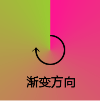
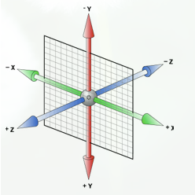

# H5

## 一、H5 语义化标签兼容性问题

> 现象：在 IE8 及以下版本不支持 H5 语义化标签

解决方案：

+ 在浏览器解析这个标签前，动态创建一次新标签元素

  ```js
  document.createElement('header');
  ```

+ 默认创建出来的是行内元素，需要手动重置样式(转为块级)


> 将来开发过程中，有很多语义化标签：header、nav、footer、aside、section、main...

解决方案：

+ 引入第三方插件 html5shiv.js 来解决 H5 语义化标签兼容性
+ 注意点：
  1. 要先引入再使用 H5 标签
  2. 对于不需要兼容处理的浏览器无需引入<font color=ff0000> **html5shiv.js(respond.js 同理，解决媒体查询兼容)** </font>，只需要 IE8 及以下版本引入即可
  3. <font color=ff0000> **IE条件注释** </font>：专门用于兼容 IE 的一种方式，只有 IE 认识，且只有 IE9 及以下版本才认识


> IE条件注释

+ css IE 条件注释，专门用于兼容 IE 低版本。只有 IE9 及以下版本认识，其它浏览器或 IE10 以上版本不会解析，当成注释处理。

+ 语法

  1. lte ----> 小于等于 ----> less than or equal to
  2. lt ----> 小于 ----> less than
  3. gte ----> 大于等于 ----> greater than or equal to
  4. gt ----> 大于 ----> greater than

+ 固定写法

  ```html
  <!DOCTYPE html>
  <html lang="en">
  <head>
    <meta charset="UTF-8">
    <meta name="viewport" content="width=device-width, initial-scale=1.0">
    <meta http-equiv="X-UA-Compatible" content="ie=edge">
    <title>Document</title>
    <!--[if lte IE 9]>
      <script src="http://html5shiv.googlecode.com/svn/trunk/html5.js"></script>
    <![endif]-->
  </head>
  <body>
    
  </body>
  </html>
  ```


## 二、H5新增类名操作

> 四个操作样式类的写法

```js
// 1.添加类
dom.classList.add()
// 2.移除类
dom.classList.remove()
// 3.判断类
dom.classList.contains()
// 4.切换类
dom.classList.toggle()
```


## 三、H5自定义属性操作

+ 说明1：等同于 getAttribute、setAttribute、removeAttribute

+ 说明2：Attribute 只能一个一个获取、设置，太麻烦

+ 用法：专门用于管理所有的自定义属性 data-

  1. 存时，在属性名前加上 data-

     ```html
     <div data-age="18"></div>
     ```

  2. 取时，通过 dataset.属性名取

     ```js
     // 1
     dom.dataset.age
     // 2
     dom.dataset['age']
     ```

  3. 修改添加，直接通过对象属性操作方式操作

     ```js
     dom.dateset.age = 12
     ```


## 四、网络状态

在移动端经常需要检测用户在线或者离线，一个属性两个事件

> H5 中检测用户网络状态的api

+ navigator.onLine 

  true说明联网了(互联网或者局域网)

+ 为了更好的确定网络是否连接，H5 定义了两个事件用于监听网络状态的变化

  ```js
  // 1.网络连接时会被调用
  window.addEventListener('online', function () {})
  
  // 2.网络断开时会被调用
  window.addEventListener('offline', function () {})
  ```


## 五、地理位置

获取用户地理位置信息的API，可以基于用户位置开发互联网应用，即基于位置服务 LBS (Location Base Service)

+ 隐私

  H5 规范提供一套保护用户隐私的机制，必须先得到用户的明确许可，才能获取用户的位置信息，在获取地理位置之前，会询问用户

+ 获取当前地理位置

  ```js
  /**
   * @param {Function} successCallback 获取成功后调用，并返回一个position对象，里面包含了地理位置信息
   * @param {Function} errorCallback 获取失败后调用，并返回error对象，里面包含了错误信息
   */
  navigator.geolocation.getCurrentPosition(successCallback, errorCallback)
  ```

+ 重复的获取当前地理位置信息

  ```js
  navigator.geolocation.watchPosition(successCallback, errorCallback)
  ```

+ 说明

  1. pc 端：chrome、火狐定位请求的页面要求要是 https 协议，所以 pc 测试要在 IE 下测试
  2. 移动端：在 IOS 10 中，苹果对 webkit 定位权限进行了修改，定位请求的页面必须是 https 协议


## 六、web存储

代码执行时，数据都是存储在内存中，当页面关闭时，内存释放，数据只有存储在硬盘上才不会被释放

> Cookie

+ 说明：传统方式以 document.cookie 进行存储，cookie 是以字符串形式存在，这个字符串有固定格式，key=value,....

+ 原生 js 操作 cookie

  ```js
  // 设置
  document.cookie = 'name=zs'
  // 获取
  document.cookie
  ```

+ jquery cookie插件

  ```js
  // 设置 
  $.cookie('name', 'zs');
  // 获取
  $.cookie('name');
  // 删除
  $.removeCookie('name');
  ```

+ 特点

  1. 大小 4kb 左右
  2. 能够在多个页面共享数据
  3. 请求时，cookie 中的数据可以携带，一般用于存储 sessionId，用于会话保持
  4. 生命周期：关闭浏览器即销毁了，可以设置过期时间

+ 缺点：原生操作太麻烦，存储大小 4kb 左右过小


> sessionStorage

+ 特点
  1. 大小 5M
  2. 不能再多个窗口共享数据
  3. 生命周期：一旦浏览器关闭，所有存储数据销毁


> localStorage

+ 特点：

  1. 永久生效，除非手动删除
  2. 可以多个窗口共享
  3. 大小为 5M

+ api

  ```js
  // sessionStorage、localStorage api相同
  // 注意：只能存简单类型的数据。如需要存复杂类型，可以使用JSON转为字符串之后存储
  // 1.设置
  localStorage.setItem(key, value);
  // 1.获取
  localStorage.getItem(key);
  // 1.删除
  localStorage.removeItem(key);
  // 1.清空所有
  localStorage.clear(); // 慎用
  ```


## 七、自定义播放器

```js
// 播放
video.play();

// 暂停
video.pause();

// 全屏切换api
video.requestFullscreen();
// 兼容谷歌、Safari
video.webkitRequestFullscreen();
// 兼容火狐
video.mozRequestFullscreen();
// 兼容IE(无，不支持requestFullscreen())

// 播放进度更改时触发
video.addEventListener('timeupdate', function () {});

// 当前进度时间
video.currentTime();

// 总时长
video.duration

// 音量 0 - 1
video.volume
```

> 如有兼容性问题的 api 怎么编写

能力检测：用这个方法之前，先判断一下是否有这个方法，进行能力检测

```js
if (video.requestFullscreen) {
  video.requestFullscreen();
} else if (video.webkitRequestFullscreen) {
  video.webkitRequestFullscreen();
} else if (video.mozRequestFullscreen) {
  video.mozRequestFullscreen();
}
```


## 八、文件读取

<inpu通过 FileReader 对象可读取本地文件，可以使用 File 对象来指定索要读取的文件或数据。其中 File 对象可以是来自用户在一个 \<input> 元素上选择文件后返回的 FileList 对象，也可以来自由拖放操作生成的DateTransfer

> File 对象

对于 file 类型的 input 框，存在一个 file 属性，这个属性是 FileList 对象，是一个伪数组，存储上传的文件。当 input 指定 multiple 属性之后，可以上传多个文件，File 对象中包含了文件的最后修改时间、文件名、文件类型等信息


> FileReader 对象

+ 作用：用于读取文件

  ```js
  // 1.创建一个FileReader对象
  var fr = new FileReader();
  // 2.读取文件的两个方法
  fr.readAsText(); // 以文本的方式读取文件
  fr.readAsDataURL(); // 以DataURL形式读取文件
  // 3.文件读取完成事件
  fr.onload = function () {}
  // 4.当文件读取完成，可通过result来获取结果
  fr.result
  ```

+ 案例：本地预览

  ```js
  // 1.获取文件对象
  var file = this.file[0];
  // 2.创建FileReader()实例
  var fr = new FileReader();
  // 3.调用实例fr的方法,进行读取操作
  fr.readAsDataURL(file);
  // 4.监听文件读取, onload事件会在文件读取完成后触发
  fr.onload = function () {
    // 5.获取读取结果
    var result = fr.result
    // 6.赋值给img展示
  }
  ```


## 九、拖拽

+ 定义：通过为元素增加 draggable 来设置此元素是否可以进行拖拽。其中图片、连接默认开启

+ 目标元素，事件监听

  页面中，任何一个元素都可以成为目标元素

+ ondragover 应用于目标元素，当停留在目标元素上时调用

+ ondrop 应用于目标元素，当在目标元素上松开鼠标时触发(浏览器默认不让拖拽，需要阻止 ondragover 的默认行为)


# C3

## 一、C3现状

+ pc 端浏览器支持程度差，需要添加私有前缀
+ 移动端支持优于pc端
+ 不断改进中
+ 应用相当广泛


## 二、浏览器前缀

私有前缀的目的：兼容不同低版本浏览器

+ 兼容Chrome、Safari

  -webkit-

+ 兼容 IE

  -ms-

+ 兼容Firefox

  -moz-

+ 兼容Opera

  -o-


## 三、选择器

+ 关系选择器

  ```css
  /* 1.后代 */
  ul li {}
  
  /* 2.子代 > */
  ul > li {}
  
  /* 3.相邻选择器 + ：E后面的第一个兄弟元素，如果E后面不是F元素则选不中 */
  E + F {}
  /* E后面的第一个兄弟元素(无需匹配) */
  E + * {}
  
  /* 4.兄弟选择器 ~ */
  /* E后面的所有兄弟元素F */
  E ~ F {}
  /* E后面的所有兄弟元素 */
  E ~ * {}
  ```

+ 属性选择器

  ```css
  /* 1.li中有skill属性 */
  li[skill] {}
  
  /* 2.li中有skill属性等于'meng' */
  li[skill="meng"] {}
  
  /* 3.li中有skill属性以'sell'开头 */
  li[skill^="sell"] {}
  
  /* 4.li中有skill属性以'meng'结尾 */
  li[skill$="meng"] {}
  
  /* 5.li中有skill属性包含'meng' */
  li[skill*="meng"] {}
  
  /* 6.不用 */
  E[att ~="val"] {}
  E[att |="val"] {}
  ```

+ 伪类选择器(单冒号)

  1. child 系列(查找时不判断类型，找到再判断)

     ```css
     /* 1.选中父元素的第一个子元素，且类型为li */
     li:first-child {}
     
     /* 2.选中父元素的最后一个子元素，且类型为li */
     li:last-child {}
     
     /* 3.选中父元素的第N个元素，且类型为li */
     /* n：第N个(数字)，从0开始；even：偶数个；odd：奇数个 */
     li:nth-child(n) {}
     
     /* 4.查找父元素，判断li是否是父元素的唯一子元素 */
     li:only-child {}
     
     /* 5.用法同nth-child(n)，区别在于倒数 */
     li:nth-last-child(n) {}
     ```

  2. -of-type 类型(查找时判断类型)

     ```css
     /* 1.查找父元素中第N个span元素 */
     span:nth-of-type(n) {}
     
     /* 2. */
     span:first-of-type {}
     
     /* 3. */
     span:last-of-type {}
     
     /* 4. */
     span:nth-of-type(2n + 1) {}
     
     /* 5.span在父元素中唯一(其它类型忽略) */
     span:only-of-type {}
     ```

  3. a标签相关系列(不止用于a标签)

     ```css
     a:link {}
     a:visited {}
     a:hover {}
     a:active {}
     ```

  4. 其它伪类选择器

     ```css
     /* 1.聚焦时触发 */
     E:focus {}
     
     /* 2.E:not(s) 匹配E元素不含S选择符(排除法) */
     li:not(:first-child) {}
     
     /* 3.匹配没有任何内容的元素 */
     E:empty {}
     
     /* 4. */
     E:checked {}
     E:enabled {}
     E:disabled {}
     
     /* 5.E:target 锚点被选中时触发 */
     h1:target {}
     ```

+ 伪元素/对象选择器(css中用"::")(兼容低版本用":", "::"性能高)

  ```css
  /* 1.::before 作用：在子元素的最前面添加一个伪元素 */
  div::before {}
  
  /* 2.::after 作用：在子元素的最后面添加一个伪元素 */
  div::after {}
  
  /* 3.p元素中第一个字 */
  p::first-letter {}
  
  /* 4.p元素第一行 */
  p::first-line {}
  
  /* 5.p元素文字被选中部分 */
  p::selection {}
  
  /* 6.控制占位符的样式(有兼容性) */
  input::placeholder {}
  input-ms-input-placeholder {}
  ```

  注意：

  1. 伪元素是行内元素
  2. 必须设置 content 属性
  3. 使用场景：遮罩层、小图标
  4. 伪元素特殊，不是真实存在的dom元素，无法被hover，也无法被js选中


## 四、阴影

> 文字阴影

+ 阴影：只是一种视觉效果，不影响布局
+ 语法：text-shadow：水平偏移 垂直偏移 模糊度(不允许负值) 颜色
+ 可叠加，用逗号隔开


> 盒子阴影

+ 语法：box-shadow：水平偏移 垂直偏移 模糊度 外延值 颜色 inset
+ 外延值：可略，放大
+ 模糊度：不允许负值
+ inset 可以实现内阴影，可放最前或最后
+ 默认值：none

```css
div {
    box-shadow: 2px 2px 2px 10px inset;
}
```


## 五、盒子模型

+ 标准盒子模型：盒子宽 = border + padding + content(width)
+ C3 盒子模型：盒子宽 = width，如果有border、padding，width(content)自动內减

```css
div {
    /* 设置的宽高是给整个盒子设置的，content 自动內减 */
    box-sizing: border-box;
    /* 设置的宽高是给content内容设置的，在content的基础上加上padding、border */
    box-sizing: content-box;
}
```


## 六、C3 背景

> background-size 控制背景图片的大小

```css
div {
    /* 数值(百分比) 缺点：可能让图片写死，失真 */
    background-size: 10px 10px;
    /* contain 包含：在容器范围内进行等比例拉伸方法；特点：整张图显示完整；缺点：可能留白 */
    background-size: contain;
    /* cover 覆盖：尽可能等比例方法，放大到将整个容器填满；优点：将整个容器铺满，不留白；缺点：图片有部分不显示 */
    background-size: cover;
}
```


> background-clip 可以设置背景显示范围(背景裁切)

```css
div {
    /* border-box(默认) 显示范围：border+padding+content */
    background-clip: border-box;
    /* padding-box 显示范围：padding+content */
    background-clip: padding-box;
    /* content-box 显示范围：content */
    background-clip: content-box;
}
```


> background-origin 设置背景原点(相对于背景图片)

```css
div {
    /* border-box 背景从border左顶点开始平铺 */
    background-origin: border-box;
    /* padding-box(默认值) 背景从padding左顶点开始平铺 */
    background-origin: padding-box;
    /* content-box 背景从content左顶点开始平铺 */
    background-origin: content-box;
}
```


> 多重背景

+ 定义：可以给盒子设置多个背景图片，多个背景之间用逗号隔开
+ 注意：此时背景颜色只能添加一次，且要添加到最后

```css
div {
    background: url(), url(), url(), pink;
    background: url(), url() pink;
}
```


## 七、虚化

```css
filter: blur(2);
```

- grayscale 灰度               值为0-1之间的小数 
- sepia 褐色　　　　　　   值为0-1之间的小数
- saturate 饱和度　　　　 值为num
- hue-rotate 色相旋转　　值为angle
- invert 反色　　　　　　  值为0-1之间的小数
- opacity 透明度　　　　　值为0-1之间的小数
- brightness 亮度　　　　 值为0-1之间的小数
- contrast 对比度　　　　 值为num
- blur 模糊　　　　　　     值为length
- drop-shadow 阴影


## 八、渐变

> 线性渐变

+ 起源：早期，通过背景图片实现。缺点是每张图片都要发送一次请求成本高

+ 语法

  ```css
  div {
      background-image: linear-gradient(方向, 颜色 范围, 颜色 范围, ... )
  }
  ```

+ 方向：

  1. 支持方位词：to right / to top / to bottom / to left
  2. 支持角度：0deg：向上，顺时针为正方向，支持负值


> 径向渐变

+ 语法：

  ```css
  div {
      background-image: radial-gradient(半径 at 圆心坐标, 颜色 范围, 颜色 范围, ...)
  }
  ```

+ 圆心的坐标

  1. 支持方向词：left top / right top / center / right bottom
  2. 支持具体坐标：x, y

+ 颜色 范围

  颜色超出100%的部分以最后层颜色填充


> 圆锥渐变

+ 语法

  ```css
  div {
  	background: conic-gradient(red 0 33.3%, green 33.3% 66.6%, blue 66.6% 100% );
      // 重复圆锥渐变 repaeting-conic-gradient
      background: repeating-conic-gradient(deeppink 0 15deg, yellowgreen 0 30deg);
  }
  ```

+ 与线性渐变及圆锥渐变的异同

  - `linear-gradient` 线性渐变的方向是一条直线，可以是任何角度

  - `radial-gradient` 径向渐变是从圆心点以椭圆形状向外扩散

    而从方向上来说，圆锥渐变的方向是这样的

    

+ https://www.cnblogs.com/coco1s/p/7079529.html


## 九、过渡

+ 条件

  1. 必须要有两种状态 A B
  2. transition 给A B 两种状态设置都可以，有区别，看需求设置
  3. C3 中的transition 实现动画，效率比 js 高

+ 分写

  ```css
  div {
      /* 1.过渡属性 width/height/all(对所有属性进行过渡) ...， 多个用逗号分隔 */
      transition-property: width, height;
      /* 2.过渡时间，持续时间 */
      transition-duration: 2s;
      /* 3.过渡动画效果 */
      /* ease(默认)：缓动，先慢后块再慢(秋千); linear：匀速 */
      /* ease-in-out：同ease，只是曲线更明显 ease-in/ease-out */
      /* steps(步数)：可以将动画分成多份依次执行，用于实现帧动画 */
      transition-timing-function: ease-in;
      /* 4.过渡延迟 */
      transition-delay: 1s;
  }
  ```

+ 合写

  1. 无顺序要求，但要求过渡时间要在过渡延时之前设置
  2. 必须要有两个状态的变化


## 十、自定义属性

```css
:root {
    --name: 18px;
}
div {
    font-size: var(--name);
}
```

+ `var()`

`var()` 函数可以代替元素中任何属性中的值的任何部分。

+ `:root`

`:root` 是一个伪类，表示文档根元素，非IE及 ie8 及以上浏览器都支持，在 `:root` 中声明相当于全局属性，只要当前页面引用了 `:root segment` 所在文件，都可以使用 `var()` 来引用


## 十、transform(none重置)

> 2D 变换

+ 缩放(以1为底数)

  ```css
  div {
      /* x：表示水平方向的缩放比；y：表示垂直方向的缩放比；一个参数的时候表示x、y一致 */
      transform: scale(x, y);
      /* 以下两个：注意覆盖问题 */
      transform: scaleX();
      transform: scaleY();
  }
  ```

+ 旋转

  ```css
  div {
      /* 90deg：旋转角度，顺时针为正方向 */
      transform: rotate(90deg);
  }
  ```

+ 平移：相对于盒子原位置进行平移

  1. 语法： translate(x, y)； x：水平方向的偏移量；y：垂直方向的偏移量
  2. 注意点
     + 相对于自身原来的位置进行平移
     + 百分比会按照自身宽高来计算
     + translate 平移的元素不会影响其它盒子，类似于相对定位

  ```css
  div {
      /* 数值 */
      transform: translate(50px, 50px);
      /* 百分比 */
      transform: translate(50%, 50%);
      /* 一下两个注意覆盖问题 */
      transform: translateX();
      transform: translateY();
  }
  ```

+ 斜切(变形)

  ```css
  div {
      /* x,y 倾斜角度 */
      transform: skew(x, y);
      /* 盒子在水平方向倾斜 y轴向x轴倾斜45度 */
      transform: skewX(45deg);
      /* 盒子在垂直方向倾斜 x轴向y轴倾斜(旋转)45度 */
      transform: skewY(45deg);
  }
  ```

+ 合写

  1. 注意 transform 的覆盖，多个属性连写用空格分开
  2. 旋转会改变坐标系，造成计算问题。解决：将旋转放在最后


> 变换源点

```css
div {
    /* 设置变换基准点 center center 为默认值。可以是数值或者方位词*/
    transform-origin: center center;
}
```


> 3D 变换

用x、y、z分别表示空间的三个维度，三条轴互相垂直




+ perspective 透视

  1. 定义：通过 perspective 属性，可以定义 3D 元素距视图的距离，单位px(表示观察者到目标元素的距离)
  2. 注意：当为父元素定义 perspective 属性后，其子元素会获得透视效果，而不是元素本身。可以得到近大远小的效果。
  3. 设置太小，打脸。设置太大，效果不明显。一般设置800px~1000px

+ transform-style: flat(默认，2d显示) / perserve-3d(3d显示)

  1. 定义：规定如何在3D空间中呈现被嵌套的元素
  2. 注意：此属性只能给父元素添加

+ perspective & transform-style 的说明 

  1. 一个 3D 元素可以咩有 perspective 不能没有 transform-style
  2. 透视：只是相当于设置了一个距离，辅助查看 3D 效果
  3. perserve-3d：给父盒子添加，让子元素保留 3D 的位置。只有设置了 perserve-3d 这个元素才称 3D 元素
  4. <font color=ff0000> perspective这是一种远小近大的视觉效果</font>，三维辅助布局
  5. transform-style 真 3D 效果。flat(在2d平面进行布局 / perserve-3d(子元素在三维空间布局))

+ rotate旋转

  ```css
  div {
      /* 让元素在平面2d旋转 */
      transform: rotate(45deg);
      /* 让元素沿着x轴转 */
      transform: rotateX(45deg);
      /* 让元素沿着y轴转 */
      transform: rotateY(45deg);
      /* 让元素沿着z轴转 */
      transform: rotateZ(45deg);
  
      transform: rotate3d(x, y, z);
  }
  ```

+ translate 平移

  ```css
  div {
      /* 沿着x轴方向平移 2d */
      transform: translateX(20px);
      /* 沿着y轴方向平移 2d */
      transform: translateY(20px);
      /* 沿着z轴方向平移 */
      transform: translateZ(20px);
  
      transform: translate(x, y);
      transform: translate3d(x, y,z );
  }
  ```

+ 左手定则

  握拳，大拇指指向轴的正方向，手指卷曲的方向就是旋转的方向

+ transitionend 事件

  在过渡动画结束时执行，H5 新增事件，通过 addEventListener 注册


## 十一、animation 动画

通过设置多个节点来精确控制一个或一组动画，

动画与过渡的区别：

+ 过渡必须触发，需要有两种状态的改变
+ 动画可以一直运行下去，无需触发


> 基本步骤

+ 通过 @keyframes 指定动画序列
+ 通过百分比或 from / to 将动画分隔成多个节点
+ 在各个节点分别定义样式
+ 通过 animation 将动画应用于相应的元素


> animation 详解

animation-name(必需)：动画名称，由 @keyframes 定义

animation-duration(必需)：动画的持续时间

animation-timing-function： 动画过渡类型

animation-iteration-count：动画循环次数

animation-duration：设置动画在循环中是否反向运动

animation-fill-mode：设置动画时间之外的状态

animation-play-state：设置动画的状态

animation-delay：动画延迟时间

动画库的使用：https://daneden.github.io/animate.css/

+ 声明动画序列，可以复用	

  ```css
  /* 两种状态 */
  @keyframes animation_name {
      from {}
      to {}
  }
  
  /* 多种状态 */
  @keyframes animation_name {
      0% {}
      25% {}
      50% {}
      75% {}
      100% {}
  }
  ```

+ 使用： animation: 动画名称 动画时间 动画次数 动画效果 动画延迟时间 动画是否反向运动 动画的状态 动画时间之外的状态

  1. 动画名称：animation-name(必需) 由 @keyframes 定义
  2. 动画时间：animation-duration(必需)：动画的持续时间，单位秒
  3. 动画次数：animation-iteration-count: infinite(无限次) / 数字
  4. 动画效果：animation-timing-function：ease(缓动动画，类似秋千，慢 -> 快 -> 慢) / ease-in / ease-out / ease-in-out / linear(匀速动画) / steps(n) 分帧执行
  5. 动画延迟时间：animation-delay：单位秒。注意：必须写在动画持续时间的后面
  6. 动画是否反向运动：animation-duration：alternate(交替) / reverse(反向开始) / normal(正常，默认) / alternate-reverse(反向开始 ---> 交替)
  7. 动画状态：animation-play-state：paused(暂停) / running(运动，默认)
  8. 动画时间之外的状态(动画执行完成后的状态)：animation-fill-mode：none(默认，不设置动画之外的状态) / forwards(停止在动画结束时的状态) / backwards(设置动画完成后停在动画开始的状态) / both(设置动画停在结束或开始的状态)
  
+ animation 合写：动画执行时间要写在延迟时间之前，无其它顺序要求

+ 组合动画：多个动画之间用逗号隔开


> animate 动画函数库的使用

1. 引入animate.css
2. 加类名 animated，如果要无限循环再加infinite
3. 再加动画类名

+ 使用方式
  1. 通过添加类名直接使用
  2. 直接引用动画名称(意味着已声明，直接使用)


## 十二、弹性布局(伸缩布局)

Flex ----> Flexibel Box：任何一个容器都可以指定为 flex 布局，让容器成为一个伸缩盒子

display：flex 具有<font color=ff0000> **主轴** </font>和<font color=ff0000> **侧轴** </font>概念

主轴：Flex 容器的主轴主要用来配置 Flex 项目：默认水平方向，默认主轴从左到右

侧轴：与主轴垂直的轴称为侧轴，默认垂直方向，默认侧轴从上向下


> 给容器设置样式

+ 主轴

  1. flex-direction(调整主轴的方向，默认水平)

     + row(主轴水平向右，默认)
     + column(主轴垂直向下)
     + row-reverse(主轴方向水平向左，此时侧轴变成水平方向) 
     + column-reverse(主轴方向垂直向上，此时侧轴变成水平方向)

  2. justify-content(主轴方向的对齐方式)

     + flex-start(元素向起始位置对齐(默认))
     + flex-end(元素向结束位置对齐)
     + center(元素向行中间对齐(居中))
     + space-around(元素平均的分布在行里)
     + space-between(第一个贴左，最后一个贴右。其它盒子均分，保证每个元素之间空隙相等)
     + space-evenly(将所有剩余空间平均分配)

  3. flex-wrap(flex 布局 --- 换行， 控制 flex 容器是单行或多行(默认不换行))

     + nowrap(不换行(默认)，子盒子 > 父盒子的高度，会压缩子盒子)
     + wrap(当高度不够时换行)

     注意：默认不换行。如子盒子 > 父盒子，会压缩子盒子来适应父盒子

+ 侧轴

  1. align-items(调整侧轴的对齐方式(<font color=ff0000> 单行 </font>))
     + flex-start(元素在侧轴起始位置对齐(默认))
     + flex-end(元素在侧轴结束位置对齐)
     + center(元素在侧轴上居中对齐)
     + stretch(元素的高度会被拉伸到最大，条件：元素不能给死高度)
  2. align-content(调整侧轴的对齐方式(<font color=ff0000> 多行 </font>))
     + flex-start(多行元素往侧轴起始对齐)
     + flex-end(多行元素往侧轴结束对齐)
     + center(元素居中)
     + stretch(元素拉伸，在不设置高度的情况)
     + space-around(各行在侧轴中平均分布)
     + space-between(第一个贴上边，最后一个贴下边，其它行在弹性盒子容器中平均分布)
     + space-evenly(将所有的剩余空间平均分配)


> 给子元素设置样式

+ flex 属性：用于子元素分配主轴空间

  例：flex：1；(1代表份数)

  作用：将<font color=ff0000> 父元素的剩余空间 </font>，按照<font color=ff0000> 份数 </font>进行分配。先分配固有宽度，再计算剩余份数

  场景：两头固定，中间自适应

+ order 属性：定义项目(元素)排列顺序。数值越小，排列越靠前，默认0

+ align-self 属性：给子元素设置侧轴对齐方式(优先级 > align-items)

  1. flex-start
  2. flex-end
  3. center
  4. stretch


> 总结

+ 在 flex 布局下，所有元素不管是行内元素还是块级元素，都是默认被内容撑开，且可设置宽高
+ 手机屏幕 320~640
+ 参考文献：http://www.ruanyifeng.com/blog/2015/07/flex-grammar.html


## 十三、鼠标滚轮事件

```js
window.addEventListener('mousewheel', function (e) {
    e.wheelDelta // 正数：向下滚 负数：向上滚
})
```


