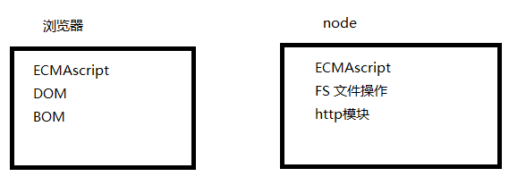

# node

nodeJs 是基于 chrome V8 引擎的 JavaScript 运行环境，nodeJs 允许 JavaScript 代码运行在服务端

+ node 不是一门新的编程语言，nodeJs 是在服务端运行 JavaScript 的运行环境

+ js解析器

  chrome ---> v8 引擎

  Firefox ---> spiderMokey

  IE ---> 查卡拉

+ 运行环境：写的程序要运行必须要有对应的运行环境

  php 代码必须要有 apache 服务器

  web端：浏览器是 JavaScript 的运行环境

  node端：nodeJs 就是 JavaScript 的运行环境

+ nodeJs 可以在服务端运行，因为 nodeJs 是基于 chrome V8 的 JavaScript 引擎


## 一、node 和 浏览器的区别

+ 相同点

  都是 JavaScript 的运行环境，能够解析 JavaScript 程序

+ 不同点

  node 无法使用 DOM 和 BOM 的操作；

  浏览器无法执行 node 中的文件操作功能

+ 图示

  

+ 命令行工具：CLI

+ 桌面应用程序：GUI


## 二、安装 node

+ 版本

  LTS版本：long-term-support  长期支持板

  Current版：Latest Features 版本，最新的特性会加入

+ 查看 node 版本

  node -v

+ 环境变量

  当要求系统运行一个程序，而没有告诉它程序所在的完整路径时

  1. 首先在当前目录中查找和该字符串匹配的可执行文件
  2. 进入用户 path 环境变量查找
  3. 进入系统 path 环境变量查找


## 三、运行 nodeJs 程序

+ 使用 node 执行 js 文件

  shift + 右键 ---> node 文件名.js

  vscode 插件 terminal

+ REPL 介绍

  1. `Read-Eval-Print-Loop` (交互式解释器)

     + R：读取。读取用户输入，解析输入 JavaScript 数据结构并存储在内存中
     + E：执行。执行输入的数据结构
     + P：打印。输出结果
     + L：循环。循环操作以上步骤，直到用户按下两次 `ctrl + c` 退出

  2. 在 REPL 中编写程序(类似于浏览器开发人员工具中的控制台功能)

     直接在控制台输入 node 命令进入 REPL 环境

  3. 按两次 `control + c` 退出 REPL 界面或者输入 `.exit`


## 四、global模块 - 全局变量

+ js 中有一个特殊的对象，称为全局对象(Global Object)。它及其所有属性都可以在程序的任何地方访问，即全局变量

+ 在浏览器 js 中，通常 window 是全局对象。而 nodeJs 中的全局对象是 global。所有的全局变量都是 global 对象的属性

+ 常用的 global 属性

  1. console：用于打印日志

  2. setTimeout / clearTimeout

     setInteral / clearInterval

  3. __dirname：当前文件路径，不包括文件名

     __filename：获取当前文件的路径，包括文件名

  4. 与模块化相关的

     require / exports / module


## 五、fs(file system) 模块

> 注意

+ 除了 global 模块中的内容可以直接使用，其它模块都是需要加载的

+ fs 模块不是全局的，需导入才能使用

  ```js
  var fs = require('fs');
  ```


> 读取文件

+ 语法： `fs.readFile(path[,options], funtion(err, data) {})`

+ 方式一：不传编码参数

  ```js
  const fs = require('fs');
  
  /**
   * @param {String} 文件的路径
   * @param {Function} 读取文件的回调函数
   */
  fs.readFile('data.text', function(err, data) {
    /** 遵循错误优先原则
     * err 错误对象
     *    读取失败时：err会包含错误信息
     *    读取成功时：err是null
     * data 读取成功后的数据(一个buffer对象)
     */
  });
  ```

+ 方式二：传编码参数

  ```js
  const fs = require('fs');
  
  /**
   * @param {String} 文件的路径
   * @param {String} 编码：设置返回一个字符串；不设置返回一个buffer对象。注意:图片无法转为utf-8格式
   * @param {Function} 读取文件的回调函数
   */
  fs.readFile('data.text', 'utf-8', function(err, data) {});
  ```

+ 读取文件说明

  nodeJs 中读取文件是异步的。 Js 代码执行占用一个线程，文件读取又是另一个新的线程。两个线程相互配合实现 API 异步

+ Buffer 对象

  1. Buffer 对象是 node 用于处理二进制数据的
  2. 任意的数据在计算机底层都是二进制数据
  3. 读取任意文件，返回结果都是二进制数据，即 Buffer 对象
  4. Buffer 对象可以调用 toString() 方法转为字符串


> 写文件

```js
const fs = require('fs');

/**
 * @param {String} file 写入的文件名(如果文件不存在，会自动创建)
 * @param {String} data 写入文件的内容(写入的内容会覆盖以前的内容)
 * @param {Function} callback 写文件后的回调
 */
fs.writeFile(file, data[, option], callback);

fs.writeFile('2.text', 'hello world', function (err) {});
```


> 追加文件

```js
const fs = require('fs');

/**
 * @param {String} path 追加的文件名(如不存在会自动创建)
 * @param {String} data 追加的文件内容
 * @param {Function} callback 追加文件后的回调
 */
fs.appendFile(path, data[, option], callback);
```


> 文件同异步说明

fs 模块中所有的文件操作，都提供了异步、同步两种方式

+ 异步方式：不会阻塞代码的执行

  ```js
  fs.readFile('2.text', 'utf-8', function (err, data) {});
  ```

+ 同步方式：会阻塞代码的执行

  ```js
  fs.readFileSync('2.text', 'utf-8');
  ```

+ 总结：同步操作虽简单，但影响性能，因此尽量使用异步


> 其它 API

```js
const fs = require('fs');

// 读取文件内容
fs.readFile(path, callback);
fs.readFileSync(path);

// 写入文件
fs.writeFile(path, data, callback);
fs.writeFileSync(path, data);

// 追加文件内容
fs.appendFile(path, data, callback);
fs.appendFileSync(path, data);

// 重命名文件
fs.rename(oldPath, newPath, callback);
fs.renameSync(oldPath, newPath);

// 删除文件
fs.unlink(path, callback);
fs.unlinkSync(path);

// 创建文件夹
fs.mkdir(path, mode, callback);
fs.mkdirSync(path, mode);

// 删除文件夹
fs.rmdir(path, callback);
fs.rmdirSync(path);

// 读取文件夹内容
fs.readdir(path, option, callback);
fs.readdirSync(path, option);

// 查看文件状态
fs.stat(path, callback);
fs.statSync(path);
```


## 六、path 模块

> 路径操作的问题

在读写文件是尅写**相对路径** 或 **绝对路径**

+ 相对路径：相对于<font color=ff0000> **执行 node 命令路径(相对于终端)** </font>

+ 绝对路径：解决相对路径相对于终端的问题

  __dirname：当前文件的目录

  __filename：当前文件(js 文件)的目录，包含文件名


> path 模块的常用方法

+ 说明

  关于路径，在 linux 中，路径分隔符是 `/`；windows 中，路径分隔符是 `\`，同时特能识别 `/`，经常出现 windows 下写的代码，在 linux 中执行不了。path 模块就是为了解决这个问题而存在，应该使用 path 模块来处理文件路径，而不是手动方式来处理

+ 常用 API

  ```js
  const path = require('path');
  
  // 拼接路径
  path.join();
  path.join(__dirname, '02-code/text.txt');
  path.join(__dirname, '02-code', 'text.txt');
  path.join('file', '02-code', 'text-txt');
  
  //返回文件路径的最后一部分
  path.basename(path[, ext]);
  
  // 返回路径的目录名
  path.dirname(path);
  
  // 获取路径的扩展名
  path.extname(path);
  ```

+ 其它 API

  ```js
  const path = require('path');
  
  // 返回文件路径的最后一部分
  path.basename(path[, ext]);
  
  // 返回路径的目录名
  path.dirname(path);
  
  // 获取路径的扩展名
  path.extname(path);
  
  // 判断目录是否是绝对路径
  path.isAbsolute(path);
  
  // 将所有的path片段拼接成一个规范的路径
  path.join([...paths]);
  
  // 规范化路径
  path.normalize(path);
  
  // 将一个路径解析成一个path对象
  path.parse(path);
  
  // 将一个path对象解析成一个规范的路径
  path.format(pathObj);
  ```


## 七、http 模块

+ 浏览器和服务器交互模型

  1. 地址栏输入地址
  2. 根据当前输入的网址与 DNS 查找其 IP 地址
  3. 服务器接收到浏览器发送的请求
  4. 服务器处理请求，将处理后的内容发送给浏览器

+ 创建服务器的基本步骤

  ```js
  // 1.导入http模块，http模块时node的核心模块，用于创建http服务器
  const http = require('http');
  
  // 2.创建服务器
  const server = http.createServer();
  
  // 3.服务器处理请求，监听浏览器发送过来的请求。只要有请求过来了，就出发这个事件
  server.on('request', (req, res) => {
    // req: 请求对象
    // res：相应对象
    res.end('hello http');
  })
  
  // 4.启动服务器，监听某个端口
  server.listen(3000, () => console.log('服务器已启动，请访问http://localhost:3000'))
  ```

+ 详细说明

  1. 给服务器注册 request 事件，只要服务器接收了客户端的请求，就会触发 request 事件
  2. request 事件有两个参数，request 表示请求对象，可以获取所有与请求相关的信息。response 是相应对象，可以获取所有与相应相关的信息
  3. 服务器监听的端口范围为 1 ~ 65535 之间，推荐使用 3000 以上的端口。3000 以下的端口一般留给系统使用

+ request 对象详解

  1. 常用属性

     req.headers：请求头部信息

     req.method：请求的方式

     req.rawHeaders：所有的请求头信息(数组的方式

     req.url：请求的地址(浏览器地址栏的地址只是一个标识

  2. 注意

     发送请求时，可能出现两次请求的情况，因为 chrome 浏览器会自动增加一个 favicon.ico 的请求

  3. post 请求参数的处理

     ```js
     server.on('request', (req, res) => {
       // 1. 接收post参数
       var postData = [];
       // 2.data事件：用于接收post请求数据
       var result = '';
       req.on('data', function (chunk) {
         // post请求传递数据可能很大，数据可能被分多块，多次传递，所以 +=
         result += chunk
       })
       // 3.end事件：当post数据接收完毕后触发
       req.on('end', function () {
         console.log(result)
       })
     })
     ```

  4. response 对象详解

     ```js
     server.on('request', (req, res) => {
       // res常用属性和方法
     
       // 1. 给浏览器发送请求体，可多次调用，从而提供连续的请求体(仅仅是写入数据，write就开始返给浏览器了，没有调用end表示没有结束)。
       res.write(data); // 注意顺序，应在设置响应头之后
       // 2. 通知服务器，所有响应头和响应主体都已被发送，可以将响应内容返回给浏览器了
       res.end(data);
       // 3. 响应的状态码，可以赋值
       res.statusCode;
       // 4. 响应的状态码信息，会根据statusCode自动设置
       res.statusMessage;
       // 5. 设置响应头信息，如content-type
       res.setHeader(name, value);
       res.setHeader('content-type', 'text/html;charset=utf-8'); // 解决乱码
       // 6. 设置响应头，同时可以设置状态码和状态码信息
       res.writeHead(statusCode, statusMessage, options);
       // 7. 服务器重定向：服务器可以通过http状态码让浏览器中的页面重定向
       res.writeHead(302, {
         'Location': '/'
       });
       res.end();
     })
     ```

     


## 八、mime 模块

+ 作用

  获取文件的 MIME 类型

+ 安装：并非 node 自带，需下载安装

  ```npm
  npm i mime
  ```

+ 使用

  ```js
  // 获取路径对应的 MIME 类型
  mine.getType(path);
  mine.getType('txt'); // ---> 'text/plain'
  // 根据 MIME 获取文件的后缀名
  mime.getExtension('text/plain'); // ---> 'txt
  ```

+ MIME 类型

  1. 定义

     MIME ---> Multipurpose Internet Mail Extensions

     多用途 Internet 邮件扩展类型是一种表示文档性质和格式的标准化方式

     浏览器通常使用 MIME 类型(而不是文件扩展名)来确定如何处理文档，因此服务器将正确的 MIME 类型附加到响应对象的头部非常重要

  2. 阻止嗅探： `'content-type': 'x-content-Type-options'`

  3. 设置正确的 MIME 类型

     `res.setHeader('content-type', MIME类型)`


# npm

## 一、npm 的基本概念

node package manager

+ npm 是 node 的包管理工具
+ npm 是世界上最大的软件注册表
+ 组成：网站 / 注册表(registry) / 命令行工具(CLI)
+ 作用：通过 npm 来快速开发中使用的包
+ 安装 node 自带 npm


## 二、npm 的基本使用

+ 初始化包

  1. 初始化包，创建一个 package.json 文件。项目都应先执行 npm init

     `npm init`

  2. 快速初始化一个包，不能有中文名

     `npm init -y`

+ 安装包

  `npm i` 命令会根据 package.json 里的 dependencies 去下载全部的依赖项

  1. 安装指定的包名到项目中

     `npm install 包名`

  2. 安装指定包的指定版本

     `npm install 包名@版本号`

  3. 注意

     如 npm 的版本5以下，需要自动更新 dependencies 。需要跟 `npm i 包名 --sava/-S`

+ 卸载包

  `npm uninstall 包名`

+ 更新包

  `npm update -g 包名`


## 三、package.json 文件

+ 定义

  package.json 文件是包(项目)描述文件，用于管理组织一个包(项目)，它是纯 JSON 格式

+ 作用

  描述当前项目(包)的信息，描述当前包(项目)的依赖项

+ 生成

  `npm init` 或 `npm init -y`

+ 作用

  1. 作为一个标准的包，必须要有 package.json 文件进行描述
  2. 一个项目的 node_modules 目录通常很大。不用拷贝 node_modules 目录，可以通过 package.json 文件配合 npm install 直接安装项目所在的依赖项

+ 描述内容

  注意：一个合法的 package.json 必须要有 name 和 version 两个属性

  ​			`npm run ...` 运行 package.json 中的脚本 scripts

  ```json
  {
    // 描述包的名字，不能有中文
    "name": "hrsass-components",
    // 描述包的版本信息，只修复bug更新z位；新增功能但向下兼容更新y位；如有大变动向下不兼容更新x位
    "version": "1.0.2",
    // 包的描述信息
    "description": "All components of hrsass",
    // 入口文件
    "main": "index.js",
    // 配置一些脚本
    "scripts": {
      "build": "rollup --watch --config rollup.config.js",
      "copy": "cp lib/hrsass-components.js ../project/node_modules/hrsass-components/lib"
    },
    // 关键字(方便搜索)
    "keywords": [],
    // 作者信息
    "author": "",
    // 许可证，开源协议
    "license": "ISC",
    // 项目的依赖，方便代码共享。通过npm i 可以直接安装所有的依赖项
    "dependencies": {
      "ant-design-vue": "^1.3.13",
      "babel-helper-vue-jsx-merge-props": "^2.0.3",
      "chokidar": "^3.0.2",
      "peer": "^0.2.10",
      "rollup": "^1.19.4",
      "rollup-plugin-json": "^4.0.0",
      "rollup-plugin-less": "^1.1.2",
      "rollup-plugin-license": "^0.11.0",
      "rollup-plugin-uglify": "^6.0.2"
    },
  }
  ```

  


## 四、本地安装和全局安装

+ 全局安装

  如想将其作为一个命令行工具，应安装到全局。这种安装方式，可以让你在任意目录下调用这个命令。如 less 命令，webpack ha-md 命令 http-server

+ 本地安装

  如果你自己的模块依赖于某个包，并通过 Node 的 require 加载。那么应选择本地安装，这种方式也是 `npm install` 命令的默认行为

  `npm i -g/--global 包名`

  全局安装到 `C:\Users\Administrator\AppData\Roaming\npm`

  `npm i 包名` 本地安装到当前项目的 node_modules 文件中作为项目的依赖


## 五、npm 下载加速

+ 方案一：直接设置

  `npm config set registry https://registry.npm.taobao.org/ --global`

  `npm config set disturl https://npm.taobao.org/dist --global`

+ 方案二：nrm

  1. nrm: npm registry manager (npm 仓库地址管理工具)

  2. 安装：`npm i -g nrm`

  3. 说明

     \# 带 * 表示当前正在使用的地址

     \# `nrm ls` 查看仓库地址列表

     \# `nrm use taobao` 切换仓库地址

+ 方案三：cnpm(安装后，此时下载地址为淘宝镜像)

  1. 作用

     中国版的npm，由淘宝提供，作用与 npm 相同

  2. 安装

     `npm i cnpm -g --registry=https://registry.npm.taobao.org/`

  3. 说明

     --registry 指定从哪个仓库下载这个包。临时指定


## 六、nodemon 自动重启

+ 作用：监视到 js 文件修改后，自动重启 node 程序
+ 安装：`npm i -g nodemon`
+ 使用：`nodemon app.js`


## 七、安装失败解决方案

+ 最佳解决方案：查看报的错误，针对性解决

+ 强制清除 npm 缓存(JSON parse neer... 时)

  `npm cache clear --force`


## 八、art-template 模板引擎

+ 安装：`npm install art-template`
+ 使用：基于模板路径渲染模块
+ `template(filename, data)`
  1. 参数1：文件的路径(必须为绝对路径)
  2. 参数2：数据
  3. 返回值：返回渲染后的内容


## 九、url 模块

+ 作用：用于 url 处理与解析

+ 注意：通过 url 拿到的查询参数都是字符串格式

  1. 导入 url 模块

     `const url = require('url')`

  2. 解析 url 字符串并返回一个 URL 对象

     参数1：表示要解析的 url 字符串

     参数2：是否将 query 属性(查询参数)解析为一个对象，如果为 true，则 query 是一个对象

     ```js
     const url = require('url');
     
     var result = url.parse('http://...details?id=18&name=xxh', true);
     
     // result.query ----> { id: 18, name: 'xxh'}
     result.query;
     ```

     


## 十、querystring 模块

+ 作用：用于解析与格式化url查询字符串

+ 注意：只在专门处理查询字符串时使用

+ 使用：

  ```js
  // 1. 引入 querystring模块
  const querystring = require('querystring');
  
  // 2. 将查询参数转为对象
  // 第一个参数为要解析的url查询字符串
  querystring.parse('foo=bar&abc=xyz'); // ----> { foo: 'bar', abc: 'xyz' }
  ```


# 模块化

es6 提供的才是规范的模块化，新规范无法直接使用

模块化规范：皆由社区提供，不标准，ES6有标准的

+ AMD 代表：`require.js`

  浏览器不具备模块化：require() / define()

+ CMD 代表：`sea.js`  浏览器端模块

+ common.js node 服务端模块

  `require()` / `module.exports`  

  node 天生具有模块化标准，<font color=red> **commonJS 有很多规范，模块化只是其中一种** </font>

+ UMD

  是一种模块化写法，兼容AMD、CMD、commonJS 以及不使用模块化语法


## 一、基本概念

在 node 中，应用由模块组成。node 中采用 commonJS 模块规范

+ 一个文件就是一个模块，所有代码运行在模块的作用域
+ 每个模块都是一个独立的作用域，在这个文件中定义的变量、函数、对象都是私有的
+ 模块加载顺序，按照代码中出现的顺序


## 二、node 中模块分类

+ 核心模块

  由 node 中本身提供，不需要安装，直接引入使用

  1. fs：文件操作模块
  2. http：网络操作模块
  3. path：路径操作模块
  4. url：解析地址的模块
  5. querystring：解析参数字符串的模块

+ 第三方模块

  + 由社区或个人提供
  + 比如：mime 模块 / art-template / jquery
  + 基本使用：npm 下载 ---> 引入 ---> 使用

+ 自定义模块

  + 由开发人员创建的模块( js 文件)

  + 基本使用

    创建模块 ---> 引入模块

  + 注意

    自定义模块的路径必须以 ./ 开头

    require('./a'); 推荐省略 .js 后缀


## 三、模块的导入和导出

+ 模块导入

  1. 通过 `require('fs')` 来加载模块
  2. 如果是第三方模块，需要先 npm 下载
  3. <font color=red> **如果是自定义模块，需要加上相对路径** </font>，可省略 .js 后缀，如果文件名为 index.js , 那么 index.js 也可省略
  4. 模块可以多次加载，但只会在第一次加载，同步加载，因为在本地加载速度快，不需要异步(服务器)

+ 模块导出 `module.exports`

  在模块内部，<font color=red> **module 变量代表的就是当前模块** </font>, 它的 exports 属性就是对外的接口。加载某个模块，加载的就是 module.exports 属性，这个属性指向一个空对象

  ```js
  // module.exports 指向的是一个对象，给对象添加属性即可
  module.exports.num = 123;
  module.exports.age = 18;
  
  // 通过 module.exports  也可以导出一个值
  module.exports = '123';
  ```

  module 对象：

  ​	node 内部提供一个 module 构造函数，所有模块都是 module 的实例

+ module.exports(<font color=red> **推荐使用** </font>) 与 exports

  1. <font color=red> **exports 是 module.exports 的引用** </font>

  2. **<font color=red> 注意：</font>**给 module.exports 赋值会切断与 exports 之间的联系

     + 直接添加属性两者皆可
     + 赋值操作时，只能用 module.exports

     `module.exports === exports ----> true`

  ```js
  // 等价操作
  module.exports.num = 123;
  exports.num = 123;
  // 赋值操作：不要使用 exports = {}
  module.exports = {};
  ```

+ 第三方模块(以 mime 包为例) 引入查找规则

  1. 先基于当前文件模块所属目录找 node-modules 目录

  2. 如找到，则去该目录中找 mime 目录

  3. 如找到，则找该目录的 package.json 文件

  4. 如找到，则找该文件的 main 属性(入口文件)

  5. 如找到，则拿到该属性对应的文件路径

  6. 如找到 mime 目录之后

     发现没有 package.json 或有 package.json 没有 main 属性 或有 main 属性，但指向的路径不存在，则 node 会默认去 mime 目录中找 index.js / index.node / index.json 文件

  7. 如找不到 index 或找不到 mime 或找不到 node_modules，则进入上一级目录找 node_modules，查找规则同上

  8. 如上一级未找到，继续向上，直到当前文件所属磁盘根目录，最后报错


# express

node 用于构建 web 服务器的一个常用框架。基于 nodeJS 平台，快速、开放的 web 开发框架

koa2 下一代的 web 服务器框架


## 一、基本使用

```js
// 1.安装 npm i express
// 2.导入
const express = require('express');
// 3.创建 express 实例， 也就是创建 express 服务器
const app = express();
// 4.路由
app.get('/', (req, res) => {
    res.send('Hello world!')
})
// 5.启动服务器
app.listen(3000, () => console.log('服务器启动成功！'))
// 说明：express 默认处理 404
// 说明：express 自动设置 mime 类型
```


## 二、API 说明

+ `express()`

  创建一个 express 应用，并返回

+ `app.get()`

  注册一个 get 类型的路由

  注意：只需注册路由，所有的请求都会被处理(未配置的请求路径，相应 404)

+ `res.send()`

  发送数据给客户端，并自动设置 content-type

  + 参数可以是字符串、数组、对象、Buffer
  + 只能使用一次

+ `req / res`

  与 http 模块中的作用相同是扩展后的请求相应对象


## 三、注册路由的三种方式

+ app.METHOD

  如：`app.get`(查询) / `app.post`(添加) / `app.delete`(删除) / `app.patch`(put修改)

+ `app.all(path, callback)`

  + <font color=red> **path 与请求地址必须完全相同(精准匹配)** </font>
  + 可以处理任意的请求数据

+ `app.use(path, callback)` ---> 更主要的是处理中间件

  + <font color=red> **注意：只要以 path 开头的请求地址都会被 use 处理** </font>
  + <font color=red> **可以处理任意的请求类型** </font>
  + path 参数可以省略，默认值为 './'
  + 场景：所有的请求都执行相同的操作(如：判断登录...)
  + `use(path, callback)` 中指定的 path 为虚拟路径，访问时要求输入 path，但 req.url 取得的不包含 path


## 四、模拟 Apache 服务器

+ 处理静态资源

  ```js
  app.use('/', express.static('web'))
  ```

  + 作用：将指定的文件夹作为静态资源目录，所有的请求都可以直接到这个目录中读取文件，读取后返回给浏览器
  + 说明：`express.static()` 可以调用多次
  + web：应该指定绝对路径


## 五、request 常用属性和方法

+ get 请求参数(获取请求路径中的参数，是一个对象)

  `req.query`

+ post 请求参数(获取 post 请求参数，需配置 body-parser 模块)

  `req.body`

  ```js
  // 获取 post 请求参数
  // 1.导入 body-parser 模块
  const bodyParser = require('body-parser')
  // 2.将 post 请求参数转为对象，存储到 req.body 中
  app.use(bodyParser.urlencoded({ extended: true }))
  // 3.此时就可以获取到 post 请求参数了
  console.log(req.body)
  ```

  

## 六、respose 常用属性和方法

```js
// 1.发送数据给客户端并自动设置 content-type
res.send()
// 2.发送文件给浏览器，并根据文件后缀自动设置 content-type，文件路径必须是绝对路径
res.sendFile(path.join(...dirname, 'index.html'))
// 3.设置 http 响应码同时发送 stateMessage
res.sendStatus(200)
// 4.设置响应头
res.set('content-type', 'text/plain')
res.set({
    'content-type': 'text-plain',
    cute: 'fang'
})
// 5.重定向
res.redirect('/index')
// 6.渲染模板：读取模板文件，使用配置好的模板引擎解析这个文件，最终将解析后的 html 内容发送给浏览器
res.render(path, obj) // 参1: 模板文件路径(可经app.set设置) 、 参2：模板中使用的数据
// 7.将参数转为 json 格式发送给浏览器
res.json({})
// 8.作用1：调用接口时，指定了 callback 参数，就返回 json格式的数据
//   作用2：调用接口时，没有指定 callback 参数，就返回 json 格式的数据
res.jsonp({})
```


## 七、express 使用模板引擎

方式1：1 ---> 2 ---> 3

方式2：1 ---> 2 ---> 4 

1. 安装

   ```npm 
   npm i art-template
   npm i express-art-template
   ```

2. 

   ```js
   // 为后缀为 html 的模板设置模板引擎
   app.engine('html', require('express-art-template'))
   ```

3. 使用

   ```js
   app.get('/', (req, res) => {
       // path: 文件路径(绝对路径，可经 app.set 设置)
       // obj: 数据
       res.render(path, obj)
   })
   ```

4. 简化写法

   ```js
   // 设置模板文件所在目录(指定从哪个目录读取模板文件，如果文件就在 views 文件夹下，此步可以省略)
   app.set('views', './')
   // 设置模板文件的后缀为 html
   app.set('view engine', 'html')
   // 渲染 index.html 模板文件，并发送给浏览器 参1： 'index' 默认去 views 文件夹读取
   res.render('index', { list: [] })
   ```


## 八、express 中外置路由使用

目的：将路由封装到一个独立的路由模块中，有利于代码的封装和模块化

```js
// route.js

// 1. 加载 express 模块
const express = require('express')
// 2. 调用 Route() 方法，得到路由容器实例
const router = express.Router()
// 3. 为 router 添加不同的路由
router.get('/', function(req, res) {
    res.send('Hello Express')
})
router.get('/add', function(req, res) {
    
})
// 4. 将 router 路由容器导出
module.exports = router
```

```js
// app.js

// 1. 加载 express 模块
const express require('express')
// 2. 加载上面自定义的路由模块
const router = require('./router')
const app = express()
// 3. 将自定义路由模块 router 通过 app.use() 方法挂载到 app 实例上，这样 app 实例程序就拥有了 router 路由
app.use(router)
app.listen(3000, () => console.log('启动成功！'))
```


## 九、中间件

+ 定义

  中间件 middleware 是一个函数，它可以访问请求对象 req，相应对象 res，可以通过 next 参数将中间件传递给下一个中间件

+ 功能

  1. 执行任何代码
  2. 修改请求和相应对象
  3. 终结请求 --- 相应循环
  4. 调用堆栈中的下一个中间件

+ 定义一个中间件

  ```js
  // 添加一个中间件
  app.use(function(req, res, next) {
      req.aa = '胡聪聪'
      res.bb = '很帅'
      // 中间件可以通过 next 传递给下一个中间件
      next()
  })
  ```

+ body-parser 中间件的使用

  + 获取 get 请求的参数：`req.query`
  + 获取 post 请求的参数：`req.body` (需要借助 body-parser 中间件)

  1. 安装

     ```npm
     npm i body-parser
     ```

  2. 使用

     ```js
     // 导入
     const bodyParser = require('body-parser')
     // 使用
     // extended：true ---> 表示使用 qs 库来解析查询字符串
     // extended：false ---> 表示使用 querystring 库来解析字符串
     // 解析 application/x-www-form-urlencode 类型的参数
     app.use(bodyParser, rlencoded({ extended: false }))
     
     // 解析 application/json 类型的 post 请求
     app.use(bodyParser.json())
     
     // 通过req.body 获取参数
     app.post('/', (req, res) => {
         console.log(req.body)
         res.send('哈哈')
     })
     ```

  3. 注意

     中间件是有顺序的