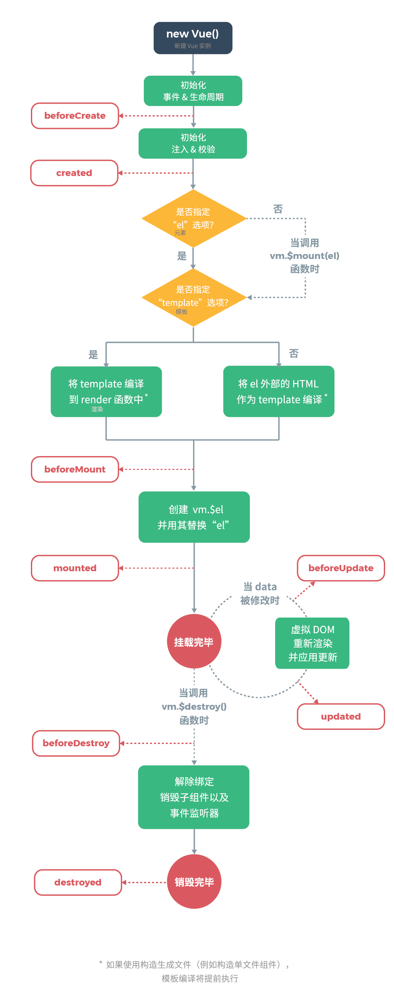

[TOC]

# Vue

## 一、介绍

> 库和框架的区别

+ Library

  库，本质上是一些函数的集合。每次调用函数实现一个特定的功能，接着把控制权交给作者，辅助开发人员来完成这个功能的

+ Framework

  框架，实际上就是一套完整的解决方案。框架中制定了一系列规则，使用框架时，只需把你的代码放到框架合适的地方，框架会在合适的时候调用你的代码

  + 框架规定了自己的编程方式，是一套完整的解决方案
  + 使用框架时，由框架控制一切，我们只需按规则写代码

+ 本质区别

  谁起了主导作用( <font color=red> **控制权** </font>, 控制反转 )

  库：控制权在开发人员，决定如何调用库中提供的方法

  框架：控制权在框架，控制整个流程

> MVVM 介绍

+ MVC 一种软件架构模式(设计模式)

  + M：Modal 数据模型(专门用于操作数据)，数据的 CRUD
  + V：View 视图(页面)
  + C：Controller 控制器(视图和数据模型沟通的桥梁，用于处理业务逻辑)

+ MVVM

  + M：Modal 数据模型
  + V：View 视图
  + VM：ViewModal 视图模型

+ 优势

  + MVC 模式，将应用程序划分三大部分，实现职责分离

  + 前端 FE 通过 JS 代码进行逻辑操作，将操作结果展示在页面中，也就是需要频繁的操作 DOM

  + MVVM 通过<font color=red> **数据双向绑定** </font>，让数据自动地双向<font color=red> **同步** </font>

    V(修改视图) ---影响---> M(数据)

    M(修改数据) ---影响---> V(视图)

  +  <font color=red> **数据驱动视图的思想，数据是核心** </font>

> Vue 中的 MVVM

+ 注意：不推荐直接手动操作 dom

  虽然 Vue 没有完全遵循 MVVM 模型， Vue 的设计无疑受到它的启发，因此文档中经常会使用 vm(ViewModal) 这个变量表示实例

+ 学习 vue 要转化思想

  数据驱动视图：不要想着怎么操作 dom， 而是想着怎么操作数据


## 二、起步

开发期间使用未压缩的 vueJS ，压缩的无报错提示

> 创建实例

```js
const vm = new Vue({
  /**
   * 作用：用来指定vue管理边界，也就是让vue管理页面中哪块内容
   * 注意：不要将vue管理边界挂载到body或html中
   */
  el: '#app',
  /**
   * 作用：指定数据为一个对象
   * data 中的数据可以直接在view(视图)中使用
   * 使用数据时要先声明再在视图中使用
   */
  data() {
    return {
      msg: '...'
    }
  },
  // vue中的计算属性
  computed: {},
  // vue中的方法
  methods: {},
  // 监视数据变化
  watch: {},
  // 局部过滤器
  filters: {},
  // 局部指令
  directives: {},
  // 局部组件
  components: {},
  // 路由
  router
})
```

> 表达式

特点：都有返回值

+ 字面量

  1 ，2，3，'abc'

+ 运算符+表达式

  如一元：`!false`

+ 表达式+运算符+表达式

  `1+2`

+ 表达式1 ？ 表达式2 ：表达式3

  如三元：`a > b ? a : b`

+ 左括号+表达式+有括号

  `(1 + 2)`

+ 表达式(参数列表)(函数调用)等


## 三、数据绑定

vue 中所有的数据绑定，都提供完全的 js 表达式支持

+ 插值表达式 `{{ }}`

  是 vue 提供的一种模板语法，叫做 Mastache(胡子)，又叫插值表达式

  + {{}} 可以使用任意的 js 表达式(只能表达式)
  + 插值表达式不能出现在 HTML 标签的属性中
  + {{}} 不能使用 if 或 for 等语句
  + 使用 {{}} 从 data 中获取数据，并展示在模板中
  + 数据对象的属性值发生了改变，插值处的内容会更新


## 四、指令

+ 定义

  指令( Directives ) 是带有 `v-` 前缀的特殊属性

+ 作用

  当表达式的值改变时，将其产生的连带影响，响应式作用于 dom

  <font color=red> **只要 vue 中的数据发生改变，页面中的指令或表达式会重新计算** </font>( vue 更新数据的特性)

> `v-modal`

+ 作用

  <font color="red"> **在表单(only use)元素上创建双向数据绑定** </font>，注意：`v-modal` 用在不同的表单元素中，有不同的功能(普通表单中表示 value，checkbox 等表示选中状态)

+ 双向数据绑定原理

  + 定义

    将 dom 与 vue 实现的 data 数据绑定到一起，彼此间相互影响

    数据的改变引起 dom 改变： m ----> v

    dom 改变也会引起数据改变： v ----> m

  + 原理：数据劫持

    ```js
    const obj = {}
    // 过渡存储
    let temp
    Object.defineProperty(obj, 'age', {
      get() {
        return temp
      },
      set(val) {
        temp = val
      }
    })
    /**
     * 1. 获取操作(obj.age)会执行get方法
     * 2. 设置操作(obj.age = 20)会执行set方法
     * 3. 参数
     *  3.1 表示给哪个对象定义
     *  3.2 表示添加的属性名称
     *  3.3 配置对象
     * 4. 注：这个方法Object.defineProperty()无法shim(浏览器兼容)，这个方法只兼容IE9及以上版本。这是vue只支持 IE9 及以上的原因
     */
    ```

> `v-text`

更新 dom 对象的 innerText

```html
<h1 v-text="msg"></h1>
```

> `v-html`

更新 dom 对象的 innerHTML

```html
<h1 v-html="msg"></h1>
```

> `v-bind`

+ 作用

  使用 data 中的数据，动态绑定元素属性值，应使用 `v-bind` 绑定，而不是插值表达式

+ 语法

  ```html
  <h1 v-bind:title="msg"></h1>
  <!-- 简写 -->
  <h1 :title="msg"></h1>
  ```

> 样式操作 class 和 style

+ calss

  + 语法：`v-bind:class="{}"` / `:class="{}"`

  + 说明

    值是一个对象，

    健：表示要添加的类名称 

    值：true：添加这个类 / false：移除这个类

  + 实现后

    ```html
    <div v-bind:class="{ active: true }"></div>
    <!-- 解析后得到 -->
    <div class="active"></div>
    
    <div :class="['active', 'text-danger']"></div>
    <!-- 解析后得到 -->
    <div class="active text-danger"></div>
    ```

+ style

  ```html
  <!-- 方式一：activeColor / fontSize 皆为data中的数据 -->
  <div v-bind:style="{ color: activeColor, 'font-size': fontSize + 'px' }"></div>
  
  <!-- 方式二 -->
  <div v-bind:style="[baseStyles, otherStyles]"></div>
  ```

> `v-on`

+ 作用：绑定事件
+ 语法：`v-on:click="say"`  / `v-on:click="say()"`
+ 简写：`@click="say"`
+ 说明：绑定的事件从 methods 中获取
  + 事件中的 this 表示当前 vue 实例
  + 通过 this.数据名 可以获取操作数据
+ 事件对象 e
  + 如果绑定事件时，没有添加小括号传递参数，那么在事件处理程序中用过第一个参数 <font color=red> **e** </font>获取到事件对象
  + 如果绑定事件时，添加了小括号，此时无法直接在事件处理程序中获取到事件对象，如果要获取事件对象应传入一个参数叫 <font color=red> **$event** </font> 。$event 是 vue 内部约定好的表示事件对象
+ 事件修饰符
  + 可只有修饰符的情况 `v-on:click.prevent`
  + 修饰符可串联 `@click.stop.prevent`
  + 有顺序执行
  + 分类
    1. `.stop` 阻止冒泡，调用 `event.stopPropagation()`
    2. `.prevent` 阻止默认行为，调用 `event.preventDefault()`
    3. `.capture` 添加事件侦听器，使用事件捕获模式
    4. `.self` 只当事件在该元素本身触发时，才会触发事件
    5. `.once` 事件只触发一次
    6. `.passive` 不能与 `.prevent` 一起使用，`.prevent` 将会被忽略，`.prevent` 会告诉浏览器你不想阻止事件默认行为
    7. `.native` 监听一个原生事件
    8. `.sync` 允许子组件修改父组件中的 props 数据，此处的修改并不是直接给 props 赋值，而是 `.sync` 修饰符内部通过子组件 ---> 父组件事件通讯的机制来修改了父组件中的数据。所以，最终数据还是由父组件修改的

> `v-for`

+ 作用：基于源数据多次渲染元素或模板块

+ 用法

  ```html
  <!-- 1. 基本用法 -->
  <div v-for="item in items"> {{ item.text }} </div>
  <!-- 2. 遍历数组 item为当前项 index为当前项下标 -->
  <div v-for="(item, index) in list">{{ item }}--{{ index }}</div>
  <!-- 3. 遍历对象 item为值 key为键 index为索引 -->
  <p v-for="(item, key, index) in obj">{{ item }}</p>
  <!-- 4. -->
  <p v-for="item in 10">{{ item }}</p>
  ```

+ key 属性

  <font color=red> **就地复用策略** </font>，标签不动，内容动。通过增加 key 属性来改变就地复用策略，此时就地复用会根据 key 值找对应的结构复用

  + 推荐：使用 `v-for` 时提供 key 属性

  + 就地复用

    ```html
    <p flag="1">aaa</p>
    <p flag="1">eee</p>
    ```

    1. 插入数据后，原有的标签 `<p>aaa</p>` 没有移动位置，而是将p标签的内容往后移动位置，标签不动
    2. 插入的导致原有内容后移，最后只新建一个p标签
    3. 这个默认的模式是高效的，只适用于不依赖组件状态或临时 dom 状态(对于依赖临时状态的列表渲染，这种就地复用策略有问题)
    4. 解决：<font color=red> **给每项都添加 key 属性，key作为身份标识具有唯一性** </font>
    5. <font color=red> **组件中使用 `v-for` key 属性为必须** </font>

> `v-of` / `v-else-if` / `v-else`

```html
<p v-if="num > 10">大于10</p>
<p v-else-if="num > 5">小于10大于5</p>
<p v-else>小于等于5</p>
```

+ 类似于 js 中的 `if-else`
+ `v-if` 和 `v-else-if` 和 `v-else` 是配合使用的，中间不得有第三者

> `v-cloak`

clock 意为斗篷、斗笠、遮盖物

+ 作用：用于解决 ` {{ }}` 插值表达式<font color=red> **闪烁** </font>的问题 

+ 数据渲染过程

  由 `{{ }}` 插值表达式 ---到--> 数据的过程

+ 使用

  1. 在标签上加 `v-cloak`

  2. 加 style 

     `[v-cloak] { display: none }`

+ 原理

  先隐藏 ----> 再由 vue 去除 `v-cloak` 属性

> `v-if` / `v-show`

+ `v-if`

  根据表达式的值的真假条件，销毁或重建元素

+ `v-show`

  根据表达式的真假值，切换元素的 display 属性

+ 区别

  `v-if` 会在 html 结构中都不存在了

  `v-show` 在 html 结构中还是存在，只是简单的切换 display 属性

+ 如何选择

  + 如果频繁的展示和隐藏某个元素，应用 `v-show`
  + 如果元素要么展示要么隐藏，应用 `v-if`

> 修通修饰键

如下修饰符实现仅在按下相应的按键时才触发鼠标或键盘事件的监听器

1. `.ctrl`

2. `.alt` 

3. `.shift` 

4. `.meta`

   mac  ---> meta ---对应---> command

   window ---> meta ---对应---> 田微标

+ 示例

  ```html
  <!-- Alt + c -->
  <input @keyup.alt.67="clear" />
  <div @click.ctrl="clear">Do Something</div>
  ```

  说明：修饰键与常规键按键不同，在与 keyup 事件一起使用时，事件触发时，修饰键必须处于按下状态，才能触发 `keyup.ctrl`

+ `.exact` 修饰符

  `.exact` 修饰符允许你控制由精确的系统修饰符组合触发事件

  ```html
  <!-- 有且只有 ctrl 被按下时才触发 -->
  <button @click.ctrl.exact="handleClick">A</button>
  <!-- 没有任何系统修饰符被按下的时候才触发 -->
  <button @click.exact="handleClick">A</button>
  ```

+ 鼠标按钮修饰符

  `.left` / `.right` / `.middle`

  这些修饰符会限制处理函数仅响应特定的鼠标按钮

> 提升性能

+ `v-pre`

  + 作用：跳过这个元素和它的子元素的编译过程，可显示原始的 mustache 标签(跳过大量没有指令的节点会加快编译)，一般用于文章等大量文本内容的位置，这些内容中没有指令表达式，因此，这些内容不需要经过 vue 解析
  + 默认：vue 会遍历所有的标签，分别判断每个标签中是否有表达式或指令需要解析

+ `v-once`

  只渲染元素和组件一次

+ 键值修饰符(按键修饰符)

  + 只能用在按键事件中(keydow、keypress、keyup)

  + 只能在指定的按键按下时才生效

  + 常用：`.enter` `.tab` `.delete` `.esc` `.space` `.up` `.down` `.left` `.right` `.数字(keycode码)`

  + 自定义按键修饰符别名(2.5.0 新增) 自动匹配按键修饰符

    `Vue.config.keycodes.f1 = 112`


## 五、动态添加数据

+ 注意

  <font color=red> **只有 data 中的数据才是响应式的，动态添加进的数据默认为非响应式** </font>

  原因：Vue 在创建实例时，内部会遍历 data 中所有的数据，将这些数据改造为 `Object.defineProperty()` 的形式，使这些数据变为响应式数据

+ 解决方案

  通过以下方式实现<font color=red> **动态添加数据** </font>的响应式

  ```js
  // 适用于添加单个属性
  Vue.set(object, key, value)
  // 适用添加多个属性
  Object.assign()
  ```

+ `Vue.set`

  ```js
  // Vue 构造函数
  Vue.set(vm.stu, 'gender', 'male')
  // vue 实例
  vm.$set(给哪个对象, 属性， 值)
  ```

+ `Object.assign`

  + 作用

    将后面对象参数中的属性与前面对象参数中的属性合并，合并后返回一个新对象

  + 注意

    如果有属性重名，以后的为准

  ```js
  // Object.assign
  // 对于对象来说，即使没有数据，不会报错，但也不是响应式的
  vm.stu = Object.assign({}, vm.stu, { gender: 'fe', height: 180 })
  ```


## 六、异步 DOM 更新

+ 说明

  <font color=red> **Vue 异步执行 Dom 更新，监听所有数据改变，一次性更新 dom** </font>

+ 优势

  可以去除重复数据，对于避免不必要的计算和避免重复 dom 操作上十分重要

+ `Vue.nextTick(callback)`

  在 DOM 更新后，执行某个操作( dom 操作)

  + `vm.$nextTick(callback)`
  + $el：表示 Vue 管理区域的根元素，是一个 dom 对象

  ```js
  methods: {
      fn () {
          this.msg = 'change'
          this.$nextTick(() => {
              // 获取更新后的 dom 内容，因为此时获取不到内容，dom内容还未更新，所以通过以上的方法获取
          })
      }
  }
  ```

+ 说明

  <font color=red> **前端中，dom 操作时最慢的。所以，如果要提升性能，要尽量减少重绘和重排(回流)。也就是减少 dom 操作** </font>

+ 为什么采用异步数据更新

  比如修改 count 数据 1000 次，如果不是异步更新 dom，只要数据将改变 dom 就更新，那么需要更新 1000 次。如果采用异步更新，数据改变后立即更新 dom，而是等数据不再更新时，一次性将本次数据改变，这样只需更新一次 dom 就行了


## 七、computed 计算属性

+ 计算属性是一个方法

+ 使用计算属性的时候，要当做属性来使用，不能调用

+ 特点：计算属性更新

  只有当计算属性依赖的数据改变时，计算属性才会重新计算，也就是只有跟计算属性相关的数据改变时，计算属性才会被重新计算

+ 计算属性的值由方法的返回值决定

+ 使用场景

  希望使用 data 中现有的数据而得到一个新的数据时

  比如：data 中有 num1、num2，想根据 num1 和 num2 得到 num3，就应用计算属性。num1 和 num2 称为 num3 的依赖项

+ 只有当依赖项发生改变时，计算属性才会重新计算

+ computed 中的属性不能与 data 中的属性同名，否则报错

+ 计算属性 vs 方法

  + <font color=red> **vue 中数据改变后，页面中对用的 dom 内容就会更新(特性！)** </font>
  + 使用方法，只要应用在页面的数据由更新，页面的数据就会进行重新计算
  + 使用计算属性：只有相关的数据更新，才会重新计算，性能优于方法

+ 区别

  <font color=red> **计算属性是基于它们的依赖进行缓存的，只有相关依赖发生改变时，才会重新求值。这意味着只要依赖项未发生改变，访问时，计算属性会立即返回之前的计算结果。而不必再次执行函数。相比方法，每当触发重新渲染时，调用方法总会再次执行函数** </font>


## 八、watch 监视数据变化

+ 作用： 监视数据的改变，当表达式的值改变后，会调用指定的回调函数，完成响应的监视操作

+ 说明：无法监视不存在的数据

```js
watch: {
    // 添加一个方法，方法的名称为要监视数据的名称
    // 1. 值监听的监听形式
    a: function(val, oldVal) {
        // val 当前值 oldVal 旧值
    },
    // 2. 对象的监听形式
    b: {
        // 监视对象属性的变化，此时val和oldVal都相同，指向同一对象(相同的引用)
        handler: function(val, oldVal) {},
        // 深度监听数据变化，可监听到对象属性的改变
        deep: true,
        // 立即出发监视, 此时第一次触发时，oldVal为undefined
        immediate: true
    },
    // 3. 只监视user对象中的age属性的变化
    'user.age': function(val, oldVal) {}
}
```


## 九、filter 过滤器

注意：<font color=red> **先创建全局过滤器，再创建 vue 实例** </font>

+ 作用

  <font color=red> **数据格式化** </font>：将数据按照我们指定的一种格式输出

+ 场景

  `{{ }}` 和 `v-bind` 表达式中

+ 分类

  + 全局过滤器

    + 语法

      `vue.filter(参1, 参2)`

      参1：过滤器名

      参2：使用过滤器时的回调(回调函数的返回值表示格式化后的数据)

    + 用法

      ```js
      // 声明
      Vue.filter('formatData', (val, format) => {
          // val 表示需要格式化的数据
          // 参1是固定的，后面的参数随意传入
          return val.moment.format(format)
      })
      // 使用 {{ 数据 | 过滤器名 }}  | ---> 管道符号
      {{ date | formatData('YYYY-MM-YY') }}
      ```

      

  + 局部过滤器

    局部过滤器时再某一个 vue 实例内部创建的，只在当前实例中起作用

    ```js
    {
        data() {
            return {}
        },
        filters: {
            filterName: (val, format) {
                
            }
        }
    }
    ```


## 十、$refs

**<font color=red> 持有注册过 ref 特性的所有 dom 元素和组件实例 </font>**

dom对象集合：dom添加 ref 属性可以将此 dom 添加到 $refs 中


## 十一、插槽

`<slot></slot>`：slot 是一个占位符，将来组件的子节点会替换 slot

+ 单

  ```js
  // 组件
  Vue.component('msg-box', {
      template: `
  		<div>
  			<h3>提示：</h3>
  			<div>
  				<slot>
  					<p>默认值，当没有传入slot的时候，此处生效</p>
  				</slot>
  			</div>
  		</div>
  	`
  })
  ```

  ```html
  <!-- html -->
  <msg-box>
  	<p>这里的内容会替换上面的slot标签</p>
  </msg-box>
  ```

+ 多(具名插槽)

  具名插槽：在给组件传递子节点时，可以通过 `name=head` 方式来指定哪个插槽传递数据

  具名插槽和匿名插槽可以混合使用(位置要对上)

  ```js
  // 组件
  Vue.component('msg-box', {
      template: `
  		<div>
  			<slot name="head" />
  			<slot name="content" />
  		</div>
  	`
  })
  ```

  ```html
  <!-- html -->
  <msg-box>
  	<span name="head"></span>
      <p name="content"></p>
  </msg-box>
  ```

+ 作用域插槽

  ```vue
  <!-- p 默认的作用域为app，而不是msg-box，但p又是msg-box的插槽 -->
  <div id="app">
      <msg-box>
      	<p>
              
          </p>
      </msg-box>
  </div>
  <!-- 解决方法 -->
  <!-- msg-box 中 -->
  template: `
  	<div>
  		<slot :data="msg"></slot>
  	</div>
  `
  <!-- app 中-->
  <!-- scope是对象，data为传递过来的数据，scope可以解构 -->
  <div id="app">
      <msg-box>
      	<p slot-scope="scope">
              {{ scope.data }}
          </p>
      </msg-box>
  </div>
  	
  ```

  

## 十二、template 内置组件

template 是一个容器，用来包裹多个元素，但是 template 不会渲染在页面中。这样，可以在不改变页面解构的情况下，来控制多个元素的显示和隐藏

```html
<template v-if="isShow">
	<p></p>
	<p></p>
	<p></p>
</template>
```

+ v-show：通过给当前标签添加 css 样式机制吗，控制元素的展示和隐藏。但 template 根本不会出现在页面中，所以加了 `display: none` **<font color=red> 无效 </font>**
+ v-if：根据值决定是否渲染，如为 false，这整个标签根本不会渲染就不会出现在页面中


## 十三、生命周期

+ 实例生命周期：一个组件(实例)从开始到最后消亡所经历的各种状态，就是一个组件(实例)的生命周期

+ 生命周期钩子函数的定义：从组件被创建 ----> 到组件挂载到页面上运行 ----> 再到页面关闭组件被卸载。这三个阶段总是伴随着各种事件的发生，这些事件统称为生命周期钩子函数

+ 生命周期阶段

  1. 挂载阶段(进入页面)
  2. 更新阶段(当数据发生改变)
  3. 卸载阶段(实例卸载)

  注意：

  1. vue 在执行过程中会自动调用生命周期钩子函数
  2. 钩子函数的名称都是 vue 提供好的

+ 虚拟 dom 对象(virtual dom)

  就是一个普通的 js 对象，用于描述 html 结构

+ diff 算法

  查找两个对象的不同之处，找到不同之处后只将不同的地方更新到视图中(<font color=red> **vue 中通过虚拟 dom 对象和 diff 算法来实现高效的视图更新** </font>)

+ vue更新 dom 方式

  只将发生改变的 dom 更新。diff算法来找不同的地方。vue 会比较数据更新前后的两个虚拟 dom 对象，通过 diff 算法找到两个对象的不同之处

  1. 第一次渲染创建 `虚拟dom树` (js 对象)
  2. 数据发生改变后，生成一颗新的 dom 树
  3. 对比新旧两颗虚拟 dom 树，通过 diff 算法找到记录差异地方
  4. 只将差异的地方重新渲染到页面中



> 挂载阶段

+ `beforeCreate()` <font color=red> **此时，无法获取data中的数据、methods中的方法** </font>

  ```js
  beforeCreate() {
      // 不常用
      // 在实例初始化之后，数据观测 data observer 和 event / watcher 事件配置之前被调用
      // 此时，无法获取data中的数据、methods中的方法
  }
  ```

+ `created()` <font color=red> **有数据，但模板还未渲染** </font>

  ```js
  created() {
      // 常用：可以调用methods中的方法，可以改变data中的数据
      // 场景：发送ajax请求数据
  }
  ```

+ `beforeMount()` 挂载之前

  ```js
  beforeMount() {
      // 挂载之前被调用
      // 该钩子函数执行时，vue还没有渲染模板，此时获取的还是模板内容
  }
  ```

+ `mounted()` <font color=red> **模板已渲染** </font>

  ```js
  mounted() {
      // 该钩子函数执行的时候，vue已经完成模板渲染。此时，可获取dom对象，进行dom操作
      // 场景：操作dom，发送ajax请求
  }
  ```

> 更新阶段

+ `beforeUpdate()` <font color=red> **此时获取到的数据是更新后的数据，但获取页面中的dom元素是更新之前的** </font>

  ```js
  beforeUpdate() {
      // 数据更新时调用，发生在虚拟dom重新渲染和打补丁之前
  }
  ```

+ `update()`

  ```js
  update() {
      // 组件dom已经更新，可执行依赖于dom的操作
  }
  ```

> 卸载阶段

+ `beforeDestroy()`

  ```js
  beforeDestroy() {
      // 实例销毁之前调用，再次实例仍然完全可用
      // 场景：实例销毁之前，执行清理任务。比如：清理定时器
  }
  ```

+ `destroyed()`

  卸载所有的 `watcher`、子组件已经事件(执行清理工作)。vue 会主动清理自己的内容(响应式数据、@事件)

  ```js
  destroyed() {
      // vue实例销毁后调用，调用后，vue实例指示的所有东西全解绑，所有的事件监听器会被移除，所有的子实例也被销毁
  }
  ```


## 十四、自定义指令

+ 作用：<font color=red> **进行 dom 操作** </font>

+ 场景

  对纯 dom 元素进行底层操作。比如：文本框获得焦点

+ 分类

  + 全局指令
  + 局部指令

> 全局指令

```js
Vue.directive('directiveName', {
    bind() {},
    update() {}
})
// bind 和 update 合写写法
vue.directive('directiveName', function(el, binding) {
    el.style.color = binding.value
})
```

> 局部指令

```js
{
    directives: {
        directiveName: {}
    }
}
```

> 指令的钩子函数

+ `bind` 和 `inserted` 的区别

  1. dom 对象还没有插入到页面中
  2. bind 中只能对元素自身进行 dom 操作，而无法对父级元素操作。<font color=red> **只会调用一次，当指令绑定到当前元素时调用** </font>

  ```js
  bind(el) {
      console.log(el.parentNode) // null
  }
  // 当元素被插入到父节点时调用(渲染时)
  inserted(el) {
      console.log(el.parentNode) // <div>...
  }
  ```

+ `update` 和 `componentUpdated` 的区别

  ```js
  // dom重新渲染前
  update(el) { // 当指令对应的数据发生改变时
  	console.log('update', el.innerHTML)    
  }
  // dom重新渲染后
  componentUpdated(el) {
      console.log('componentUpdated', el.innerHTML)
  }
  ```

+ `unbind`

  ```js
  // 指令与元素解绑时调用(页面移除此元素时)
  unbind(el) {}
  ```

+ 说明

  1. 对象字面量

     如果指令需要传入多个值时，可以传入一个 js 对象字面量，指令能够接收所有合法的 js 表达式

     ```html
     <div v-demo="{ color: 'white', text: 'hello' }"></div>
     ```

  2. 钩子之间数据共享：建议通过元素的 dataset 来进行

> 指令的参数

所有的钩子函数两个参数 el 和 binding

+ el：当前元素
+ binding： 一个对象，包含以下属性
  1. name：指令名，不包含 v- 前缀
  2. value：指令的绑定值，如 `v-my-directive="1+1"` 中，绑定值为 2
  3. oldValue：指令绑定的前一个值，仅在 update 和 componentUpdated 钩子中可用
  4. expression：字符串形式的指令表达式，如 `v-my-directive="1+1"` 中的表达式为 `1+1`
  5. arg：传给指令的参数，可选，如`v-my-directive:foo` 中，参数为 `foo`
  6. modifiers：一个包含修饰符的对象，例如 `v-my-directive.foo.bar` 中，修饰符对象为 `{foo: true, bar: true}`


## 十五、组件化开发

+ 概念：将一个完整的页面，分离成一个一个小的组件
+ 优点：容易维护、复用

> 全局组件

+ 定义(注册)

  `Vue.component(tagName, options)`

  参1：表示组件名称

  参2：配置对象，此配置对象与 vue 实例的配置对象几乎相同

  ```js
  // 示例
  Vue.component('Hello', {
      // 作用：指定组件模板
      template: '',
      // 同vue示例
      methods: {},
      // 不同vue示例，此data为函数
      data(){
          return {}
      }
  })
  ```

+ 使用(HTML结构中)

  ```html
  <Hello></Hello>
  ```

+ 注意点

  1. 组件的模板有且只有一个<font color=red> **根元素** </font>

  2. <font color=red> **组件也有自己的数据，通过 data 配置项指定组件的数据，但 data 是一个函数** </font>

     ```js
     // 返回值为一个对象，该对象的属性，表示该组件要使用的数据
     // 目的：为了多个相同组件之间的data互不影响
     data() {
         return {
             
         }
     }
     ```

  3. vue 实例中的配置项，几乎都可以在组件中使用

     如：template / data() / methods / 实例钩子函数 / computed / watch / filter / directive

  4. 组件时特殊的 vue 实例

     + 组件时一个独立的个体，组件之间的数据是无法相互使用的
     + 组件必须要在实例(如 app)之前创建，因为实例在挂载时，要先有组件

> 局部组件

只在当前实例有效(当前实例或模板中使用)

```js
// 在vm中
components: {
    Hello: {
        template: ''
    }
}
```

> 组件通讯

1. 组件时一个独立的个体，封闭的个体

2. 组件中的数据，默认情况下，只能在组件内部使用

3. 使用组件在开发项目时，多个组件之间可能需要相互配置，可能要使用另一组件的数据，这就产生了组件之间相互通讯的问题

4. 组件通讯的三种情况

   + 父组件 ---> 子组件
   + 子组件 ---> 父组件
   + 非父子组件之间的通讯

5. <font color=red> **单向数据流** </font>

   父组件数据发生改变，变化的数据会向下流动到子组件中，反则不行，类const机制

6. 自定义事件名：`v-on` 事件监听器在 dom 模板中会被自动转换为全小写，建议使用 `kebb-case` 事件名

7. props：html 中的 prop 大小写不敏感

+ 组件通讯：父传子(父为实例，子为模板组件)

  + 方式：通过属性传递的方式，实现父子组件的通讯。通过 props 配置执行组件能够接受数据：`props['parentMsg']`

  + 步骤

    1. 在父组件的模板中，给子组件增加一个自定义的属性

        `v-bind:parentMsg="msg"`

    2. 子组件通过 props 属性进行接收，<font color=red> **props负责接收父组件传递的数据** </font>

       `props: ['parentMsg']`

    3. 子组件在内部模板中可以直接使用传递过来的值
    4. 注意：<font color=red> **props 是只读属性** </font>，无法修改，只能使用，用法相当于本身的 data 中

+ 组件通讯：子到父（子组件为模板组件，父组件为vue实例)

  整体思路

  1. 父组件提供一个方法，作为自定义事件，传递给子组件

     ```html
     // 父组件给子组件注册一个自定义事件
     <child @fn="getChildMsg"></child>
     ```

  2. 子组件触发这个自定义事件，触发事件时把数据传递给父组件

     ```js
     // 子组件调用方式
     // 参1：表示要触发的事件，后面可以传参，父组件通过形参接收
     this.$emit('fn')
     ```

+ 组件通讯：非父子组件(兄弟组件)

  非父子组件通过一个空的 vue 实例来传递数据

  ```js
  // bus 事件总线
  const bus = new Vue()
  
  // 思路：A ---> B 传智
  // 1. 组件B给bus注册一个事件，监听事件的处理程序，在组件创建时，给bus注册事件
  created() {
      bus.$on('get', msg => {})
  }
  // 2. 组件A触发bus上对应的事件，把值当成参数来传递
  methods: {
      send() {
          bus.$emit('get', this.msg)
      }
  }
  // 3. 组件B通过事件处理程序可以获取到传递的值
  bus.$on('get', msg => {})
  ```


## 十六、vue 单文件组件

`signle-file component`

+ 后缀名 `.vue`，该文件需要被编译后才能在浏览器使用
+ 单文件组件依赖两个包 `vue-loader` `vue-template-compiler`
+ 安装 `npm i  vue-loader vue-tempplate-compiler -D`

> 单文件组件使用步骤

1. 安装

   ```npm
   npm i vue-loader vue-template-compiler -D
   ```

2. `webpack.config.js` 中配置 `.vue` 文件的 loader

   ```js
   { text: /\.vue$/, use: 'vue-loader' }
   ```

3. `webpack.config.js` 中添加 plugins

   ```js
   const VueLoaderPlugin = require('vue-loader/lib/plugin')
   new VueLoaderPlugin()
   ```

4. 创建 `App.vue` 单文件组件

5. 在 `main.js` 入口文件中，导入 vue 和 App.vue 组件。通过 render 将组件与实例挂在一起

> 有单文件组件后在入口文件 main 中的使用

```js
// main.js
import Vue from 'vue'
// 导入组件
import App from './App.vue'
//
const vm = new Vue({
    el: '#app',
    render: function(createElement) {
        return createElement(App)
    }
})
```

> 单文件组件

```vue
<template></template>
<script>
	// 组件中的逻辑代码
    export default {}
</script>
<style lang="less">
	// 样式，可指定lang，lang等于less时。表示可使用less编译
</style>
```

```js
// webpack.config.js
const VueLoaderPlugin = require('vue-loader/lib/plugin')
{ test: /\.vue$/, loader: 'vue-loader' }
plugins: [ new VueLoaderPlugin() ]
```


## 十七、vue 项目中样式问题

两个 component 之间重名的样式会发生覆盖

解决方式：给 style 标签添加 scope 属性，scope 属性添加后，样式只对组件中存在的内容生效。如果结构是通过类似于 innerHTML / v-html **<font color=red> 动态创建 </font>**的，**<font color=red> 那么改文件写的样式不会生效与动态创建的内容 </font>**

```vue
<style scope></style>
```


## 十八、vue 脚手架 vue-cli

+ 作用：通过一条命令，快速生成 vue 项目的目录结构。生成的项目中，webpack 的所有配置项都已经自动配置完成

+ 注意：初始化脚手架的时候，所在的路径不能有中文

+ vue 脚手架的使用步骤

  1. 全局安装 `npm i vue-cli -g`

  2. 通过 vue 命令初始化一个带有 webpack 模板的项目结构 `vue init webpack 项目名称`

     + `vue-build` 选择 vue 编译模式

       `runtime-compiler` ---> 完整版：运行时+编译器

     + `use eslint to lint your code` 是否使用 Eslint 检验你写的代码

     + 代码风格

       `standard` / `airbnb`

     + `setup unit text` 单元测试 ---> N

     + `setup eze tests with Nighustch` 端到端测试 ---> N

+ vue 不同构建版本说明

  vue 中提供两种编译模式

  1. 完整版：运行时+编译器：既可使用 render 函数，也可使用 template 模板

  2. 只包含运行时版本

     我们自己手动通过 webpack 配置的打包环境中，通过 `import Vue from 'vue'` 导入的 vue 就是运行时版本的。`vue-runtime-esm.js` 只能用 render 函数来渲染组件

  3. 以上两个版本的区别

     完整版中既包含了运行时，又包含了编译器。编译器就是用来解析 vue 模板的(可以理解为就是 vue 实例中 template 配置项)。如果在运行时版本中，无法使用 template 模板内容，因为运行时版本中没有编译器，也就无法编译 template 模板内容，此时应用 render 函数来渲染组件内容

     ```js
     component: { App },
     render(c) {
         return c(App)
     }
     ```

     


## 十九、Json-Server 工具

https://github.com/typicode/json-server

1. create a xxx.json file with some date

   ```json
   {
     "posts": [
       { "id": 1, "title": "json-server", "author": "typicode" }
     ],
     "comments": [
       { "id": 1, "body": "some comment", "postId": 1 }
     ],
     "profile": { "name": "typicode" }
   }
   ```

2. Start JSON Server

   ```cmd
   json-server --watch db.json
   ```

3. ok, can use it

   以请求 list 为例

   | 方法   | 路径    | 说明             |
   | ------ | ------- | ---------------- |
   | Get    | /list   | 获取全部数据     |
   | Get    | /list/1 | 获取 id=1 的数据 |
   | Post   | /list   | 增加数据         |
   | Put    | /list/1 | 更新 id=1 的数据 |
   | Patch  | /list/1 | 更新 id=1 的数据 |
   | Delete | /list/1 | 删除 id=1 的数据 |

4. 说明

   json-server 提供 REST API

   RESR API 约定：

   + 查询数据 Get
   + 添加数据 Post
   + 删除数据 Delete
   + 修改数据
     + Put：Put请求必须提供完整的数据
     + Patch：只要提供更新部分的数据


## 二十、项目上线

+ 打包 ---> dist

  ```npm
  npm run build
  ```

+ 优化(文件过大)

  1. 按需加载

     首屏加载时间：首屏加载的快慢是衡量项目性能的一个重要指标

     按需加载：只加载首屏需要用到的内容，不在首屏的内容不加载，等到用到哪些内容的时候再加载

     实现：**<font color=red> vue 异步组件(路由懒加载) </font>** + webpack代码分离功能( vue-cli 已经配置好了，只要将组件修改为异步组件即可 )

     异步组件写法：

     ```JS
     const Home from '@/components/hom'
     // 改为
     const Home = () => import('@/components/home')
     ```

  2. 将两个组件一起打包

     ```js
     const Goods = () => import(/* webpackChunkName: "goods" */ '@/components/Goods')
     const GoodAdd = () => import(/* webpackChunkName: "goods" */ '@/components/GoodAdd')
     ```

  3. 优化打包后的文件体积

     + `vender.js` 体积最大(第三方模块)，所有的第三方文件都是本地代码中引入的，所以打包时，将这些第三方文件打包到 dist 目录中导致体积文件变大

     + 解决方式：CDN(内容分发网络) 

       不在本地引入第三方文件，直接引用线上的第三方文件地址。因为引入的是线上文件地址，那么本地代码没有这些文件了，打包出来的 dist 中也不会再包含这些文件，打包体积就小了

       1. 在 `index.html` 中引入第三方文件的线上地址

       2. 在 `./build/webpack.base.config.js` 中( resolve前)加额外的配置项

          ```js
          // 配置第三方CDN
          // 小写vue(键)：表示要导入包名称
          // 大写Vue(值)：表示这个包在window中暴露出来的名字
          externals: {
              vue: 'Vue'
          }
          ```

          


# 单应用程序

SPA-单页应用程序：`Single Page Application`

+ 定义：单页应用程序：只有一个 web 页面的应用，是加载单个 html 页面，并在用户与应用程序交互时动态更新该页面的 web 应用程序
+ 优势
  1. 减少请求体积，加快页面相应速度、降低对服务器压力
  2. 更好的用户体验，让用户在 web app 感受 native app 的流畅
+ 主要技术点
  1. `ajax` / `axios`
  2. 哈希值(锚点)的使用：`window.location.hash`
  3. `hashchange` 事件： `window.addEventListenner('hashchange', fn)`
+ 实现思路
  1. 监听锚点变化的事件，根据不同的锚点值，请求相应的数据
  2. 锚点(#)原本用作页面内部进行跳转，定位并展示相应的内容
  3. SPA 中，锚点被用作请求不同资源的标识，请求数据并展示内容


# Router

一套映射规则(一对一的对应规则)

<font color=red> **`$router` ---> 路由实例** </font>

<font color=red> **`$route` ---> 当前激活的路由信息对象(包含当前 URL 解析得到的信息)** </font>

+ 浏览器中的路由：浏览器 URL 中的哈希值(#hash)与展示视图内容(template)之间的对应规则
+ vue 中的路由：hash 与 component 的对应关系，一个 hash 值对应一个组件


## 一、基本使用

1. 安装

   ```npm
   npm i vue-router -S
   ```

2. 引入 `vue 文件`，再引入 `vue-router.js`

3. 创建路由规则(路由实例)

   ```js
   // 在创建路由之前得有component
   const Home = Vue.component('Hello', {})
   // path：用来指定路由规则，不带#。path：'*'，表示所有，写在最后
   // component：用来指定路由匹配时要展示的组件
   const router = new VueRouter({
       routes: [{
           path: '/hello',
           component: 
       }]
   })
   ```

4. 将路由实例与 vue 实例关联

   ```js
   const vm = new Vue({
       el: '#app',
       data: {},
       router: router
   })
   ```

5. 在页面中指定路由展示在页面中的位置( <font color=red> **路由出口** </font>)

   ```html
   <router-view></router-view>
   ```

6. <font color=red> **路由入口** </font>

   ```html
   <!-- to属性与路由规则中的path相同 -->
   <router-link to="/home"></router-link>
   ```


## 二、路由内部执行过程

+ 点击页面中的 `router-link` (a 标签)，改变浏览器的 hash 值
+ 哈希值改变之后，路由内部自动监听这个改变
+ 使用配置好的路由规则，来与当前的哈希值进行匹配
+ 如果匹配成功，就展示该路由对应的组件到页面中，路由出口 `<router-view />` 位置


## 三、默认路由与重定向

+ 默认路由：`/` 自动被匹配

+ 路由重定向

  ```js
  { path: '/', redirect: '/home' }
  ```


## 四、路由导航高亮

+ 当前匹配的导航链接会自动添加 `router-link-exact-active` `router-link-active`(当前活动类名) 类名

+ 通过配置项 `linkActiveClass: now` 来修改默认的高亮类名

  ```js
  const router = new VueRouter({
      routes: [],
      // 修改的是 `router-link-active` 这个类名
      linkActiveClass: 'now'
  })
  ```

+ 路由菜单高亮类名规则

  1. 默认情况下，只要哈希值包含 `router-link` 中 to 属性的值，该路由会有一个高亮类名(模糊匹配), <font color=red> **`router-link-active` 此类名模糊匹配** </font>
  2. 只要当哈希值和 `router-link` 中的 to 属性完全匹配时，该路由会添加 <font color=red> **`router-link-exact-active` 这个类名(精准匹配)** </font>
  3. 解决：`router-link` 加 `exact` 属性，让该路由变为精确匹配


## 五、路由参数

+ 说明：<font color=red> **需要把某种匹配到所有的路由** </font>，全映射到同一组件，此时，可以通过<font color=red> **路由参数来处理** </font>

+ 语法：`/user/:id`

+ 使用：当匹配到一个路由时，参数值会被设置到 **<font color=red> `this.$route.params` </font>** 。可以通过 **<font color=red> `$route.query` </font>** 获取 URL 中的查询字符串(querystring)等

  ```html
  <!-- 链接 -->
  <router-link to="/user/1001">用户 JACK</router-link>
  <router-link to="/user/1002">用户 ROSE</router-link>
  ```

  **<font color=red> `/:id?` 添加 ? 该路由为可选项，路由参数可有可无 </font>**

  ```js
  // 路由
  { path: '/user/:id', component: User }
  ```

  该路由可以匹配什么样的哈希值：

  + 能匹配的路由一定由两部分组成的
  + 不能匹配的，如：
    + `/user` 少了一部分
    + `/abc` 从头就不匹配
    + `/user/1/2` 多了一部分
  + 可匹配
    + `/user/12`
    + `/user/abc`

+ 组件中如何获取路由参数

  ```js
  // 在组件模板中获取
  {{ $router.params.id }}
  // 在组件代码中获取
  this.$route.params.id
  ```

+ **<font color=red> 动态获取路由参数(响应路由参数变化) </font>**

  ```js
  // 触发：/user/1 ---> /user/2
  // 复用策略：两个路由公共一个组件时，组件不会被销毁重建。所以，可以监听$route变化
  watch: {
      $route(to, from) {}
  }
  ```


## 六、嵌套路由 - 子路由

+ 路由时可以嵌套的，即：路由又包含子路由

+ 规则：父组件包含 `router-view`，在路由规则中使用 children 配置

  ```js
  // 父组件
  const User = Vue.component('user', {
      template: `
  		<div class="user">
  			<router-view></router-view>
  		</div>
  	`
  })
  
  // 子组件
  const UserProfile = {}
  const UserPosts = {}
  
  // 路由配置
  {
      path: '/user',
      component: User,
      // path说明：如果加 '/'，变成单独的路由独立存在。如果不加 '/'，那么该路由会与父级路由合并
      children: [{
          // 当 /user/profile 匹配成功， UserProfile会被渲染在User组件的<router-view />中
          path: 'profile',
          component: UserProfile
      }, {
          path: 'posts',
          component: UserPosts
      }]
  }
  ```


## 七、编程式导航

`this.$router.push('/home')`

语法：`router.push(location, onComplete, onAbort)` 相当于 `<router-link />`

说明：通过 js 代码实现路由跳转

```js
// 如果提供path，那么params会被忽略
push('/home')
push({path: '/home'})
push({name: 'Home', params: {}, query: {} })
```


## 八、导航守卫

导航表示路由正在发生改变

+ 基本用法

  ```js
  router.beforeEach((to, from, next) => {
      // 当一个导航触发时，全局前置守卫按照创建顺序调用，守卫是异步解析的
      // 每个守卫接收三个参数
      // to：Route 即将要进入的路由目标对象
      // from：Route 当前导航正要离开的路由
      // next：Funtion
      //		next() ---> 进入管道中的下一个钩子, 直接去to的路由
      //		next(false) ---> 中断当前的导航
      //		next('/') 或 next({ path: '/' }) ---> 跳转到一个不同的地址
      //		next(error) ---> 如传入next的参数是一个 Error 实例。则导航会被终止且该错误会被传递给 router.OnError() 注册过的回调
  })
  ```


# Axios

https://github.com/axios/axios

vue 是一个渐进式框架，没有提供发送 ajax 请求功能。所以，一般在 vue 中，用 axios 包来发送请求

`Promise based Http client for the browser and nodeJs`

+ 以 promise 为基础的 http 客户端，运用于浏览器和 nodeJs
+ 封装 ajax 用来发送请求，异步获取数据


## 一、基本使用

> get

```js
// url后拼接数据
axios.get(url).then(res => {
    // res是一个axios处理后的结果是一个对象，数据被放在res.data中
    console.log(res.data)
})

// 地址栏+param
axios.post(url, {
    params: {
        name: 'hy'
    }
}).then(res => {
    console.log(res.data)
})
```

> post / patch

```js
// 参1：地址
// 参2：数据对象
axios.post(url, { name: 'hy' }).then(res => {
    console.log(res.data)
})
```

> 请求方式

```js
// 请求方式别名
axios.request(config)
axios.get(url[,config])
axios.delete(url[,config])
axios.head(url[,config])
axios.options(url[,config])
axios.post(url[,data[,config]])
axios.put(url[,data[,config]])
axios.patch(url[,data[,config]])
// 统一方式
axios[config]
axios[{
    url: '',
    method: 'get',
    data: {}, // params: {}
    timeout: 1000,
    responseType: 'json'
}]
```

示例

```js
// 1. 引入，直接调用axios提供的api发生请求
created() {
    axios.get(url).then(res => {
        console.log(res)
    })
}
// 2. 配合 webpack 使用
import Vue from 'vue'
import axios from 'axios'
//将axios添加到 Vue.prototype中
Vue.prototype.$axios = axios

// 3. 组件中红使用
methods: {
    getData() {
        this.$axios.get(url).then(res => {}).catch(err => {})
    }
}

// 4. api使用方式
axios.get(url[,config])
// ...
```


## 二、全局配置

```js
axios.defaults.baseURL = 'http://localhost:8899'
```


## 三、拦截器

+ 请求拦截器

  <font color=red> **发请求 ---> 被拦截 ---> 服务器** </font>

  ```js
  axios.interceptors.request.use(function(config) {
      // 请求之前执行的操作
  }, function(err) {
      // 错误处理
      return Promise.reject(err)
  })
  ```

+ 相应拦截器

  <font color=red> **服务器返回 ---> 被拦截 ---> 浏览器** </font>

  ```js
  axios.interceptors.response.use(function(res) {
      // 请求完成后都要执行的操作
  }, function(err) {
      //错误处理
      return Promise.reject(err)
  })
  ```

+ 示例

  ```js
  // 1. 示例-get
  axios.get('/user?id=123').then(res => {
      
  }).catch(err => {
      
  }).then()
  // 或传对象
  axios.get('/user', {
      params: {
          id: 123
      }
  })
  
  // 2. 示例-post
  axios.post('/user', {}).then(res => {
      
  }).catch(err => {
      
  })
  
  // 3. 示例-并发
  axios.all([函数, 函数]).then(
  	axios.spread(function(account, params) {
          
      })
  )
  // 函数定义示例
  functionGetUserAccount() {
      return axios.get('/user/123')
  }
  
  // 4. 示例-可通过相关的配置发送请求
  axios({
      method: 'post',
      url: '',
      data: {}
  })
  ```

  


# Vuex

## 一、概念

+ vuex是专门为vue提供的状态(<font color=ff0000> **状态即数据** </font>)管理工具
+ 状态管理工具采用了集中式管理数据的方式，统一管理项目中多个组件之间需要共享的数据
+ 场景：应用够简单，勿使用vuex。免得代码繁琐，冗余


## 二、基本使用

+ 安装

  ```js
  npm i vuex
  ```

+ 页面中先导入 vue，再导入 vuex

+ 使用


## 三、核心概念

+ store 仓库，仓储
  1. 一个 vue 项目中只能有一个 store
  2. 提供两方面的内容：一. state(状态data)  二.操作stae的方法
  3. 注意：只能通过vuex中提供的方法来修改store中的数据，而不能直接修改state数据


## 四、基本使用

+ 基本使用

  ```js
  import Vue from 'vue'
  import Vuex from 'vuex'
  Vue.use(Vuex)
  /**
   * @param {Object} 配置对象
   */
  export default new Vuex.Store({
      // state 相当于组件中的data 获取：store.state.num
      state: {
          num: 0
      }
  })
  
  ```

+ 修改数据

  store 中提供修改 state 方法的配置对象，如要修改 store 中的数据，应该把方法放在 mutations 配置对象中

  ```js
  // 1.定义
  mutations: {
      addNum(state, payload) {
          state.num++
      }
  }
  
  // 2.使用
  // 参数1：方法名(字符串)；参数2：要传入的参数(建议传入对象)
  store.commit('addNum', payload)
  ```

  

## 五、配置vue使用

+ 创建 `vuex.store` 实例

  ```js
  const store = new Vuex.Store({
      state: {
          num: 0
      },
      mutations: {
        	// 1.定义方法  
          addNum(state, payload) {
              state.num += payload.count
          }
      }
  })
  ```

+ 关联

  ```js
  const vm = new Vue({
      store,
      methods: {
          fn () {
              // 2.触发 任何组件可通过 this.$store 取得数据
              this.$store.commit('addNum', { count: 8 })
          }
      }
  })
  ```

  创建文件夹位置：`store/index.js` 中(同路由相同)


## 六、使用说明点

+ 任何组件都可以通过<font color=ff0000> **$store.state** </font>取得数据
+ <font color=ff0000> **不要在表单元素中直接使用 v-model 来操作 store 中的数据，数据由 vuex 的 store 提供，修改也套它来修改**</font>
+ 解决方案
  1. 单向绑定数据 ` :selected="todo.done"`
  2. 绑定change事件来触发定义好的方法，在方法中通过 `$store.commit()` 触发 store 中的 mutations 中的方法
+ 通过时间对象 e 取得文本框的值 `e.target.value`


## 七、getter vuex中的计算属性

vuex 允许在 store 中定义 "getter" (类计算属性)，像计算属性一样，getter 返回值会根据它的依赖项被缓存起来，只当它的依赖项发生改变才会被重新计算

```js
// 1.定义
new Vuex.Store({
    getters: {
        // 根据state已有的数据得到一个新的数据
        leftCount(state) {
            return state.num + '元'
        }
    }
})

// 2.使用
this.$store.getters.leftCount
```


## 八、Action

与 mutations 相似

+ 特点
  1. 可包含任意的异步操作(mutations必须是同步函数)
  2. action 提交的是 mutations 而不是直接变更状态
+ 区别
  1. action 只负责封装异步操作，真正修改state的还是mutation
  2. DevTools 工具无法追踪记录 mutation 中的异步操作

```js
// 1.定义
actions = {
    // context 类似于store
    // addTodo mutation中的方法，实际在action中还是调用了 mutation 中的方法
    addTodoAsync (context, payload) {
        context.commit('addTodo', payload)
    }
}

// 2.组件中使用
this.$store.dispatch(addTodoAsync, payload)
```


## 九、Module

解决 state 对象繁杂的问题，分为模块

```js
const ModuleA = {}
const ModuleB = {}
const store = new Vuex.Store({
    // modules 相当于还是写了state
    modules: {
        a: ModuleA,
        b: ModuleB
    }
})

// 组件中使用
this.$store.state.a
```


## 十、mapGetters 辅助函数(其它的属性也有对应的映射方式)

将 `vuex getters` 中的属性，映射成为当前组件的计算属性中

```js
import { mapGetters } from 'vuex'
// mapGetters 参数：一个数组，存放store中的getter，然后在页面组件中可以直接使用
export default {
    computed: {
        ...mapGetters([])
    }
}
```


# 反向代理


+ 作用：解决跨域的方式(只有浏览器中有跨域问题)

  1. jsonp
  2. CORS 跨域资源共享
  3. 反向代理

+ 脚手架中配置 `config/index.js`

  配置反向代理(webpack-dev-server的配置项)

  ```js
  proxyTable: {
      '/api': {
          target: 'http://127.0.0.1:3000/', // 代理的目标服务器地址
          changeOrigin: true, // 是否跨域
          pathRewrite: {
              '^/api': '/' // 匹配以/api为开头的请求地址，并使用/替换(实际请求路径中不包含/api就以/替换)
          }
      }
  }
  ```

+ 参考文献

  https://www.jianshu.com/p/f489e7764cb8