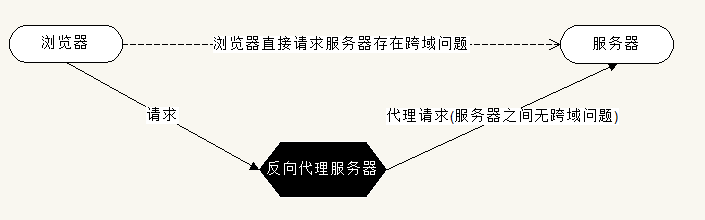

[TOC]

# Vue

## 一、介绍

> 库和框架的区别

+ Library

  库，本质上是一些函数的集合。每次调用函数实现一个特定的功能，接着把控制权交给作者，辅助开发人员来完成这个功能的

+ Framework

  框架，实际上就是一套完整的解决方案。框架中制定了一系列规则，使用框架时，只需把你的代码放到框架合适的地方，框架会在合适的时候调用你的代码

  + 框架规定了自己的编程方式，是一套完整的解决方案
  + 使用框架时，由框架控制一切，我们只需按规则写代码

+ 本质区别

  谁起了主导作用( <font color=red> **控制权** </font>, 控制反转 )

  库：控制权在开发人员，决定如何调用库中提供的方法

  框架：控制权在框架，控制整个流程

> MVVM 介绍

+ MVC 一种软件架构模式(设计模式)

  + M：Modal 数据模型(专门用于操作数据)，数据的 CRUD
  + V：View 视图(页面)
  + C：Controller 控制器(视图和数据模型沟通的桥梁，用于处理业务逻辑)

+ MVVM

  + M：Modal 数据模型
  + V：View 视图
  + VM：ViewModal 视图模型

+ 优势

  + MVC 模式，将应用程序划分三大部分，实现职责分离

  + 前端 FE 通过 JS 代码进行逻辑操作，将操作结果展示在页面中，也就是需要频繁的操作 DOM

  + MVVM 通过<font color=red> **数据双向绑定** </font>，让数据自动地双向<font color=red> **同步** </font>

    V(修改视图) ---影响---> M(数据)

    M(修改数据) ---影响---> V(视图)

  +  <font color=red> **数据驱动视图的思想，数据是核心** </font>

> Vue 中的 MVVM

+ 注意：不推荐直接手动操作 dom

  虽然 Vue 没有完全遵循 MVVM 模型， Vue 的设计无疑受到它的启发，因此文档中经常会使用 vm(ViewModal) 这个变量表示实例

+ 学习 vue 要转化思想

  数据驱动视图：不要想着怎么操作 dom， 而是想着怎么操作数据


## 二、起步

开发期间使用未压缩的 vueJS ，压缩的无报错提示

> 创建实例

```js
const vm = new Vue({
  /**
   * 作用：用来指定vue管理边界，也就是让vue管理页面中哪块内容
   * 注意：不要将vue管理边界挂载到body或html中
   */
  el: '#app',
  /**
   * 作用：指定数据为一个对象
   * data 中的数据可以直接在view(视图)中使用
   * 使用数据时要先声明再在视图中使用
   */
  data() {
    return {
      msg: '...'
    }
  },
  // vue中的计算属性
  computed: {},
  // vue中的方法
  methods: {},
  // 监视数据变化
  watch: {},
  // 局部过滤器
  filters: {},
  // 局部指令
  directives: {},
  // 局部组件
  components: {},
  // 路由
  router
})
```

> 表达式

特点：都有返回值

+ 字面量

  1 ，2，3，'abc'

+ 运算符+表达式

  如一元：`!false`

+ 表达式+运算符+表达式

  `1+2`

+ 表达式1 ？ 表达式2 ：表达式3

  如三元：`a > b ? a : b`

+ 左括号+表达式+有括号

  `(1 + 2)`

+ 表达式(参数列表)(函数调用)等


## 三、数据绑定

vue 中所有的数据绑定，都提供完全的 js 表达式支持

+ 插值表达式 `{{ }}`

  是 vue 提供的一种模板语法，叫做 Mastache(胡子)，又叫插值表达式

  + {{}} 可以使用任意的 js 表达式(只能表达式)
  + 插值表达式不能出现在 HTML 标签的属性中
  + {{}} 不能使用 if 或 for 等语句
  + 使用 {{}} 从 data 中获取数据，并展示在模板中
  + 数据对象的属性值发生了改变，插值处的内容会更新


## 四、指令

+ 定义

  指令( Directives ) 是带有 `v-` 前缀的特殊属性

+ 作用

  当表达式的值改变时，将其产生的连带影响，响应式作用于 dom

  <font color=red> **只要 vue 中的数据发生改变，页面中的指令或表达式会重新计算** </font>( vue 更新数据的特性)

> `v-modal`

+ 作用

  <font color="red"> **在表单(only use)元素上创建双向数据绑定** </font>，注意：`v-modal` 用在不同的表单元素中，有不同的功能(普通表单中表示 value，checkbox 等表示选中状态)

+ 双向数据绑定原理

  + 定义

    将 dom 与 vue 实现的 data 数据绑定到一起，彼此间相互影响

    数据的改变引起 dom 改变： m ----> v

    dom 改变也会引起数据改变： v ----> m

  + 原理：数据劫持

    ```js
    const obj = {}
    // 过渡存储
    let temp
    Object.defineProperty(obj, 'age', {
      get() {
        return temp
      },
      set(val) {
        temp = val
      }
    })
    /**
     * 1. 获取操作(obj.age)会执行get方法
     * 2. 设置操作(obj.age = 20)会执行set方法
     * 3. 参数
     *  3.1 表示给哪个对象定义
     *  3.2 表示添加的属性名称
     *  3.3 配置对象
     * 4. 注：这个方法Object.defineProperty()无法shim(浏览器兼容)，这个方法只兼容IE9及以上版本。这是vue只支持 IE9 及以上的原因
     */
    ```

> `v-text`

更新 dom 对象的 innerText

```html
<h1 v-text="msg"></h1>
```

> `v-html`

更新 dom 对象的 innerHTML

```html
<h1 v-html="msg"></h1>
```

> `v-bind`

+ 作用

  使用 data 中的数据，动态绑定元素属性值，应使用 `v-bind` 绑定，而不是插值表达式

+ 语法

  ```html
  <h1 v-bind:title="msg"></h1>
  <!-- 简写 -->
  <h1 :title="msg"></h1>
  ```

> 样式操作 class 和 style

+ calss

  + 语法：`v-bind:class="{}"` / `:class="{}"`

  + 说明

    值是一个对象，

    健：表示要添加的类名称 

    值：true：添加这个类 / false：移除这个类

  + 实现后

    ```html
    <div v-bind:class="{ active: true }"></div>
    <!-- 解析后得到 -->
    <div class="active"></div>
    
    <div :class="['active', 'text-danger']"></div>
    <!-- 解析后得到 -->
    <div class="active text-danger"></div>
    ```

+ style

  ```html
  <!-- 方式一：activeColor / fontSize 皆为data中的数据 -->
  <div v-bind:style="{ color: activeColor, 'font-size': fontSize + 'px' }"></div>
  
  <!-- 方式二 -->
  <div v-bind:style="[baseStyles, otherStyles]"></div>
  ```

> `v-on`

+ 作用：绑定事件
+ 语法：`v-on:click="say"`  / `v-on:click="say()"`
+ 简写：`@click="say"`
+ 说明：绑定的事件从 methods 中获取
  + 事件中的 this 表示当前 vue 实例
  + 通过 this.数据名 可以获取操作数据
+ 事件对象 e
  + 如果绑定事件时，没有添加小括号传递参数，那么在事件处理程序中用过第一个参数 <font color=red> **e** </font>获取到事件对象
  + 如果绑定事件时，添加了小括号，此时无法直接在事件处理程序中获取到事件对象，如果要获取事件对象应传入一个参数叫 <font color=red> **$event** </font> 。$event 是 vue 内部约定好的表示事件对象
+ 事件修饰符
  + 可只有修饰符的情况 `v-on:click.prevent`
  + 修饰符可串联 `@click.stop.prevent`
  + 有顺序执行
  + 分类
    1. `.stop` 阻止冒泡，调用 `event.stopPropagation()`
    2. `.prevent` 阻止默认行为，调用 `event.preventDefault()`
    3. `.capture` 添加事件侦听器，使用事件捕获模式
    4. `.self` 只当事件在该元素本身触发时，才会触发事件
    5. `.once` 事件只触发一次
    6. `.passive` 不能与 `.prevent` 一起使用，`.prevent` 将会被忽略，`.prevent` 会告诉浏览器你不想阻止事件默认行为
    7. `.native` 监听一个原生事件
    8. `.sync` 允许子组件修改父组件中的 props 数据，此处的修改并不是直接给 props 赋值，而是 `.sync` 修饰符内部通过子组件 ---> 父组件事件通讯的机制来修改了父组件中的数据。所以，最终数据还是由父组件修改的

> `v-for`

+ 作用：基于源数据多次渲染元素或模板块

+ 用法

  ```html
  <!-- 1. 基本用法 -->
  <div v-for="item in items"> {{ item.text }} </div>
  <!-- 2. 遍历数组 item为当前项 index为当前项下标 -->
  <div v-for="(item, index) in list">{{ item }}--{{ index }}</div>
  <!-- 3. 遍历对象 item为值 key为键 index为索引 -->
  <p v-for="(item, key, index) in obj">{{ item }}</p>
  <!-- 4. -->
  <p v-for="item in 10">{{ item }}</p>
  ```

+ key 属性

  <font color=red> **就地复用策略** </font>，标签不动，内容动。通过增加 key 属性来改变就地复用策略，此时就地复用会根据 key 值找对应的结构复用

  + 推荐：使用 `v-for` 时提供 key 属性

  + 就地复用

    ```html
    <p flag="1">aaa</p>
    <p flag="1">eee</p>
    ```

    1. 插入数据后，原有的标签 `<p>aaa</p>` 没有移动位置，而是将p标签的内容往后移动位置，标签不动
    2. 插入的导致原有内容后移，最后只新建一个p标签
    3. 这个默认的模式是高效的，只适用于不依赖组件状态或临时 dom 状态(对于依赖临时状态的列表渲染，这种就地复用策略有问题)
    4. 解决：<font color=red> **给每项都添加 key 属性，key作为身份标识具有唯一性** </font>
    5. <font color=red> **组件中使用 `v-for` key 属性为必须** </font>

> `v-of` / `v-else-if` / `v-else`

```html
<p v-if="num > 10">大于10</p>
<p v-else-if="num > 5">小于10大于5</p>
<p v-else>小于等于5</p>
```

+ 类似于 js 中的 `if-else`
+ `v-if` 和 `v-else-if` 和 `v-else` 是配合使用的，中间不得有第三者

> `v-cloak`

clock 意为斗篷、斗笠、遮盖物

+ 作用：用于解决 ` {{ }}` 插值表达式<font color=red> **闪烁** </font>的问题 

+ 数据渲染过程

  由 `{{ }}` 插值表达式 ---到--> 数据的过程

+ 使用

  1. 在标签上加 `v-cloak`

  2. 加 style 

     `[v-cloak] { display: none }`

+ 原理

  先隐藏 ----> 再由 vue 去除 `v-cloak` 属性

> `v-if` / `v-show`

+ `v-if`

  根据表达式的值的真假条件，销毁或重建元素

+ `v-show`

  根据表达式的真假值，切换元素的 display 属性

+ 区别

  `v-if` 会在 html 结构中都不存在了

  `v-show` 在 html 结构中还是存在，只是简单的切换 display 属性

+ 如何选择

  + 如果频繁的展示和隐藏某个元素，应用 `v-show`
  + 如果元素要么展示要么隐藏，应用 `v-if`

> 修通修饰键

如下修饰符实现仅在按下相应的按键时才触发鼠标或键盘事件的监听器

1. `.ctrl`

2. `.alt` 

3. `.shift` 

4. `.meta`

   mac  ---> meta ---对应---> command

   window ---> meta ---对应---> 田微标

+ 示例

  ```html
  <!-- Alt + c -->
  <input @keyup.alt.67="clear" />
  <div @click.ctrl="clear">Do Something</div>
  ```

  说明：修饰键与常规键按键不同，在与 keyup 事件一起使用时，事件触发时，修饰键必须处于按下状态，才能触发 `keyup.ctrl`

+ `.exact` 修饰符

  `.exact` 修饰符允许你控制由精确的系统修饰符组合触发事件

  ```html
  <!-- 有且只有 ctrl 被按下时才触发 -->
  <button @click.ctrl.exact="handleClick">A</button>
  <!-- 没有任何系统修饰符被按下的时候才触发 -->
  <button @click.exact="handleClick">A</button>
  ```

+ 鼠标按钮修饰符

  `.left` / `.right` / `.middle`

  这些修饰符会限制处理函数仅响应特定的鼠标按钮

> 提升性能

+ `v-pre`

  + 作用：跳过这个元素和它的子元素的编译过程，可显示原始的 mustache 标签(跳过大量没有指令的节点会加快编译)，一般用于文章等大量文本内容的位置，这些内容中没有指令表达式，因此，这些内容不需要经过 vue 解析
  + 默认：vue 会遍历所有的标签，分别判断每个标签中是否有表达式或指令需要解析

+ `v-once`

  只渲染元素和组件一次

+ 键值修饰符(按键修饰符)

  + 只能用在按键事件中(keydow、keypress、keyup)

  + 只能在指定的按键按下时才生效

  + 常用：`.enter` `.tab` `.delete` `.esc` `.space` `.up` `.down` `.left` `.right` `.数字(keycode码)`

  + 自定义按键修饰符别名(2.5.0 新增) 自动匹配按键修饰符

    `Vue.config.keycodes.f1 = 112`


## 五、动态添加数据

+ 注意

  <font color=red> **只有 data 中的数据才是响应式的，动态添加进的数据默认为非响应式** </font>

  原因：Vue 在创建实例时，内部会遍历 data 中所有的数据，将这些数据改造为 `Object.defineProperty()` 的形式，使这些数据变为响应式数据

+ 解决方案

  通过以下方式实现<font color=red> **动态添加数据** </font>的响应式

  ```js
  // 适用于添加单个属性
  Vue.set(object, key, value)
  // 适用添加多个属性
  Object.assign()
  ```

+ `Vue.set`

  ```js
  // Vue 构造函数
  Vue.set(vm.stu, 'gender', 'male')
  // vue 实例
  vm.$set(给哪个对象, 属性， 值)
  ```

+ `Object.assign`

  + 作用

    将后面对象参数中的属性与前面对象参数中的属性合并，合并后返回一个新对象

  + 注意

    如果有属性重名，以后的为准

  ```js
  // Object.assign
  // 对于对象来说，即使没有数据，不会报错，但也不是响应式的
  vm.stu = Object.assign({}, vm.stu, { gender: 'fe', height: 180 })
  ```


## 六、异步 DOM 更新

+ 说明

  <font color=red> **Vue 异步执行 Dom 更新，监听所有数据改变，一次性更新 dom** </font>

+ 优势

  可以去除重复数据，对于避免不必要的计算和避免重复 dom 操作上十分重要

+ `Vue.nextTick(callback)`

  在 DOM 更新后，执行某个操作( dom 操作)

  + `vm.$nextTick(callback)`
  + $el：表示 Vue 管理区域的根元素，是一个 dom 对象

  ```js
  methods: {
      fn () {
          this.msg = 'change'
          this.$nextTick(() => {
              // 获取更新后的 dom 内容，因为此时获取不到内容，dom内容还未更新，所以通过以上的方法获取
          })
      }
  }
  ```

+ 说明

  <font color=red> **前端中，dom 操作时最慢的。所以，如果要提升性能，要尽量减少重绘和重排(回流)。也就是减少 dom 操作** </font>

+ 为什么采用异步数据更新

  比如修改 count 数据 1000 次，如果不是异步更新 dom，只要数据将改变 dom 就更新，那么需要更新 1000 次。如果采用异步更新，数据改变后立即更新 dom，而是等数据不再更新时，一次性将本次数据改变，这样只需更新一次 dom 就行了


## 七、computed 计算属性

+ 计算属性是一个方法

+ 使用计算属性的时候，要当做属性来使用，不能调用

+ 特点：计算属性更新

  只有当计算属性依赖的数据改变时，计算属性才会重新计算，也就是只有跟计算属性相关的数据改变时，计算属性才会被重新计算

+ 计算属性的值由方法的返回值决定

+ 使用场景

  希望使用 data 中现有的数据而得到一个新的数据时

  比如：data 中有 num1、num2，想根据 num1 和 num2 得到 num3，就应用计算属性。num1 和 num2 称为 num3 的依赖项

+ 只有当依赖项发生改变时，计算属性才会重新计算

+ computed 中的属性不能与 data 中的属性同名，否则报错

+ 计算属性 vs 方法

  + <font color=red> **vue 中数据改变后，页面中对用的 dom 内容就会更新(特性！)** </font>
  + 使用方法，只要应用在页面的数据由更新，页面的数据就会进行重新计算
  + 使用计算属性：只有相关的数据更新，才会重新计算，性能优于方法

+ 区别

  <font color=red> **计算属性是基于它们的依赖进行缓存的，只有相关依赖发生改变时，才会重新求值。这意味着只要依赖项未发生改变，访问时，计算属性会立即返回之前的计算结果。而不必再次执行函数。相比方法，每当触发重新渲染时，调用方法总会再次执行函数** </font>


## 八、watch 监视数据变化

+ 作用： 监视数据的改变，当表达式的值改变后，会调用指定的回调函数，完成响应的监视操作

+ 说明：无法监视不存在的数据

```js
watch: {
    // 添加一个方法，方法的名称为要监视数据的名称
    // 1. 值监听的监听形式
    a: function(val, oldVal) {
        // val 当前值 oldVal 旧值
    },
    // 2. 对象的监听形式
    b: {
        // 监视对象属性的变化，此时val和oldVal都相同，指向同一对象(相同的引用)
        handler: function(val, oldVal) {},
        // 深度监听数据变化，可监听到对象属性的改变
        deep: true,
        // 立即出发监视, 此时第一次触发时，oldVal为undefined
        immediate: true
    },
    // 3. 只监视user对象中的age属性的变化
    'user.age': function(val, oldVal) {}
}
```


## 九、filter 过滤器

注意：<font color=red> **先创建全局过滤器，再创建 vue 实例** </font>

+ 作用

  <font color=red> **数据格式化** </font>：将数据按照我们指定的一种格式输出

+ 场景

  `{{ }}` 和 `v-bind` 表达式中

+ 分类

  + 全局过滤器

    + 语法

      `vue.filter(参1, 参2)`

      参1：过滤器名

      参2：使用过滤器时的回调(回调函数的返回值表示格式化后的数据)

    + 用法

      ```js
      // 声明
      Vue.filter('formatData', (val, format) => {
          // val 表示需要格式化的数据
          // 参1是固定的，后面的参数随意传入
          return val.moment.format(format)
      })
      // 使用 {{ 数据 | 过滤器名 }}  | ---> 管道符号
      {{ date | formatData('YYYY-MM-YY') }}
      ```

      

  + 局部过滤器

    局部过滤器时再某一个 vue 实例内部创建的，只在当前实例中起作用

    ```js
    {
        data() {
            return {}
        },
        filters: {
            filterName: (val, format) {
                
            }
        }
    }
    ```

    


# Vuex

## 一、概念

+ vuex是专门为vue提供的状态(<font color=ff0000> **状态即数据** </font>)管理工具
+ 状态管理工具采用了集中式管理数据的方式，统一管理项目中多个组件之间需要共享的数据
+ 场景：应用够简单，勿使用vuex。免得代码繁琐，冗余


## 二、基本使用

+ 安装

  ```js
  npm i vuex
  ```

+ 页面中先导入 vue，再导入 vuex

+ 使用


## 三、核心概念

+ store 仓库，仓储
  1. 一个 vue 项目中只能有一个 store
  2. 提供两方面的内容：一. state(状态data)  二.操作stae的方法
  3. 注意：只能通过vuex中提供的方法来修改store中的数据，而不能直接修改state数据


## 四、基本使用

+ 基本使用

  ```js
  import Vue from 'vue'
  import Vuex from 'vuex'
  Vue.use(Vuex)
  /**
   * @param {Object} 配置对象
   */
  export default new Vuex.Store({
      // state 相当于组件中的data 获取：store.state.num
      state: {
          num: 0
      }
  })
  
  ```

+ 修改数据

  store 中提供修改 state 方法的配置对象，如要修改 store 中的数据，应该把方法放在 mutations 配置对象中

  ```js
  // 1.定义
  mutations: {
      addNum(state, payload) {
          state.num++
      }
  }
  
  // 2.使用
  // 参数1：方法名(字符串)；参数2：要传入的参数(建议传入对象)
  store.commit('addNum', payload)
  ```

  

## 五、配置vue使用

+ 创建 `vuex.store` 实例

  ```js
  const store = new Vuex.Store({
      state: {
          num: 0
      },
      mutations: {
        	// 1.定义方法  
          addNum(state, payload) {
              state.num += payload.count
          }
      }
  })
  ```

+ 关联

  ```js
  const vm = new Vue({
      store,
      methods: {
          fn () {
              // 2.触发 任何组件可通过 this.$store 取得数据
              this.$store.commit('addNum', { count: 8 })
          }
      }
  })
  ```

  创建文件夹位置：`store/index.js` 中(同路由相同)


## 六、使用说明点

+ 任何组件都可以通过<font color=ff0000> **$store.state** </font>取得数据
+ <font color=ff0000> **不要在表单元素中直接使用 v-model 来操作 store 中的数据，数据由 vuex 的 store 提供，修改也套它来修改**</font>
+ 解决方案
  1. 单向绑定数据 ` :selected="todo.done"`
  2. 绑定change事件来触发定义好的方法，在方法中通过 `$store.commit()` 触发 store 中的 mutations 中的方法
+ 通过时间对象 e 取得文本框的值 `e.target.value`


## 七、getter vuex中的计算属性

vuex 允许在 store 中定义 "getter" (类计算属性)，像计算属性一样，getter 返回值会根据它的依赖项被缓存起来，只当它的依赖项发生改变才会被重新计算

```js
// 1.定义
new Vuex.Store({
    getters: {
        // 根据state已有的数据得到一个新的数据
        leftCount(state) {
            return state.num + '元'
        }
    }
})

// 2.使用
this.$store.getters.leftCount
```


## 八、Action

与 mutations 相似

+ 特点
  1. 可包含任意的异步操作(mutations必须是同步函数)
  2. action 提交的是 mutations 而不是直接变更状态
+ 区别
  1. action 只负责封装异步操作，真正修改state的还是mutation
  2. DevTools 工具无法追踪记录 mutation 中的异步操作

```js
// 1.定义
actions = {
    // context 类似于store
    // addTodo mutation中的方法，实际在action中还是调用了 mutation 中的方法
    addTodoAsync (context, payload) {
        context.commit('addTodo', payload)
    }
}

// 2.组件中使用
this.$store.dispatch(addTodoAsync, payload)
```


## 九、Module

解决 state 对象繁杂的问题，分为模块

```js
const ModuleA = {}
const ModuleB = {}
const store = new Vuex.Store({
    // modules 相当于还是写了state
    modules: {
        a: ModuleA,
        b: ModuleB
    }
})

// 组件中使用
this.$store.state.a
```


## 十、mapGetters 辅助函数(其它的属性也有对应的映射方式)

将 `vuex getters` 中的属性，映射成为当前组件的计算属性中

```js
import { mapGetters } from 'vuex'
// mapGetters 参数：一个数组，存放store中的getter，然后在页面组件中可以直接使用
export default {
    computed: {
        ...mapGetters([])
    }
}
```


# 反向代理



+ 作用：解决跨域的方式(只有浏览器中有跨域问题)

  1. jsonp
  2. CORS 跨域资源共享
  3. 反向代理

+ 脚手架中配置 `config/index.js`

  配置反向代理(webpack-dev-server的配置项)

  ```js
  proxyTable: {
      '/api': {
          target: 'http://127.0.0.1:3000/', // 代理的目标服务器地址
          changeOrigin: true, // 是否跨域
          pathRewrite: {
              '^/api': '/' // 匹配以/api为开头的请求地址，并使用/替换(实际请求路径中不包含/api就以/替换)
          }
      }
  }
  ```

+ 参考文献

  https://www.jianshu.com/p/f489e7764cb8