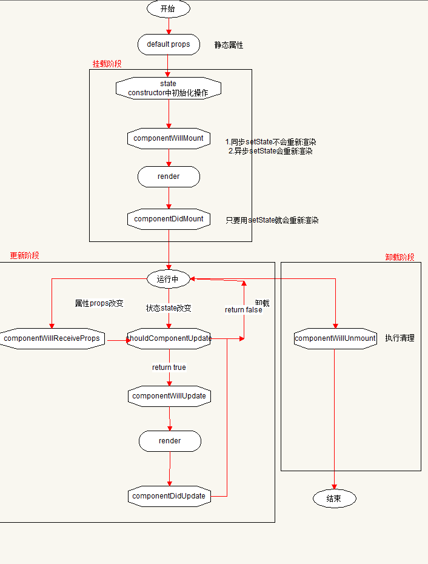

[TOC]

# React

## 一、简介

> 特点

+ 通过 <font color=#ff0000 >***jsx语法***</font> 实现组件化开发，为 <font color=ff0000>***函数式的UI编程***</font> 方式打开了大门
+ 性能高，通过 <font color=ff0000> ***diff算法*** </font> 和 <font color=ff0000> ***虚拟DOM*** </font>实现视图的高效更新


> 核心概念

+ 虚拟DOM(Virtual Dom)，真Dom对象自身属性太多

+ Diff算法(虚拟Dom的加速器，提升React性能法宝)

  <!-- 解释：将数据更新前后的对象进行比较，从而找到差异的地方，只将差异的地方更新到页面中，如果使用原生的Dom对象，比较的内容就太多 -->

  

> React基本使用

+ 安装两个包

  <!-- react: 核心包； react-dom：用于解析Jsx语法，转化为浏览器中能够识别的HTML内容 -->

  ```npm
  npm i react react-dom
  ```

+ main.js 导入两包

  ```js
  // main.js
  import React from 'react'
  import ReactDom from 'react-dom'
  ```

+ 创建React元素(返回值：React对象)

  ```js
  /**
   * 参1：React元素的名称
   * 参2：表示当前元素的属性，类型Object
   * 参3：当前节点的子节点(文本节点、元素节点)
   */
  React.createElement('div', { id: 'dv'})
  ```

+ 将创建的元素渲染到页面中(react-dom)

  ```js
  const dv = React.createElement('div', { id: 'dv'}, 'hello world')
  /**
   * 参1：表示要渲染的React元素
   * 参2：表示React元素要渲染到哪个容器下
   */
  ReactDOM.render(dv, document.getElementById('root'))
  ```

+ React.createElement方法的注意点

  1. 要创建的React元素必须为HTML中的元素

  2. 如果该元素没有属性，第二个参数传入null即可

  3. 传递给React元素的注意点

     ⑴ <font color=ff0000> ***class*** </font>要写为className

     ⑵ 使用htmlFor代替<font color=ff0000> ***for*** </font>属性

     ```html
     <label for=""></label>
     <label htmlFor=""></label>
     ```

  4. 参3的元素节点依旧使用React.createElement添加，文本节点直接写字符串即可。从参3往后都为子节点

  5. 缺点：语法繁琐、不直观，无法直接看出html结构

  6. 用<font color=ff0000> ***jsx*** </font>语法代替React.createElement


## 二、JSX

> JSX：JavaScript XML(html) 在js代码中直接写html结构

+ 如果要在js中使用jsx语法，需要经过Babel转换后才能使用

+ 步骤

  1. 安装

     ```npm
     npm i babel-preset-react -D
     ```

  2. 配置

     ```json
     { "presets": ["env", "stage-2", "react"] }
     ```

  3. 作用：用于解析React语法(jsx)


> 注意点

+ JSX 的标签名应为HTML中的标签名字
+ <font color=ff0000> **<u>*要添加class应用className，for属性应用htmlFor*</u>** </font>
+ JSX必须要有唯一的根节点
+ 写JSX语法推荐用()包装所有元素


> JSX 中使用JS提供的<font color=ff0000> **数据** </font>

+ 在JSX中，通过 {} 语法来使用js提供的数据

+ 注意不是 {{}} 插值表达式

+ 在 {} 中可以使用任意的表达式，不可以使用语句，不要在 {} 中使用对象(直接使用)

+ 注释用 {} 包裹

  ```js
  const str = 10
  const dv = (
    <div>
      <h1>{ str }</h1>
    </div>
  )
  ReactDOM.render(dv, document.getElementById('root'))
  ```


> JSX 的转化过程

```js
const dv = (
  <div>
    <h1>哈哈</h1>
  </div>
)

// 默认调用
React.createElement('div', null, ReactDOM.createElement('h1', null, '哈哈'))
```

过程：JSX ----> React.createElement() ----> 虚拟DOM对象 ----> HTML结构

ps：所以有时并未显式的使用React，但需引入，因为隐式的用到了


## 三、组件

> 两种组件(react中，所有的内容都是js)

+ 函数组件
+ class类组件


> 函数组件

+ 函数名称(<font color=ff0000> **组件名** </font>)必须为<font color=ff0000> **首字母大写** </font>，react通过首字母是否大写来区分是一个组件还是一个普通函数

+ **函数组件必须要有返回值**
  1. return null 表示什么都不渲染
  2. 如果要渲染内容，将要渲染的内容返回即可，可返回 JSX 或者 字符串
+ 组件必须要有一个根节点
+ 组件名可为单/双标签

```js
function Hello () {
  return (
    <div>
      <p>元素内容</p>
    </div>
  )
}

ReactDOM.render(<Hello />, document.getElementById('root'))
```


> 函数组件传递数据

+ 传递：在 <font color=ff0000>**组件的标签**</font> 上面 <font color=ff0000>**添加**</font> 要传递的数据(通过 {} 可传递任意类型的数据 )
+ 接收：通过函数组件的形参<font color=ff0000> **props** </font>(约定)来获取传递的数据，类型object
+ props
  1. 类型：对象
  2. 对象中的属性，表示传递给组件的数据
  3. <font color=ff0000> **props** **是只读的**</font>，只能读取，无法修改或添加(不可扩展)

```js
const dv = <div>hello world</div>
// 2.props接收并使用
function Hello(props) {
  return (
    <div>
      { props.name }
      { props.el }
    </div>
  )
}
// 1.传递
ReactDOM.render(<Hello name="jack" el={ dv } />, document.getElementById('root'))
```


> class组件

+ class组件继承自 React.Component
+ class组件中必须提供render方法，且return jsx/null

```js
// 1.创建class组件
class Hello extends React.Component {
  render() {
    return <h1>这是class组件</h1>
  }
}

// 2.渲染组件
ReactDOM.render(<Hello />, document.getElementById('root'))
```


> 给class组件传递数据

+ 在组件标签中添加要传递的属性
+ 在class中的方法内部通过<font color=ff0000> **this.props** </font>来获取传递的数据

```js
// 2.this.props使用数据
class Hello extends React.Component {
  render() {
    return (
      <div>这是我的名字：{ this.props.name }</div>
    )
  }
}

// 1.传递数据
ReactDOM.render(<Hello name="xxh" />, document.getElementById('root'))
```


> 函数组件 和 class组件的比对说明

+ 函数组件 ----> <font color=ff0000> **无状态组件** </font>(木偶组件) ----> 只渲染视图

+ class组件 ----> <font color=ff0000> **有状态组件** </font>(智能组件) ----> 渲染视图交互

  状态即数据

+ 在class组件中，组件内部可有私有数据(状态 state)，<font color=ff0000> 可修改组件中的**数据**来达到更新组件内容(视图)的目的</font>

+ 在函数组件中，是没有数据(状态 state)的，无法实现修改数据更新视图的目的

+ 函数组件中，仅负责渲染视图内容，传递什么数据就负责渲染什么数据

+ 对比：功能：class组件的功能更加强大；性能：函数组件的性能更好

+ 总结：应根据场景结合两种组件各自的优势来选择使用哪个组件


> class组件中的数据state

+ 在 constructor 中，通过 this.state 来初始化state

+ this.state.属性 来使用

+ props 只读，state可修改，通过 this.setState({})来修改

+ state特点

  1. state是组件内部私有数据，只能在当前组件使用
  2. state是可以修改的，但不要直接 ’this.state.属性 = 值‘ 来修改，一定要通过 this.setState({}) 方式修改
  3. state一般与页面数据相关，涉及更新
  4. 组件中的state的数据应该尽量少，多则会影响react组件渲染的性能。**只将页面中用到的数据放在state中，而其它一些需要公用的数据(方法中)可直接添加给this，而不是添加给state**

+ 如果 constructor 只用于初始化state，那么可以简写为

  ```js
  class Hello extends React.Component {
    state = {
      name: 'xxh'
    }
  }
  ```

+ 综上示例

```js
class Hello extends React.Component {
  constructor (props) {
    super(props)
    // 1.初始化数据
    this.state = {
      num: 6,
      gender: 'male'
    }
  }

  componentDidMount () {
    // 3.修改state的方式
    this.setState({
      num: 999
    })
  }

  render () {
    // 2.使用state
    return (
      <div>
        { this.state.num }
      </div>
    )
  }
}

ReactDOM.render(<Hello />, document.getElementById('root'))
```


> constructor 中获取props数据

+ 在 class 中的 constructor 中无法直接获取 props (只有 constructor 特殊，别的函数直接通过 this.props 获得)

+ 解决方法

  ```js
  constructor (props) {
      super(props)
      // 此时可用props.  this.props/props
  }
  ```


## 四、react中的样式

+ 行内样式

+ 类样式

  ```js
  import './css/index.css'
  ```


## 五、props.children 属性

+ 作用：用于获取组件的子节点

  ```js
  <Hello name="rose"> // name 通过props获取
    <h1>这是一个元素的节点</h1> // 通过props.children 获取
  </Hello>
  ```

+ props.children 相当于vue中的插槽， vue通过插槽获取子节点，react通过props.chidlren获取子节点

+ 如果没有给组件添加子节点，那么props没有children属性


## 六、react事件的绑定和this指向

```js
// on + Click 区别于htmlonclick皆为小写
<button onClick={事件处理函数}>点击事件</button>
```

+ react中的事件对象是react自己封装的，不是原生的e

+ 常用场景

  ⑴ 阻止浏览器的默认行为：e.preventDefault()

  ⑵ 读取文本框的值：e.target.value

  ⑶ 事件对象中的e默认不让看，e.persist()

+ react事件处理程序中的this指向问题

  ⑴ 默认情况下，事件处理程序中的this指向undefined(模块化中的顶级this指向undefined，默认严格模式)

  ⑵ 失望时间处理程序中的this指向当前实例对象，class内部的方法(render...)this指向当前实例

  ⑶ 解决方案

  ```js
  // 方法1 改为箭头函数再直接调用
  class Hello extends React.Component {
    handleClick() {
      console.log(this, 111)
    }
  
    render () {
      return (
        <div>
          {/* <button onClick={ this.handleClick }>按钮</button> */}
          <button onClick={ e => this.handleClick() }>按钮</button>
        </div>
      )
    }
  }
  
  // 2.改处理函数
  class Hello extends React.Component {
    constructor (props) {
      super(props)
      
    }
    // 这种赋值的方式创建方法，不是标准的js语法，需要stage-2处理
    // handleClick() {
    //   console.log(this, 111)
    // }
    handleClick = () => {
      console.log(this, 111)
    }
  
    render () {
      return (
        <div>
          <button onClick={ this.handleClick }>按钮</button>
        </div>
      )
    }
  }
  
  // 3 bind方式：bing不同于call、apply它返回一个修改内部this指向的函数
  // 3.1 不会直接调用函数, 而是返回一个改变内部this指向后的新函数
  // 3.2 bind方法返回的函数中的this无法再次改变
  class Hello extends React.Component {
    // constructor最早执行的一个函数
    constructor (props) {
      super(props)
      this.handleClick = this.handleClick.bind(this)
    }
    handleClick() {
      console.log(this, 111)
    }
    
  
    render () {
      return (
        <div>
          <button onClick={ this.handleClick }>按钮</button>
        </div>
      )
    }
  }
  ```


## 七、React组件生命周期

一个组件从开始到消亡所经历的各种状态（只有class组件有生命周期）



> 挂载阶段(进入页面或组件渲染时执行)

- [**constructor()**](https://zh-hans.reactjs.org/docs/react-component.html#constructor)
- [`static getDerivedStateFromProps()`](https://zh-hans.reactjs.org/docs/react-component.html#static-getderivedstatefromprops)
- [**render()**](https://zh-hans.reactjs.org/docs/react-component.html#render)
- [**componentDidMount()**](https://zh-hans.reactjs.org/docs/react-component.html#componentdidmount)

```js
class Hello extends React.Component {
    
  componentWillMount () {
    // 表示组件将要挂载，但还没有渲染(render)
    // 拿不到组件中的dom元素 ----> null
    // 注意：将来废弃
  }

  componentDidMount () {
    // 表示已挂载，已渲染(render)
    // 可以获取组件中的dom元素，操作dom、ajax请求
  }

  render () {}
}
```


> 更新阶段(组件中的state发生改变或者接受到新的props)

- [`static getDerivedStateFromProps()`](https://zh-hans.reactjs.org/docs/react-component.html#static-getderivedstatefromprops)
- [`shouldComponentUpdate()`](https://zh-hans.reactjs.org/docs/react-component.html#shouldcomponentupdate)
- [**render()**](https://zh-hans.reactjs.org/docs/react-component.html#render)
- [`getSnapshotBeforeUpdate()`](https://zh-hans.reactjs.org/docs/react-component.html#getsnapshotbeforeupdate)
- [**componentDidUpdate()**](https://zh-hans.reactjs.org/docs/react-component.html#componentdidupdate)

```js
class Hello extends React.Component {


    shouldComponentUpdate (nextProps, nextState) {
        /** 
         * 1.这个钩子函数必须返回布尔值：true表示更新页面内容；false表示不更新页面内容
         * 2.状态state改变时触发
         * 3.可实现条件更新，满足制定条件时才更新
         * 4.通过 this.state 获取到的是更新前的状态(可通过形参nextProps、nextState获取最新值)
         */
    }

    componentWillReceiveProps () {
        /**
         * 1.父组件中传递的属性发生改变时触发
         * 2.将来废弃
         * 3.替代：static getDerivedStateFromProps(nextProps, nextState)
         */
    }


    componentWillUpdate() {
        // 将来废弃
    }

    componentDidUpdate() {

    }

    render () {}
}
```


> 卸载阶段(组件从页面消失掉，不再展示在页面中)

- [**componentWillUnmount()**](https://zh-hans.reactjs.org/docs/react-component.html#componentwillunmount)

```js
class Hello extends React.Component {

    componentWillUnmount() {
        // 1.触发：当组件不再展示在页面时
        // 2.作用：执行清理工作
    }

    render () {}
}
```


## 八、this.state()方法说明

+ 在react中，必须调用此方法来修改state状态

+ setState 有两个作用

  ⑴ 修改state数据

  ⑵ 将state的改变，重新渲染在视图中

+ setState 为异步操作

+ 解决

  ```js
  // callback: state更新后执行，此时可获取最新的state
  this.setState({name: 'xxh'}, () => {
      console.log(this.state.name)
  })
  ```

+ 另一种用法

  ```js
  /**
       * @param {preState} 表示当前的state状态
       * @param {props} 表示当前的props
       * @return {Object} 对象，表示更新的state
       */
  this.setState(function (preState, props) {
      return {
          name: 'xxh'
      }
  })
  ```

  


## 九、受控组件 与 非受控组件

> 受控组件(value + change)

+ 原则：react中的数据由state提供的，并且只能用过setState()方法修改
+ 说明：表单的值受到react的控制，就为受控组件

```js
class Hello extends React.Component {
  
  constructor () {
    super()
    this.state = {
      count: 1
    }
  }
  handler (e) {
   this.setState({
     count: e.target.value
   })
  }
  render () {
      // value 值绑定为this.state.count，只能通过setState改变，页面输入无效, 需配合onChange
    return (
      <div>
        <input type="text" value={ this.state.count } onChange={e => this.handler(e)} />
      </div>
    )
  }
}
```


> 非受控组件

+ 创建ref对象

+ 给文本框添加ref属性

+ 通过 this.input.current.value 来获取到文本框的值

  ```js
  class NameForm extends React.Component {
    constructor(props) {
      super(props);
      this.handleSubmit = this.handleSubmit.bind(this);
      this.input = React.createRef();
    }
  
    handleSubmit(event) {
      alert('A name was submitted: ' + this.input.current.value);
      event.preventDefault();
    }
  
    render() {
      return (
        <form onSubmit={this.handleSubmit}>
          <label>
            Name:
            <input type="text" ref={this.input} />
          </label>
          <input type="submit" value="Submit" />
        </form>
      );
    }
  }
  ```

+ 给输入框添加默认值

  ```js
  render () {
      // 这种形式为非受控组件+设置默认值
      return (
          <input type="text" defaultValue={ this.state.count } />
      )
  }
  ```

  


## 十、通讯组件

> 父 ----> 子

在子组件中绑定<font color=ff0000> 属性 </font>，子组件通过<font color=ff0000> props </font>获取


> 子 ----> 父

父组件提供方法 ----> 将方法传递给子组件 ----> 子组件调用传参


> 兄弟

因为react是单向数据流，需要借助父组件传递

+ 一个兄弟组件通过接收 props 使用父组件的数据
+ 另一个兄弟改变父组件中的数据(父组件传递方法，子组件给参数来实现子改父，本质上还是父自己改)


> 复杂的通讯(再借助状态提升太乏力)

解决方法：

+ context
+ 状态管理工具(1、3可以配合任意框架使用)
  1. flux 最高提出前端中状态管理思想
  2. redux
  3. mobx
  4. vuex(只能用在vue中)


## 十一、数据流和状态提升

> react是单向数据流(父组件 ----> 子组件)

数据流动的方向是自上而下的，父组件的数据可以通过props来流动到子组件中。并且父组件的数据改变时，也可以自动的再流动到子组件中。<font color=ff0000> **子组件无法自行修改props数据** </font>


> 状态提升

+ 数据应由父组件提供，由子组件使用(状态state)

+ 利用状态提升的原则，可以实现兄弟组件之间的通讯

  方式：将数据放在离两个需要通讯的兄弟组件最近的一个父组件中


## 十一、Context

+ 创建Context对象

  ```js
  // 1 createContext() 方法的返回值是一个对象
  // 2 对象提供两个组件：Provider(提供者)、Consumer(消费者)
  const { Provider, Consumer } = React.createContext()
  ```

+ 使用 Provider 包裹最外层的父组件

  ```js
  class Hello extends React.Component {
    render() {
      // value 表示在组件中需要共享的数据
      return (
        <Provider value={}>
          {/* 这里插入子组件 */}
        </Provider>
      )
    }
  }
  ```

+ 要使用数据的组件用 Consumer 包裹。它的子节点是一个回调函数，通过回调函数的参数，可以获取到 Provider 提供的数据，回调函数的返回值表示要渲染子组件的内容

  ```js
  class Children extends React.Component {
    render() {
      return (
        <Consumer>
          { value => (<div></div>) }
        </Consumer>
      )
    }
  }
  ```

+ defaultValue

  1. Consumer 组件可以单独使用，不强制要求必须在 Provider 组件内部使用
  2. 当没有使用 Provider 组件， Consumer  组件就可以从 createContext(defaultValue) 方法的参数中获取默认值
  3. Consumer 按就近原则去查找 Provider ( 在 Provider  多个嵌套的情况下)


## 十二、props

> defaultProps 说明

```js
class Hello extends React.Component {
  // ES6 静态属性写法
  // 作用: 给props设置默认值,如果未传递则使用默认值
  static defaultProps = {
    initCount: 0
  }

  constructor () {}

  render () {}
}
```


> props 校验

+ 目的：保证使用组件时，不会出现与组件中要求数据类型不一致的问题

+ 使用

  1. 安装

     ```npm
     npm i prop-types
     ```

  2. 导入

     ```js
     import propTypes from 'prop-types'
     ```

  3. 给要进行props检验的组件添加静态属性propTypes

  4. 在静态属性中添加校验

     ```js
     // colors：表示要检验的props中的属性名
     // propTypes.array：表示当前props的类型为数组
     // isRequired：表示当前props必须传给组件
     class Parent extends React.Component {
       
       static propTypes = {
         colors: propTypes.array.isRequired
       }
     
       render() {}
     }
     ```

  5. propTypes类型具体见文档

     ```js
     import propTypes from 'prop-types'
     
     class Parent extends React.Component {
       
       static propTypes = {}
     
       static defaultProps = {}
     
       render() {}
     }
     ```

     


## 十三、ref

+ 使用场景：Dom操作

+ 语法：

  ```js
  // 1 旧版
  render() {
      // 通过 this._input获取当前的dom对象
      return <input ref={ input => this._input = input } type="text"/>
  }
      
  // 2.新版
  class Parent extends React.Component {
      // 1.创建ref
      constructor () {
          this._input = React.createRef()
      }
  
      // 通过this._input.current就可以获取当前的dom
      componentDidMount () {
          console.log(this._input.current)
      }
  
      render() {
      // 2.赋值ref
          return (
              <div>
              <input ref={ this._input } type="text"/>
              </div>  
      	)
  	}
  }
  ```

+ ref在函数组件中的使用

  ```js
  // 以下示例为旧版，或者可以使用新版
  function Hello () {
    // 1. 创建一个变量(函数组件中)
    let txt = null
    // 3. 通过变量获取dom
    function handleClick () {
      console.log(txt)
    }
    // 2.给dom元素添加ref = { input => 变量 = input }
    return (
      <div>
        <input ref={ input => txt = input} type="text"/>
      </div>
    )
  }
  ```


# 路由

## 一、react路由三个核心

+ Router 组件

  1. 用来包裹整个应用，只有被Router包裹的内容，才能实现路由导航的功能
  2. Router 组件只能使用一次
  3. 只能有一个根节点

+ Link 组件

  1. 导航菜单
  2. 最终被渲染为a标签

  ```js
  <Link to="/home"> 首页 </Link>
  ```

+ Route组件

  1. 每个路由规则对应一个Route组件

  2. 通过 **path** 属性配置路由规则

  3. 通过 **component** 属性表示该路由规则匹配时要展示的组件

  4. 通过 **exact** 属性改为精准匹配

     ```js
     // path="/home/:movice" ---> 动态路由
     // "movice/:age?" ---> 可选路由
     // 模糊匹配路由，加exact改为精准匹配
     <Route path="/home" component={ Home }></Route>
     ```

  5. Route组件写在哪，展示的地方就在哪


## 二、使用

+ 安装

  ```npm
  npm i react-router-dom
  ```

+ 导入路由

  ```js
  import { HashRouter as Router, Route, Link } from 'react-router-dom'
  ```

+ 其它路由

  ```js
  import { BrowserRouter, MemoryRouter，NavLink, Switch } from 'react-router-dom'
  ```

  1. HashRouter 使用哈希值(#)来实现路由跳转

  2. BrowserRouter 代替 HashRouter 可去掉地址栏的#，使用H5提供的 history API 来实现控制路由跳转

  3. MemoryRouter 在非浏览器环境(如reactNative)中使用

  4. NavLink Link的升级版，匹配到路由时加入active类名，通过属性activeClassName改变

  5. Switch 组件包裹的Route只会匹配渲染第一个

     ```js
     // 原则：将匹配范围广的路由置于后面
     render () {
         <Switch>
             <Route path="/movice/detail/:moviceId"></Route>
         	<Route path="/movice/:moviceType/:page?"></Route>
         </Switch>
     }
     ```

     


## 三、react-router-dom 路由组件说明

+ 组件是通过react路由展示的，那么这个组件中可通过 props 属性获取当前路由的相关属性(history、location、match)

+ 组件不是通过react路由展示的，解决：WithRouter方法(react-router-dom提供)，用于包裹不是通过路由展示的组件，让这个组件能够获取到路由提供的数据

  ```js
  import { withRouter } from 'react-router-dom'
  
  class Parent extends React.Component {
      render () {
         const {his} = this.props
      }
  }
  
  /**
   * @param {Class} 一个组件
   * @return {Class} 一个新的组件
   * 场景：不是通过路由展示的组件，想获取路由相关属性
   */
  export default withRouter(Parent)
  ```


## 四、React中路由的不同点

+ 只有保证父级路由对应的组件先展示，子级对应的路由组件才会展示
+ 设计路由的时候，要求 Link 的 to 属性要遵循规则：<font color=ff0000> **子路由的哈希值应包含父级路由的哈希值** </font>
+ 在 path="/" 的情况下添加 exact 属性变为精准匹配


# Redux

## 一、React项目技术栈

+ react
+ react-router(react-router-dom)
+ 状态管理：mobx(简单) / redux(复杂)
+ dva：集成 react / react-router / redux


## 二、redux核心概念

```npm
npm i redux -S
```

+ store
+ reducer
+ action


## 三、原则和概念

+ 单一数据源

+ state是只读的

+ 使用纯函数来执行修改

+ 不要直接修改状态，而是返回一个新的状态

  ```js
  state = {
      list: [1, 2, 3]
  }
  
  // 错误示范
  state.list.push(4)
  return state
  
  // 正确示范
  return [...state.list, 4]
  ```

+ action ----提供想法----> store ----通知你来干----> reducer


## 四、三个核心概念的理解

+ stroe(redux仓库)：管理者，管理 action 和 reducer，提供了store以及操作store的方法 ----> 妈
+ action(想法)：“砖家”， 只提供想法，不干活 ----> 孩子
+ reducer(实现)：劳动者，搬砖的人


> action

+ action 是<font color=ff0000> **行为** </font>的抽象，视图中的每个用户交互都是一个action(增、删任务等。。)

+ 作用一：定义应用中可以执行的动作(或操作)的类型(type)

+ 作用二：提供并传递要改变的状态

+ 使用：通过 store.dispatch() 将 action 传到store

+ 注意点

  1. <font color=ff0000> **类型：Js对象** </font>

  2. 要求：必须有 type 属性(string)，表示要执行的动作，使用全大写字母来表示，可以带有_

     ```js
     {
         type: 'ADD_TODO'，
         data: {}
     }
     ```

  3. 如果这个交互动作需要<font color=ff0000> **数据** </font>，应在对象中提供数据

  4. <font color=ff0000> **一般由方法生成** </font>(actionCreate)

  5. 当应用规模大时，type 会被定义成字符串常量，建议使用单独的模块或者文件来存放 action 。一般文件名定义为 actionTypes.js 用来存储所有 action 的名称

```js
// 函数生成，灵活，不写死
const addTodo = name => ({
    type: 'ADD_TODO'，
    name
})

const todo = addTodo('study react')
```


> reducer 根据指定的action，来实现要完成的状态

+ reducer 是<font color=ff0000> **行为响应** </font>的抽象，根据action执行相应的逻辑操作，<font color=ff0000> **返回最新的state** </font>
+ 代码解释 (previousState, action) => newState
+ 根据应用现有的状态和触发的 action 返回新状态的函数称为 reducer
+ 注意：不要直接修改state，应返回一个新的state，保证数据的不可变性(immutability)
  1. <font color=ff0000> **纯函数(函数式编程的一个概念，输入决定输出)** </font>, 
     + 不要直接修改state
     + 不要修改传入的参数，而应根据传入的数据返回一个最新的数据
  2. 传入旧数据和 action
  3. 返回新状态
  4. 每个 reducer 只负责管理应用全部state中它负责的一部分(职责单一)
  5. 随着应用的膨胀，要对 reducer 函数进行拆分，拆分后的每一块独立负责管理 state 的一部分

```js
const todos = (state = [], action) => {
  switch (action.type) {
    case 'ADD_TODO':
      // 返回一个新数据，并不修改传入的数据
      return [...state, {
        text: action.text,
        completed: false
      }]
    // 如果无法处理传入的action，应返回参数state，而不是不作处理
    default:
      return state
  }
}
```

+ reducer 纯函数说明
  1. 特点：同样的输入，必须得到同样的输出
  2. 原则
     + 不得改写参数
     + 不能调用 Date.now()、ajax 修改作用域外的东西、Math.random() 等不纯的方法，因为每次会得到不一样的结果
     + 不能调用系统 I/O 的 API
  3. reducer 必须为一个纯函数
  4. 纯函数主要的含义就是它<font color=ff0000> **不可以修改影响输入值** </font>
  5. 没有副作用，副作用指的是例如函数中一些异步调用或者会影响函数作用域之外的变量一类的操作


> store

+ 一个应用只有一个 store
+ store 负责将 action 和 reducer 关联在一起
+ store 的<font color=ff0000> **作用** </font>： 1. 维持应用的state 2. 提供操作state的方法
+ store 中的核心方法
  1. getState() ----> 获取当前state状态
  2. dispatch() ----> 分发action，触发某个动作
  3. subscribe() ----> 订阅，当store中的state发生变化时就会触发，参数：回调函数
+ 组件强更新：class 组件中的 this.forceUpdate()

```js
// MVC ---> react V ---> redux M/C
// 1.根据 reducer 创建 store
// createStore 用于创建 store 需要一个 reducer 作为参数
import { createStore } from 'redux'
import todoApp from './reducers'
// 2.根据 reducers 创建 store
// 参1：reducer  参2：设置默认状态
// 说明：创建 store 的时候，将reducer 作为参数传给 store， store内部会自动调用传入的reducer。目的：拿到默认状态。store拿到reducer方法返回值，默认走default
let store = createStore(todoApp)
// 3.获取state
store.getState()

// ⑴ 注册监听器
// ⑵ 返回注销该监听器的函数
// 说明：每次state更新时，都会执行该回调函数打印日志
const unsubscribe = store.subscribe(() => {
  console.log(store.getState())
})

// 4.更新state
// 调用所有已经注册的监听器函数，比如：上面打印日志监听器
store.dispatch(addTodo('learn about store'))

// ⑶ 注销监听器
unsubscribe()
```


## 五、搭配React(react 和 redux 关联)

+ react-reudx 规定：UI组件由用户提供；容器组件由react-redux自动生成
+ 用户负责视图层(view)，状态管理交由react-redux

+ 问题
  1. react组件如何触发一个 action 动作(dispatch)
  2. store中状态改变后如何重新渲染到页面中
+ 解决
  1. 提供 connect() 方法，用来连接 react 和 redux
  2. 基于react中单向数据流， 父组件更新自动传递。使用 react-redux 中提供的父组件， provide 包裹自己的组件


> react-redux 的基本使用

+ 安装

  ```npm
  npm i react-redux -S
  ```

+ 从 react-redux 包中导入 Provider、connect

+ 使用 Provider 包裹整个 react 应用

+ 使用 connect 包裹自己的组件，并且传递组件中要用的 state 和 操作 state 的 dispatch 方法


> connect() 方法

+ 作用：用于从 UI 组件生成容器组件，将两种组件关联起来。通过connect方法，可以包裹一个现有的组件，为该组件提供内部需要用到的 redux 中的 state 和操作 state 的方法
+ 理解：相当于 connect 在获取 redux 的 store 之后，再根据传入的方法，把我们需要的部分对应到 props 属性中，再传递到我们的组件中

```js
import {Provider, connect} from 'react-redux'
// TodoList(ui组件) --转为--> TodoListContainer(容器组件)
// TodoListContainer 就是由 react-redux 通过 connect 方法自动生成的容器组件
const TodoListContainer = connect()(TodoList)
```

+ 为了定义业务逻辑，需要给出下面两方面的信息

  1. 输入逻辑：redux 中的 state 对象(数据)， 如何在 UI 组件中使用
  2. 输出逻辑：用户发出的动作如何变为 Action 对象，从 UI 组件传出去

  ```js
  import { connect } from 'react-redux'
  
  // 1.映射state
  // mapStateToProps作用：将redux中的state转化为传递给组件的props
  // count：传递给组件的数据props.count：为connect方法提供一个参数，用来在组件中获取redux中提供的数据
  const mapStateToProps = (state, ownProps) => ({
    count: state
  })
  
  // 2.映射dispatch
  const mapDispatchToProps = (dispatch, ownProps) => ({
    handleIncrement: () => {
      dispatch(increament(3))
    },
    handleDecrement: () => {
      dispatch(decrement(1))
    }
  })
  
  // connect方法功能：
  // 1.包裹原组件，将state和action通过props的方式传入到原组件内部
  // 2.监听store中state的变化，使其包裹的原组件可以相应state变化实时更新
  // connect方法新返回一个组件，是原始组件的包裹，包裹后的组件中可获取到state和dispatch方法
  const VisibleTodoList = connect(mapStateToProps, mapDispatchToProps)(TodoList)
  ```

+ 通过 connect() 创建的组件， 在 mount 的时候就注册监听器，当通过 dispatch 修改状态时，触发监听，监听中调用 setState() 触发了组件更新


> provide组件

+ 作用： provide 的唯一功能是传入 store 对象，让容器组件中的所有组件可以使用 store 中的 state

```js
import { Provider, connect } from 'react-redux'
import { createStore } from 'redux';

let store = createStore(reducer)
// provide 组件，可以让容器组件拿到state
ReactDOM.render(
  <Provider store={ store }>
    <App></App>
  </Provider>, document.getElementById('root')
)
```


> combineReducers ：import { combineReducers } from 'redux'

+ 作用：把一个由不同 reducer 函数作为值的对象，合并成一个根 reducer 函数
+ 说明1：合并 reducer 会影响 redux 中 state 的结构(state 结构与该方法对象参数结构相同)
+ 说明2：合并后的 reducer 可以调用各个子 reducer，并把它们的结果合并成一个 state 对象， state 对象的结构由传入 reducer 的 key 决定

```js
import { combineReducers } from 'redux';

// 使用combineReducers合并多个reducer
function todos(state = [], action) {}
function visibilityFilter(state = {}, action) {}

// 合并两个reducer：会被合并为一个state对象
// 说明：最终的state中包含两个属性
const todoApp = combineReducers({
  todos, visibilityFilter
})
// 导出reducers
export default todoApp
```


# Fetch

+ Fetch 说明

  1. Fetch 等同于 XMLHttpRequest
  2. Fetch 方法返回一个 Promise 对象
  3. 通过 Fetch 请求返回一个 Promise 对象，调用 .then 方法获取相应对象

  ```js
  fetch(url).then(res => {
    // 1.数据处理
    // res.blob() 转为二进制对象图片
    // res.json() 转为json格式
    return res.blob()
  }).then(data => {
    // 2.取到结果
  })
  ```

+ 解决跨域

  1. JSONP 需要服务器配合，只能用get请求

  2. CORS 跨域资源共享

  3. 反向代理 webpack-dev-server 配置，服务器需配置一致，只在本地生效。开发期间的服务

  4. fetch-jsonp(社区用fetch封装包) 包来发送jsonp请求

     ```npm
     npm i fetch-jsonp
     ```

     ```js
     import fetchJsonp from 'fetch-jsonp'
     ```

  5. 兼容方案 https://github.com/github/fetch


# Ant Design(倾向于后台)

+ 安装

  ```js
  npm i antd
  ```

+ 导入组件库

  ```js
  import { DatePicker } from 'antd'
  ```

+ 导入样式

  ```js
  import 'antd/dist/antd.css'
  ```

+ 渲染导入的组件

  ```js
  ReactDOM.render(<DatePicker />, document.getElementById('root'))
  ```

+ 按需加载(以上缺点：只用到一个组件却导入了全部)

  1. 自动导入需要的组件(此包实现)

     ```npm
     npm i babel-plugin-import -D 
     ```

  2. 配置 .babelrc

     ```json
     "plugins": [
         ["import", { "libraryName": "antd", "style": "css" }]
     ]
     ```

     

  

# todos 案例

+ 处理唯一id

  ```js
  import { v4 } from 'uuid'
  ```

+ 明确错误源码的位置

  ```js
  // webpack.config.js
  devtool: "cheap-module-eval-source-map"
  ```

+ 分离开发思想

  1. 容器组件和展示组件分离
  2. 容器组件：Container：都是与redux进行交互的逻辑，容器组件由connect方法生成，容器组件中看不到组件结构，而用来包裹展示组件提供 state 和 dispatch 的逻辑