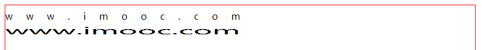

# SVG

## 一、定义

+ 可伸缩矢量图形( Scalable Vector Graphics )
+ SVG 使用XML格式定义图形

## 二、优势

+ SVG图像中的文本是可选的， 同时也是可搜索的(适合制作地图)
+ SVG 与 JPEG / GIF 图像比起来， 尺寸更小， 且可压缩性更强
+ 可伸缩，不失真

## 三、viewport 视口

+ 定义：SVG可见区域的大小，画布大小

```html
<!-- 默认单位px -->
<svg width="800" height="600"></svg>
```

## 四、viewBox 视区盒子

+ 定义：视口中视图区域

+ 语法：viewBox=“x, y, w, h”

```html
<svg width="800" height="600" viewBox="0 0 80 60"></svg>
```

+ 注意：
  1. viewBox与viewport宽高比为一定比例时会撑满 viewport
  2. preserveAspectRatio属性：让viewBox保持宽高比
+ demo  1.html

#### 4.1 preserveAspectRatio

+ 语法： preserveAspectRatio=[defer]\<align>\<metOrSlice>

  + defer：可选，仅在image元素上应用

  + align：必选，控制viewBox是否强制进行均匀缩放

    + 取值： 

      1. xMin  viewBox的最小X值对齐viewport的左边部
      2. xMid  viewBox的X轴中点对齐viewport的X轴中点
      3. xMax viewBox的最大X值对齐viewport的右边部
      4. YMin  viewBox的最小Y值对齐viewport的顶边
      5. YMid  viewBox的Y轴中点对齐viewport的Y轴中点
      6. Y Max viewBox的最大Y值对齐viewport的底边

      

  + metOrSlice：控制viewBox缩放的方式

    + 取值：
      1. meet(默认)： 保持宽高比缩放，相当于background-size: container
      2. slice： 保持宽高比缩放并将超出部分裁剪，相当于background-size:  conver
      3. none：不保持宽高比，缩放图像适合整个viewBox，图像可能变形

  ```html
  <svg 
       width="800" 
       height="600" 
       viewBox="0 0 80 60"
       preserveAspectRatio="xMidYmid meet"
  ></svg>
  ```

+ demo  2.html

## 五、SVG 坐标系统

+ 世界坐标系统

+ 最初最表系统

+ 用户最表系统

+ 嵌套坐标系统

+ 转换坐标系统

  1. SVG transform属性

     + 定义：缩放、移动、倾斜、旋转。类似于css transform转换
     + 语法：
       + transform=“translate(\<tx> [\<ty>])”
         1. tx 代表x轴上的translation值；ty表示y轴上的translation值
         2. ty值是可选的，默认为0
         3. 不包含单位
       + transform="rotate(\<rotate-angle> [\<cx> \<cy>])"
         1. rotate-angle  旋转角度，不写单位，默认单位为deg
         2. 可选cx和cy值代表无单位的旋转中心点
         3. 如cx和cy未设置， 旋转点未当前用户坐标系原点
       + transform="scale(\<sx> [\<sy>])"
         1. sx 代表沿x轴的缩放值
         2. sy代表y轴缩放值，可选， 如省略默认值等于sx
         3. 特别说明：HTML元素缩放是以自己为中心点，SVG元素的缩放是相对SVG的左上角， ***当SVG元素缩放时， 整个坐标系被缩放，导致元素在视口中重新定位***
       + transform="skewX(\<skew-angle>)"  transform="skewY(\<skew-angle>)"
         1. 

     ```html
     <!-- 取值: translate/rotate/scale/skew/matrix -->
     <svg width="800" height="600">
     	<rect x="200" y="100" width="400" height="200" transform="translate(100)" ></rect>
     </svg>
     ```

     + 也可以使用css transform用于SVG元素，但IE不支持
     + 两者不同之处： 
       1. ***css transform是相对于自身元素  SVG是相对于画布***
       2. SVG transform只支持二维变换

## 六、SVG 形状

#### 6.1 矩形

1. \<rect x="x" y="y" rx="rx" ry="ry" width="width" height="height" />
2. 参数说明
   + rx 可选，圆角的x半径，默认为0 
   + ry 可选， 圆角的y半径，默认为0

#### 6.2 圆形

1. \<circle cx="cx" cy="cy" r="r" />
2. 参数说明
   + r 圆的半径
   + cx 圆心的坐标
   + cy 圆心坐标 

#### 6.3 椭圆

1. \<ellipse cx="cx" cy="cy" rx="rx" ry="ry" />
2. 参数说明
   + rx/ry 椭圆的x/y半径
   + cx/cy 椭圆中心点的x/y坐标

#### 6.4 线

1. \<line x1="x1" y1="y1" x2="x2" y2="y2" />
2. 参数说明
   + x1/x2 起点/终点的x坐标
   + y1/y2 起点/终点的y坐标

#### 6.5 折线

1. \<polyline points="x1 y1 x2 y2 x3 y3 ...." />
2. 参数说明
   + 参数为xy坐标，可以无限
3. 注意：路径绘制完成后会闭合图形，形成一个闭合的多边形(可以不用回到原点)

#### 6.6 多边形

1. \<polygon points="x1 y1 x2 y2 x3 y3 ...." />
2. 参数说明
   + 参数为xy坐标，可以无限
3. 和折线很像，polygon的路径在最后一个点处自动回到第一个点

#### 6.7 路径

1. \<path />

2. path元素的形状通过属性d定义，d是一个点集数列以及其它关于如何绘制路径的信息，值是一个“命令+参数”的序列

3. 属性命令

   每个命令都用一个关键字目表示，例：M 表示 moveTo命令，每个命令有两种表示方式，大写字母表示绝对定位；小写字母表示相对定位。属性d采用用户坐标系统，所以不需标明单位

   + 直线命令

     \<path d="M x  y  L x  y  H x  V y  Z" stroke="#f00" fill="transparent" />

     \<path d="m dx dy l dx dy h dx v dy z" stroke="#f00" fill="transparent" />

     1. M x y (m dx dy)
        + 定义： moveTo命令， 移动画笔而不画
        + M x y 表示将画笔移动到坐标x, y
        + m dx dy 表示将画笔向右移动dx像素, 向下移动dy像素
     2. L x y (l dx dy)
        + 定义： lineTo命令， 在当前位置到新的位置画一条线段
        + L x y 表示从L命令之前的点到x，y
        + l dx dy表示从l命令之前的点到相对向右dx像素向下dy像素的点之间画一条线段
     3. H x(h dx)
        + 定义：绘制水平线
        + H x 表示绘制到x轴上的x点位置
        + h dx表示向右绘制dx像素
     4. V y (v dy)
        + 定义： 绘制垂直线
        + V y 表示绘制到y轴上的y点的位置
        + v dy 表示向下绘制dy像素
     5. Z(z)
        + 定义：闭合路径命令。不区分大小写

   + 曲线命令

     1. 分类： 贝赛尔曲线 和 弧形

     2. 贝赛尔曲线

        + path元素中存在两种贝赛尔曲线： 三次贝赛尔曲线C 和 二次贝赛尔曲线Q

        + 三次贝赛尔曲线

          1. C x1 y1, x2 y2, x y(c dx1 dy1, dx2 dy2, dx dy)
          2. x1 y1 起点控制点
          3. x2 y2 终点控制点
          4. x y 曲线终点

          ```html
          <path d="M10 10 C 20 20, 40 20, 50 10" stroke="#f00" fill="transparent" />
          ```

        + C命令的对称命令 S命令

          1. S x2 y2, x y(s dx2 dy2, dx dy)

          2. S命令用于将若干个贝赛尔曲线连起来，从而创建出一条很长的平滑曲线

          3. S命令跟C命令或另一个S命令后面。它第一个控制点会被假设成前一个控制点的对称点

          4. S命令单独使用，它的两个控制点就会被假设为用一个点

             ```html
             <path d="M10 80 C 40 10, 65 10, 95 80 S 150 150, 180 80" stroke="#f00" fill="transparent" />
             ```

             

        + 二次贝塞尔曲线

          1. Q x1 y1, x y(q dx1 dy1, dx dy) 只需要一个控制点，确定起点和终点的曲线斜率

          2. x1 y1 控制点

          3. x y 曲线终点

             ```html
             <path d="M10 40 Q 95 10 180 40" stroke="#f00" fill="transparent" />
             ```

        + Q命令的对称命令T命令

          1. T x y (t dx dy)
          2. 类似于S命令，用于将若干个贝赛尔曲线连起来，创建出一条很长的平滑曲线
          3. 通过前一个控制点，腿短出一个新的控制点
          4. T命令单独使用，控制点和终点会是同一个点， 画出来的将是一条直线

   + 弧形

     A rx ry x-axis-rotation large-arc-flag sweep-flag x y

     a rx ry x-axis-rotation large-arc-flag sweep-flag dx dy

     1. 参数说明

        + rx ry 分别是椭圆的x轴半径和y轴半径
        + x-axis-rotation控制椭圆的旋转角度，默认角度deg，正方向为顺时针
        + large-arc-flag决定弧线是大于还是小于180度。 0表示小角度弧，1表示大角度弧
        + sweep-flag表示弧线的方向，0表逆时针，1顺时针
        + x y 表示弧形的终点

        ```html
        <path
              d="M 10 315
                 L 110 215
                 A 30 50 0 0 1 162.55 162.45
                 L 172.55 152.45
                 A 30 50 -45 0 1 215.1 109.9
                 L 315 10"
              stroke="#f00"
              fill="green"
        />
        ```


## 七、SVG 文本

#### 7.1 text元素

+ \<text>www.imooc.com\</text>

+ 设置字体属性

  + font-family
  + font-style
  + font-weight
  + font-wariant
  + font-stretch
  + font-size
  + font-size-adjust
  + kering
  + letter-spacing
  + word-spacing
  + text-decoration

  ```html
  <!-- 单位有多种 -->
  <text font-size="12px" font-weight="bold" x="0" y="0"></text>
  ```

+ 文本的位置

  + 普通用法 x=“0” y="0"
  + 其它用法 x="0 20 40 60 80 ..." y="0 10 20 30 40 ..."

+ 文本的偏移

  + 普通用法 dx="dx" dy="dy"
  + 其它永达 dx="x1 x2 x3 .." dy="y1 y2 y3 y4"

+ 文本的旋转

  + 普通用法 rotate=“45”
  + 其它用法 rotate=“0 45 90”
  + 以上都是对单个文字操作的，如果要整体旋转，要使用 transform=“rotate(45)”

+ 文本的长度

  + textLength="400" 每个字母平分空间

+ 文本的宽度

  + lengthAdjust=“spacingAndGlyphs/spacing(默认值)” 

    ```html
    <!-- spacingAndGlyphs：可以理解为填满 spacing：理解为空出 -->
    <text x="0" y="25" textLength="400" lengthAdjust="spacingAndG	lyphs">www.imooc.com</text>
    ```

    

#### 7.2 tspan元素

+ 定义：用来标记大块文本的子部分，必须是一个text元素或者别的tspan元素的子元素(得在text或者tspan元素里面使用)

  ```html
  <text>www.<tspan fill="red">imooc</tspan>.com</text>
  
  <text>www.<tspan fill="red" stroke-width="0.1">imooc</tspan>.com</text>
  ```

#### 7.3 textPath元素

+ 定义： 利用xlink:href属性把字符对齐到路径，让字体环绕路径、顺着路径走

  ```html
  <path 
        id="path" 
        d="M 10 10 Q 150 80 290 10" 
        stroke="red" 
        fill="transparent">
  </path>
  <text>
  	<textPath xlink:href="#path">http://www.imooc.com</textPath>
  </text>
  ```

  


## 八、填充和边框

#### 8.1 上色

+ fill

+ stroke

  ```html
  <!-- fill-opacity 修饰fill透明度 -->
  <!-- fill/stroke中直接可以使用rgba -->
  <rect
        x="10"
        y="10"
        width="80"
        height="30"
        fill="red"
        fill-opacity="0.5"
        stroke="green"
        stroke-opacity="0.8"
  />
  ```

+ 使用css

  + 内联css

    ```html
    <svg viewBox="0 0 200 100">
        <style type="text/css">
            .style {
                stroke: #F47983;
                fill: #ABCDEF
            }
            .style:hover {
                stroke: #ABCDEF;
                fill: #F47983;
                cursor: pointer;
            }
        </style>
        <rect class="style" x="10" y="10" width="180" height="80" />
    </svg>
    ```

  + 外联css

    ```html
    <!-- 标签引入 -->
    <?xml-stylesheet type="text/css" href="style.css"?>
    ```

#### 8.2 描边

+ stroke-width 

  描边宽度 取值： 数字

+ stroke-linecap 

  控制边框终点的形状 取值：butt/square/round

  1. butt 常规
  2. square 超出实际路径范围 超出大小由stroke-width决定
  3. round 边框终点为圆角 圆角半径由stroke-width 决定

  ```html
  <svg viewBox="0 0 160 60" xmlns="http://www.w3.org/2000/svg">
      <line x1="20" x2="140" y1="10" y2="10" stroke="black" stroke-width="10" stroke-linecap="butt"/>
      <line x1="20" x2="140" y1="30" y2="30" stroke="black" stroke-width="10" stroke-linecap="square"/>
      <line x1="20" x2="140" y1="50" y2="50" stroke="black" stroke-width="10" stroke-linecap="round"/>
  </svg>
  ```

  

  

+ stroke-linejoin

  控制两条描边线段之间的连接方式 取值： miter/round/bevel

  1. miter 默认值 尖角
  2. round 圆角
  3. bevel 连接处形成一个斜接

  ```html
  <svg viewBox="0 0 160 80" xmlns="http://www.w3.org/2000/svg">
      <polyline points="10 30 30 10 50 30" stroke="black" stroke-width="10" stroke-linecap="butt" fill="none" stroke-linejoin="miter"/>
      <polyline points="60 40 80 20 100 40" stroke="black" stroke-width="10" stroke-linecap="round" fill="none" stroke-linejoin="round"/>
      <polyline points="110 50 130 30 150 50" stroke="black" stroke-width="10" stroke-linecap="square" fill="none" stroke-linejoin="bevel"/>
  </svg>
  ```

  

  

+ stroke-dasharray

  将虚线类型应用到描边上, 一组用逗号分隔的数字组成的数列，第一个数字表示填色区域的长度，第二个数字表示非填色区域的长度

  ```html
  <svg version="1.1" xmlns="http://www.w3.org/2000/svg" viewBox="0 0 200 100" xml:space="preserve">
      <path d="M 10 50 Q 50 10 100 50 T 190 50" stroke="black" stroke-linecap="round" stroke-dasharray="5,10,5" fill="none"/>
      <path d="M 10 50 L 190 50" stroke="red" stroke-linecap="round" stroke-width="1" stroke-dasharray="5,5" fill="none"/>
  </svg>
  ```

  

## 九、滤镜

#### 9.1 剪切

+ 定义： 裁掉部分内容

  ```html
  <svg viewBox="0 0 400 200" xmlns="http://www.w3.org/2000/svg">
      <!-- 用defs定义一个虚拟的图形， 通过clip-path引入 -->
      <defs>
          <clipPath id="cut-off-bottom">
              <rect x="0" y="0" width="200" height="100" />
          </clipPath>
      </defs>
      <circle cx="100" cy="100" r="100" clip-path="url(#cut-off-bottom)" />
  </svg>
  ```

  

#### 9.2 渐变

1. 说明：必须给渐变内容制定一个id属性，以供元素调用。为了让渐变被重复使用，渐变内容需要定义在\<defs>标签的内部

2. 调用：\<element fill="url(#gradient)" stroke="url(#gradient)" />

3. 分类

   + 线性渐变

     ```html
     <svg viewBox="0 0 400 200" xmlns="http://www.w3.org/2000/svg">
         <defs>
             <!-- x1y1 起点 x2y2终点 用于控制方向-->
             <linearGradient id="gradient" x1="0%" y1="0%" x2="100%" y2="0%">
                 <stop offset="20%" stop-color="yellow" />
                 <stop offset="20%" stop-color="red" />
                 <stop offset="40%" stop-color="red" />
                 <stop offset="40%" stop-color="blue" />
                 <stop offset="60%" stop-color="blue" />
                 <stop offset="60%" stop-color="green" />
             </linearGradient>
         </defs>
         <ellipse cx="200" cy="100" rx="100" ry="50" fill="url(#gradient)" />
     </svg>
     
     ```

   + 径向渐变

     ```html
     <svg viewBox="0 0 400 200" xmlns="http://www.w3.org/2000/svg">
         <defs>
             <!-- 
     			fx fy 起始点位置
     			cx cy 圆心???
     		-->
             <radialGradient id="gradient" cx="50%" cy="50%" r="50%" fx="30%" fy="30%">
                 <stop offset="0%" stop-color="yellow" />
                 <stop offset="100%" stop-color="red" />
             </radialGradient>
         </defs>
         <ellipse cx="200" cy="100" rx="100" ry="50" fill="url(#gradient)" />
     </svg>
     ```

     

#### 9.3 遮罩

​	使用透明度和灰度值遮罩计算得到的软边缘

```html
<svg viewBox="0 0 400 200" xmlns="http://www.w3.org/2000/svg">
    <defs>
        <linearGradient id="Gradient">
            <stop offset="0" stop-color="white" stop-opacity="0" />
            <stop offset="1" stop-color="white" stop-opacity="1" />
        </linearGradient>
        <mask id="mask">
            <rect x="0" y="0" width="200" height="100" fill="url(#Gradient)" />
        </mask>
    </defs>
    <circle cx="100" cy="100" r="100" mask="url(#mask)" />
</svg>

```


#### 9.4 嵌入光栅图像

​	SVG的\<image>元素允许在一个SVG对象内部呈现光栅图像

```html
<svg viewBox="0 0 400 200" xmlns="http://www.w3.org/2000/svg">
    <image xlink:href="imooc.svg" x="50" y="50" width="100" height="100" />
    <image xlink:href="imooc.png" x="250" y="50" width="100" height="100" />
</svg>
```


## 十、SVG动画

#### 10.1 animation元素及效果概览

+ \<set> 设置

  ```html
  <svg width="400" height="400" xmlns="http://www.w3.org/2000/svg">
      <circle cx="200" cy="200" r="50" style="fill:#ff6600" >
          <!-- attributeName：控制的属性 begin：开始执行时间 to：属性值改变为 -->
          <set attributeName="r" attributeType="XML" to="80" begin="3s" />
      </circle>
  </svg>
  ```

+ \<animate> 动画

  ```html
  <svg width="400" height="400" xmlns="http://www.w3.org/2000/svg">
      <circle cx="200" cy="200" r="50" style="fill:#ff6600" >
          <!-- 
  			attributeName: 控制哪个属性
  			form to: 从多少到多少
  			begin dur： 开始执行时间和结束时间
  		-->
          <animate attributeName="r" from="50" to="80" begin="0s" dur="3s" />
      </circle>
  </svg>
  
  ```

+ \<animateTransform> 实现transform变换动画效果

  ```html
  <svg width="400" height="400" xmlns="http://www.w3.org/2000/svg">
      <circle cx="200" cy="200" r="50" style="fill:#ff6600" >
          <!-- 注意变换会带来坐标的变化 -->
          <animateTransform attributeName="transform" begin="0s" dur="3s" type="scale" from="1" to="1.5" />
      </circle>
  </svg>
  ```

+ \<animateMotion> 让SVG各种图像沿着特定的路径运动

  ```html
  <svg width="400" height="400" xmlns="http://www.w3.org/2000/svg">
      <polygon points="-12 -69,-58 85,64 -14,-81 -14,41 85" style="fill: #ff6600;" >
          <!-- 注意rotate="auto"有与没有的区别 -->
          <animateMotion path="M100 100, A120 120, -45 0 1, 300 300 A120 120, -45 0 1, 100 100" dur="3s" rotate="auto" />
      </polygon>
  </svg>
  ```

  1. 组合动画： 构成复杂动画

     ```html
     <svg width="400" height="400" xmlns="http://www.w3.org/2000/svg">
         <circle cx="200" cy="200" r="50" style="fill:#ff6600" >
             <!-- repeatCount:重复次数 -->
             <animate attributeName="r" from="50" to="80" begin="0s" dur="3s" repeatCount="indefinite" />
             <animate attributeName="opacity" from="1" to="0" begin="0s" dur="3s" repeatCount="indefinite" />
         </circle>
     </svg>
     ```

  2. 动画属性详解

     + attributeName 要变化的属性名称 可以是元素实行也可以是css属性

     + attributeType: "CSS/XML/auto"

       xml: 比如 x y

     + from 动画的起始值 未定义则默认值为attributeName 的值

     + to 动画的结束值

     + by 动画的相对变化值

     + values 用分号分隔的一个或者多个值，可以看出是动画的多个关键点值

       1. to...
       2. from...to...
       3. from...by...
       4. values...

     + begin 动画开始时间 begin="value1;value2" 动画分别在begin时间点执行

     + end 动画结束时间

     + offset-value 偏移值

     + syncbase-value 基于同步确定值

     + event-value 与事件相关联的值

     + repeat-value 重复多少次之后执行

     + accessKey-value 定义快捷键，按下某个按键动画开始

     + wallclock-sync-value 真实世界的时钟时间定义

     + indefinite 无限等待

     + dur 动画持续时间 常规时间值或者indefinite

     + calcMode keyTimes keySplines

       1. discrete 直接from值跳到to值
       2. linear 匀速(animateMotion元素以外元素的calcMode默认值)
       3. paced 通过插值让动画变化步调平稳均匀
       4. spline 插值定义贝赛尔曲线

     + repeatCount 动画执行次数

     + repeatDur 重复动画的总时间

     + fill 动画间隙的填充方式

       1. remove 默认值 动画结束直接回到开始的地方
       2. freeze 动画结束后结束之后的状态

     + accumulate 

       1. none 默认值
       2. sum 动画结束时候的位置为下次动画的起始位置

#### 10.2 动画的暂停和播放

+ svg.pauseAnimations() 暂停
+ svg.unpauseAnimations() 播放


## 十一、SVG嵌入HTML

#### 11.1 使用svg文件

+ \<embed>

  ```html
  <!DOCTYPE html>
  <html lang="en">
  <head>
      <meta charset="UTF-8">
      <title>1_1_embed</title>
  </head>
  <body>
      <embed src="imooc.svg" width="1024" height="768" type="image/svg+xml" pluginspage="http://www.adobe.com/svg/viewer/install/" />
  </body>
  </html>
  ```

+ \<object>

  ```html
  <!DOCTYPE html>
  <html lang="en">
  <head>
  	<meta charset="UTF-8">
  	<title>1_1_object</title>
  </head>
  <body>
  	<object data="imooc.svg" width="1024" height="768" type="image/svg+xml" codebase="http://www.adobe.com/svg/viewer/install/" />
  </body>
  </html>
  ```

+ \<iframe>

  ```html
  <!DOCTYPE html>
  <html lang="en">
  <head>
  	<meta charset="UTF-8">
  	<title>1_1_iframe</title>
  </head>
  <body>
  	<iframe src="imooc.svg" width="1024" height="768"></iframe>
  </body>
  </html>
  ```

+ \

  ```html
  <!DOCTYPE html>
  <html lang="en">
  <head>
  	<meta charset="UTF-8">
  	<title>2_img</title>
  </head>
  <body>
  	
  </body>
  </html>
  ```

#### 11.2 嵌入svg结构

​	直接将svg整个标签放在html结构中