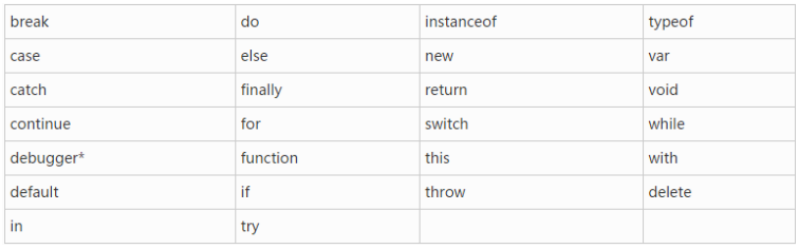
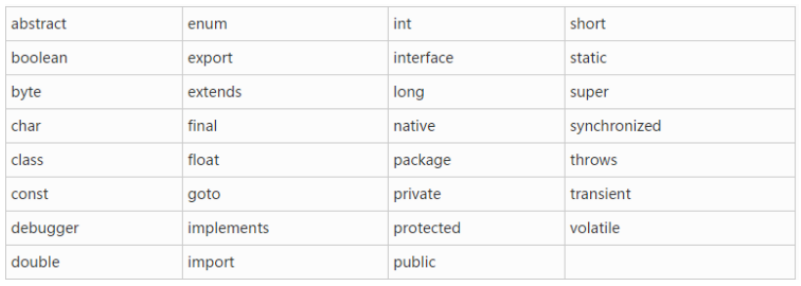
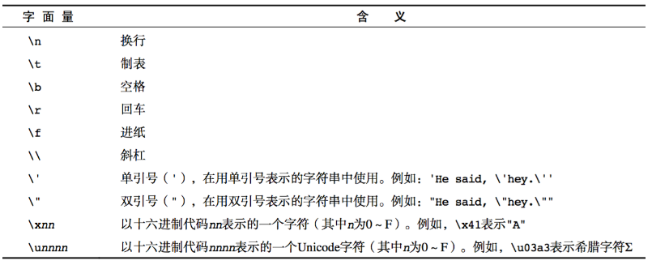

# 一、JavaScript介绍

javascript是一种运行在***客户端***的***脚本语言***

+ js注释

  1. 单行注释： //
  2. 多行注释： /*开头 */结尾
  3. 文档注释：/** 在js中一般用于给函数做说明

+ js常见的输入输出语句

  ```js
  // 1.弹出一个提示框
  alert("hello world");
  // 2.弹出一个确认弹窗
  confirm("我帅吗？");
  // 3.弹出一个文本输入框
  prompt("请输入你的真是年龄");
  // 4.在网页上添加一段内容
  document.write("<h1>hello world</h1>");
  // 5.控制台输出日志
  console.log("hello word");
  ```

+ js组成

  1. ECMAscript----->javascript语言标准
  2. Dom----->操作界面元素的一套方法
  3. Bom----->操作浏览器功能的一套方法


# 二、变量

+ 声明： 使用var声明

+ 使用：

  1. 声明变量的同时进行赋值

     ```js
     var name = '小马哥';
     ```

  2. 先声明，后赋值

     ```js
     var name;
     name = '小马哥'
     ```

  3. 不声明直接赋值(不建议)

     ```js
     height = 100;
     ```

  4. 同时声明多个变量

     ```js
     var age = 10,name= 'zs' 
     ```

  5. 有些特殊变量可以不声明不赋值，直接使用

     ```js
     console.log(name);
     console.log(top); // top不允许修改，无法赋值
     ```

+ 变量的命名规范(使用名词)

  1. 变量由**字母**、**数字**、**下划线**、**$符号**组成

  2. 不能以数字开头

  3. 燕哥区分大小写

  4. 不能使用中横线(会识别为减号)

  5. 不能使用关键字和保留字

     + 关键字：对于js来说有特殊意义的一些单词

       

     + 保留字：js保留了一些单词，这些单词现在不用，但是以后要用。

       


# 三、数据类型

+ 基本数据类型(简单数据类型、原始数据类型、值类型)

  1. number 数值类型

     + 八进制：一0开头的数值：var a = 0120，十进制为80。注意：比如079并非八进制，因八进制数字为0-70

     + 十六进制： 以0x开头

     + 浮点数：存在精度丢失问题，由小数的二进制的表示方式产生的，解决方式为尽量避免使用浮点数

     + 数值范围

       ```js
       // 1.最小值(最小正数)
       Number.MIN_VALUE
       // 2.最大值
       Number.MAX_VALUE
       // 3.正无穷
       Infinity
       // 4.负无穷
       -Infinity
       ```

     + 数值判断NaN

       ```js
       // 1. 意为not a number
       // 2. NaN是数值类型
       // 3. NaN不等于任何值，包括自身
       // 4. 运算不出结果，js不报错，返回NaN
       // 5. isNaN判断一个值不是数字，返回true 不是一个数字。返回false是一个数字
       
       ```

  2. string 字符串类型(特俗：不可变性)

     + 转义符

       

     + 字符串长度(length)

       ```js
       var a = '您好';
       console.log(a.length);
       ```

     + 字符串拼接(+)

       ```js
       // 1. 两边只要有一个为字符串，那么+就是字符串拼接
       // 2. 两边为数字，为算术功能
       ```

  3. boolean 布尔类型

     + true false 区分大小写
     + 计算机内部存储true为1 false 为0
     + false： 0 “” false undefined null NaN

  4. undefined 未定义

     + undefined表示一个声明了但没有赋值的变量，值默认为undefined
     + 如果一个函数没有明确的返回值，那么此函数的返回值为undefined
     + 如果访问一个对象不存在的属性，这个属性的值即为undefined

  5. null

     + null便是一个不存在的对象

  ```js
  // 打印数据类型(type of 只能获取基本数据类型)
  type of a
  typeof(a)
  typeof(null) // 返回值是object
  ```

+ 引用数据类型(复杂数据类型)

  1. 数组Array
  2. 函数function

+ 共同点

  1. 基本数据类型保存的是值本身，赋值、传递时都是值本身

     ```js
     var a = 23;
     var b = a; // 赋值时赋值的是23这个值，赋值值本身
     a = 24; // 此时修改a的值，b值还是23没有变化
     ```

  2. 引用数据类型保存的是地址

     ```js
     var a = [1,2,3,4];
     var b = a;	// 赋值时赋值的是地址
     a.push(5);	// a添加改变数组，此时b也改变，a改变的是内存里的数据，b访问时访问的是改变后的数据
     ```


# 四、数据类型转换

+ 转行成字符串

  1. 调用方法tostring可将数值、布尔值转换为字符串(不适用于undefined和null)

     ```js
     var a = 12;
     a.tostring();
     ```

  2. 调用函数String()可将数值、布尔值、undefined和null转换成字符串

     ```js
     var b = 12;
     String(b);
     ```

  3. 使用字符串拼接(+)

+ 转换成数字

  1. 使用parseInt()将字符串转换成数字

     ```js
     // parseInt parseFloat 会对字符串逐个转换，遇到非数字停止转换
     var a = '123';
     parseInt(a);	// 只会取整数，舍弃小数
     ```

  2. 使用parseFloat()将字符串转换为小数

     ```js
     var b = '456';
     parseFloat(b);	// 只会保留小数
     ```

  3. 使用Number()函数将字符串转换成数字

     特点：整体转换。如果字符串有转换不了的非数字，则报错NaN

  4. 让字符串和数字作除了加法的其它运算

     ```js
     var d = "345";
     var num;
     num = d - 0;
     num = d / 1;
     num = d * 1;
     ```

  5. 在字符串前使用正号(常用)负号

     ```js
     var a = '456';
     var num;
     num = +a;
     ```

  6. a.toFixed(num)  保留num位小数

+ 转换成布尔值

  1. 使用*Boolean*()函数转换

     + 数字转换成布尔值，只有0和NaN会被转换成false

     + 如果字符串转换为boolean值，只有空字符串会为false

     + undefined、null会被转为false

     + 总结：0、NaN、‘’、undefined、null、false会被转换为false，其它皆为true

  2. 使用!!转换

     ```js
     var x = 12;
     console.log(!!x);	// 结果为true
     ```