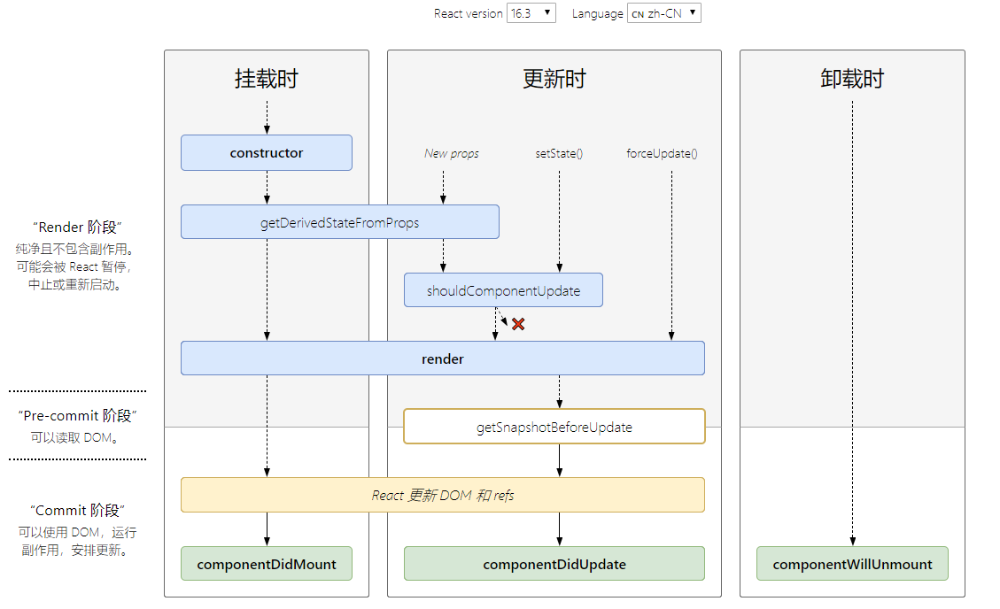
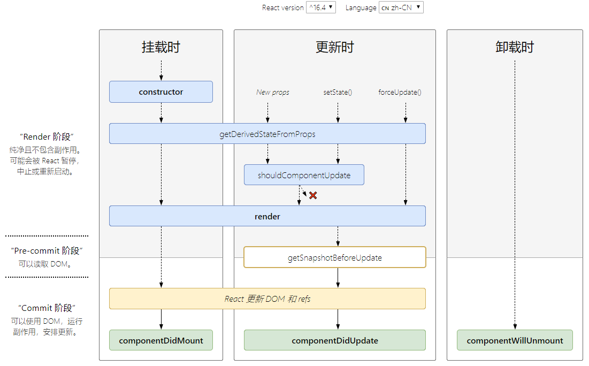

# 以组件方式考虑UI的构建

### 一、理解 React 组件

<font color=red> **props + state ----> view** </font>

+ React 组件一般不提供方法，而是某种状态机
+ React 组件可以理解为一个纯函数
+ 单向数据绑定


### 二、何时创建组件

<font color=red> **单一职责原则** </font>

+ 每个组件只做一件事
+ 如果组件变得复杂，那么应该拆分成小组件


### 三、数据状态管理

<font color=red> **DRY原则** </font>

+ 能计算得到的状态就不要单独存储

  比如一个 loading 状态，可以通过是否有数据得到是否处于 loading，而不需要单独存储一个 loading 状态

+ 组件尽量无状态，所需数据通过 props 获取


### 四、受控组件 vs 非受控组件

+ 受控组件

  表单元素状态由使用者维护

  ```jsx
  // value 的值一直是 this.state.value 来控制
  <input
  	type="text"
  	value={ this.state.value }
  	onChange={ e =>this.setState({ value: e.target.value }) }
  />
  ```

+ 非受控组件

  表单元素状态 dom 自身维护

  ```jsx
  <input
  	type="text"
      ref={ node => this.input = node }
  />
  ```


# JSX 的本质不是模板引擎，而是语法糖

### 一、本质

```jsx
const name = 'Nate Wang';
const element = <h1>Hello, { name }</h1>
      
// 实际上是以下的样子
const name = 'Nate Wang';
const element = React.createElement('h1', null, 'Hello, ', name);
```

### 二、约定

+ React 认为小写的 tag 是原生 DOM 节点，如 div
+ 大写字母开头为自定义组件
+ JSX 标记可以直接使用属性语法，例如 `<menu.Item />`，属性语法不需要遵循大写字母开头的约定


# React 组件的生命周期以及使用场景

http://projects.wojtekmaj.pl/react-lifecycle-methods-diagram/





### 一、constructor

+ 用于初始化内部状态
+ 唯一可以直接修改 state 的地方


### 二、getDerivedStateFromProps

+ 当 state 需要从 props 初始化时使用
+ 尽量不要使用：维护两者状态一致性会增加复杂度
+ 每次 render 都会调用
+ 典型场景：表单控件获取默认值


### 三、componentDidMount

+ UI 渲染完成后调用
+ 只执行一次
+ 典型场景：获取外部资源


### 四、componentWillUnmount

+ 组件移除时被调用
+ 典型场景：资源释放


### 五、getSnapshotBeforeUpdate

+ 在页面 render 之前调用，state 已更新

+ 典型场景：获取 render 之前的 DOM 状态

  return 的值会作为 componentDidUpdate 的第三个参数传入


### 六、componentDidUpdate

+ 每次 UI 更新时被调用
+ 典型场景：页面需要根据 props 变化重新获取数据


### 七、shouldComponentUpdate

+ 决定 Virtual DOM 是否要重绘
+ 一般可以由 <font color=red> **PureComponent** </font>自动实现
+ 典型场景：性能优化
