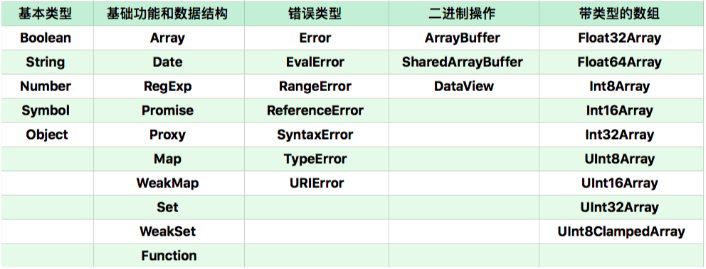

# 一、JavaScript

### 05 | JavaScript类型：关于类型，有哪些你不知道的细节？

+ Undefined 类型表示未定义，它的类型只有一个值，就是 undefined。任何变量在赋值前是 Undefined 类型、值为 undefined


+ JavaScript 的 undefined 是一个变量，而并非是一个关键字，为了避免无意中被篡改，建议使用 void 0 来获取 undefined 值


+ Null 类型也只有一个值，就是 null，它的语义表示空值，与 undefined 不同，null 是 JavaScript 关键字


+ JavaScript 中的字符串一旦字符串构造出来，无法用任何方式改变字符串的内容，字符串具有值类型的特征


+ 检查等式左右两边差的绝对值是否小于最小精度，才是正确的比较浮点数的方法

  ```js
  // 错误方式
  console.log( 0.1 + 0.2 == 0.3)
  // 正确方式
  console.log( Math.abs(0.1 + 0.2 - 0.3) <= Number.EPSILON)
  ```


+ 多数情况下，Number 是比 parseInt 和 parseFloat 更好的选择


+ Number、String 和 Boolean，三个构造器是两用的，当跟 new 搭配时，它们产生对象，当直接调用时，它们表示强制类型转换


### 06 | JavaScript对象：面向对象还是基于对象？

+ JavaScript 对象的两类属性
  1. 数据属性：它比较接近于其它语言的属性概念。数据属性具有四个特征
     + value：就是属性的值
     + writable：决定属性能否被赋值
     + enumerable：决定 for in 能否枚举该属性
     + configurable：决定该属性能否被删除或者改变特征值
  2. 访问器（getter/setter）属性
     + getter：函数或 undefined，在取属性值时被调用
     + setter：函数或 undefined，在设置属性值时被调用
     + enumerable：决定 for in 能否枚举该属性
     + configurable：决定该属性能否被删除或者改变特征值


### 08 | JavaScript对象：你知道全部的对象分类吗？

+ JavaScript 中的对象分类

  1. 宿主对象（host Objects）：由 JavaScript 宿主环境提供的对象，它们的行为完全由宿主环境决定

  2. 内置对象（Built-in Objects）：由 JavaScript 语言提供的对象

     + 固有对象（Intrinsic Objects ）：由标准规定，随着 JavaScript 运行时创建而自动创建的对象实例

     + 原生对象（Native Objects）：可以由用户通过 Array、RegExp 等内置构造器或者特殊语法创建的对象
       

       通过这些构造器，我们可以用 new 运算创建新的对象，所以我们把这些对象称作原生对象

     + 普通对象（Ordinary Objects）：由{}语法、Object 构造器或者 class 关键字定义类创建的对象，它能够被原型继承


### 16 | JavaScript执行（一）：Promise里的代码为什么比setTimeout先执行？

+ 宿主发起的任务称为<font color=red> **宏观任务** </font>，把 JavaScript 引擎发起的任务称为<font color=red> **微观任务**</font>， 许多的微观任务的队列组成了宏观任务
+ 如何分析异步执行的顺序：
  - 首先我们分析有多少个宏任务；
  - 在每个宏任务中，分析有多少个微任务；
  - 根据调用次序，确定宏任务中的微任务执行次序；
  - 根据宏任务的触发规则和调用次序，确定宏任务的执行次序；
  - 确定整个顺序。


### 17丨JavaScript执行（二）：闭包和执行上下文到底是怎么回事？

+ 执行上下文：一段代码（包括函数）执行所需的所有信息
  1. lexical environment：词法环境，当获取变量或者 this 值时使用。
  2. variable environment：变量环境，当声明变量时使用
  3. code evaluation state：用于恢复代码执行位置。
  4. Function：执行的任务是函数时使用，表示正在被执行的函数。
  5. ScriptOrModule：执行的任务是脚本或者模块时使用，表示正在被执行的代码。
  6. Realm：使用的基础库和内置对象实例。
  7. Generator：仅生成器上下文有这个属性，表示当前生成器。