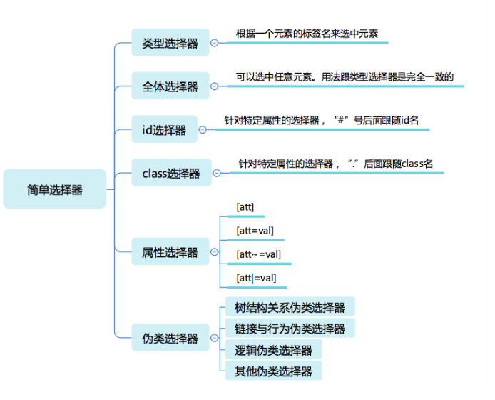
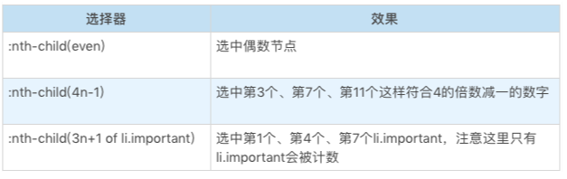
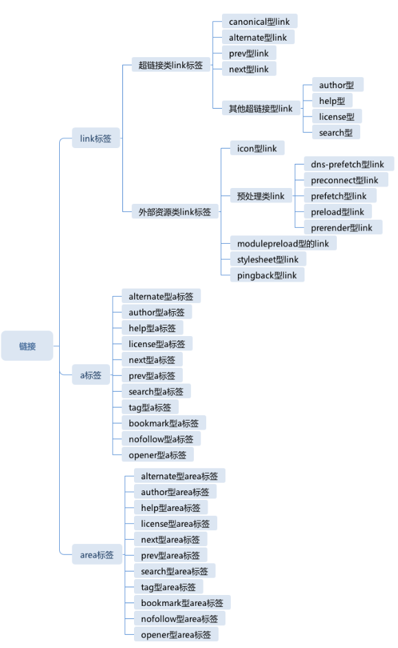

# 一、JavaScript

### 05 | JavaScript类型：关于类型，有哪些你不知道的细节？

+ Undefined 类型表示未定义，它的类型只有一个值，就是 undefined。任何变量在赋值前是 Undefined 类型、值为 undefined


+ JavaScript 的 undefined 是一个变量，而并非是一个关键字，为了避免无意中被篡改，建议使用 void 0 来获取 undefined 值


+ Null 类型也只有一个值，就是 null，它的语义表示空值，与 undefined 不同，null 是 JavaScript 关键字


+ JavaScript 中的字符串一旦字符串构造出来，无法用任何方式改变字符串的内容，字符串具有值类型的特征


+ 检查等式左右两边差的绝对值是否小于最小精度，才是正确的比较浮点数的方法

  ```js
  // 错误方式
  console.log( 0.1 + 0.2 == 0.3)
  // 正确方式
  console.log( Math.abs(0.1 + 0.2 - 0.3) <= Number.EPSILON)
  ```


+ 多数情况下，Number 是比 parseInt 和 parseFloat 更好的选择


+ Number、String 和 Boolean，三个构造器是两用的，当跟 new 搭配时，它们产生对象，当直接调用时，它们表示强制类型转换


### 06 | JavaScript对象：面向对象还是基于对象？

+ JavaScript 对象的两类属性
  1. 数据属性：它比较接近于其它语言的属性概念。数据属性具有四个特征
     + value：就是属性的值
     + writable：决定属性能否被赋值
     + enumerable：决定 for in 能否枚举该属性
     + configurable：决定该属性能否被删除或者改变特征值
  2. 访问器（getter/setter）属性
     + getter：函数或 undefined，在取属性值时被调用
     + setter：函数或 undefined，在设置属性值时被调用
     + enumerable：决定 for in 能否枚举该属性
     + configurable：决定该属性能否被删除或者改变特征值


### 08 | JavaScript对象：你知道全部的对象分类吗？

+ JavaScript 中的对象分类

  1. 宿主对象（host Objects）：由 JavaScript 宿主环境提供的对象，它们的行为完全由宿主环境决定

  2. 内置对象（Built-in Objects）：由 JavaScript 语言提供的对象

     + 固有对象（Intrinsic Objects ）：由标准规定，随着 JavaScript 运行时创建而自动创建的对象实例

     + 原生对象（Native Objects）：可以由用户通过 Array、RegExp 等内置构造器或者特殊语法创建的对象
       

       通过这些构造器，我们可以用 new 运算创建新的对象，所以我们把这些对象称作原生对象

     + 普通对象（Ordinary Objects）：由{}语法、Object 构造器或者 class 关键字定义类创建的对象，它能够被原型继承


### 16 | JavaScript执行（一）：Promise里的代码为什么比setTimeout先执行？

+ 宿主发起的任务称为<font color=red> **宏观任务** </font>，把 JavaScript 引擎发起的任务称为<font color=red> **微观任务**</font>， 许多的微观任务的队列组成了宏观任务
+ 如何分析异步执行的顺序：
  - 首先我们分析有多少个宏任务；
  - 在每个宏任务中，分析有多少个微任务；
  - 根据调用次序，确定宏任务中的微任务执行次序；
  - 根据宏任务的触发规则和调用次序，确定宏任务的执行次序；
  - 确定整个顺序。


### 17丨JavaScript执行（二）：闭包和执行上下文到底是怎么回事？

+ 执行上下文：一段代码（包括函数）执行所需的所有信息
  1. lexical environment：词法环境，当获取变量或者 this 值时使用。
  2. variable environment：变量环境，当声明变量时使用
  3. code evaluation state：用于恢复代码执行位置。
  4. Function：执行的任务是函数时使用，表示正在被执行的函数。
  5. ScriptOrModule：执行的任务是脚本或者模块时使用，表示正在被执行的代码。
  6. Realm：使用的基础库和内置对象实例。
  7. Generator：仅生成器上下文有这个属性，表示当前生成器。


### 18丨JavaScript执行（三）：你知道现在有多少种函数吗？

+  new 的执行过程
  1. 以构造器的 prototype 属性（注意与私有字段 [[prototype]] 的区分）为原型，创建新对象；
  2. 将 this 和调用参数传给构造器，执行；
  3. 如果构造器返回的是对象，则返回，否则返回第一步创建的对象。


### 26丨JavaScript词法：为什么12.toString会报错？

+ 十进制的 Number 可以带小数，小数点前后部分都可以省略，但是不能同时省略

  ```js
  .01
  12.
  12.01
  // 这时候12. 会被当做省略了小数点后面部分的数字而看成一个整体
  12.toString()
  // 正确做法：加空格
  12 .toString()
  ```


### 29 | JavaScript语法（一）：在script标签写export为什么会抛错？

+ 现代浏览器支持用 script 标签引入模块或者脚本，如果要引入模块，必须给 script 标签添加 type=“module”。如果引入脚本，则不需要 type

  ```js
  <script type="module" src="xxxxx.js"></script>
  ```

+ var 声明永远作用于脚本、模块和函数体，在预处理阶段，不关心赋值的部分

+ function 声明出现在 if 等语句中的情况有点复杂，它仍然作用于脚本、模块和函数体级别，在预处理阶段，仍然会产生变量，它不再被提前赋值

  ```js
  // 这段代码得到 undefined。如果没有函数声明，则会抛出错误
  console.log(foo);
  if(true) {
      function foo(){
   
      }
  }
  ```


# 二、HTML、CSS

### 03丨HTML语义：div和span不是够用了吗？

+ h1-h6 是最基本的标题，它们表示了文章中不同层级的标题。有些时候，我们会有副标题，为了避免副标题产生额外的一个层级，我们使用 hgroup 标签

  ```html
  <h1>JavaScript 对象 </h1>
  <h2> 我们需要模拟类吗？</h2>
  <p>balah balah</p>
  ```

  此段生成以下标题结构：

  - JavaScript 对象
    - 我们需要模拟类吗？
    - …

  ```html
  <hgroup>
      <h1>JavaScript 对象 </h1>
      <h2> 我们需要模拟类吗？</h2>
  </hgroup>
  <p>balah balah</p>
  ```

  这一段生成以下标题结构：

  - JavaScript 对象——我们需要模拟类吗？
    - …

+ section 的嵌套会使得其中的 h1-h6 下降一级，因此，在 HTML5 以后，我们只需要 section 和 h1 就足以形成文档的树形结构

  ```html
  <section>
      <h1>HTML 语义 </h1>
      <p>balah balah balah balah</p>
      <section>
          <h1> 弱语义 </h1>
          <p>balah balah</p>
      </section>
      <section>
          <h1> 结构性元素 </h1>
          <p>balah balah</p> 
      </section>
  ......
  </section>
  ```


### 04丨HTML语义：如何运用语义类标签来呈现Wiki网页？

+ ```js
  // 缩写标签
  <abbr title="World Wide Web">WWW</abbr>
  ```

  


### 09丨CSS语法：除了属性和选择器，你还需要知道这些带@的规则

+ CSS 的顶层样式表由两种规则组成的规则列表构成，一种被称为 at-rule，也就是 at 规则，另一种是 qualified rule，也就是普通规则

  1. @ 规则

     + @charset ： https://www.w3.org/TR/css-syntax-3/

       @charset 用于提示 CSS 文件使用的字符编码方式，它如果被使用，必须出现在最前面。这个规则只在给出语法解析阶段前使用，并不影响页面上的展示效果。

       ```css
       @charset "utf-8";
       ```

     + @import ：https://www.w3.org/TR/css-cascade-4/

       @import 用于引入一个 CSS 文件，除了 @charset 规则不会被引入，@import 可以引入另一个文件的全部内容。

       ```css
       @import "mystyle.css";
       @import url("mystyle.css");
       
       // import 还支持 supports 和 media query 形式
       @import [ <url> | <string> ]
               [ supports( [ <supports-condition> | <declaration> ] ) ]?
               <media-query-list>? ;
       ```

     + @media ：https://www.w3.org/TR/css3-conditional/

       media 就是大名鼎鼎的 media query 使用的规则了，它能够对设备的类型进行一些判断。在 media 的区块内，是普通规则列表。

       ```css
       @media print {
           body { font-size: 10pt }
       }
       ```

     + @page ： https://www.w3.org/TR/css-page-3/

       page 用于分页媒体访问网页时的表现设置，页面是一种特殊的盒模型结构，除了页面本身，还可以设置它周围的盒。

       ```css
       @page {
         size: 8.5in 11in;
         margin: 10%;
        
         @top-left {
           content: "Hamlet";
         }
         @top-right {
           content: "Page " counter(page);
         }
       }
       ```

     + @counter-style ：https://www.w3.org/TR/css-counter-styles-3

       counter-style 产生一种数据，用于定义列表项的表现

       ```css
       @counter-style triangle {
         system: cyclic;
         symbols: ‣;
         suffix: " ";
       }
       ```

     + @keyframes ：https://www.w3.org/TR/css-animations-1/

       keyframes 产生一种数据，用于定义动画关键帧

       ```css
       @keyframes diagonal-slide {
        
         from {
           left: 0;
           top: 0;
         }
        
         to {
           left: 100px;
           top: 100px;
         }
        
       }
       ```

     + @fontface ：https://www.w3.org/TR/css-fonts-3/

       fontface 用于定义一种字体，icon font 技术就是利用这个特性来实现的。

       ```css
       @font-face {
         font-family: Gentium;
         src: url(http://example.com/fonts/Gentium.woff);
       }
        
       p { font-family: Gentium, serif; }
       ```

     + @supports ：https://www.w3.org/TR/css3-conditional/

       support 检查环境的特性，它与 media 比较类似

     + @namespace ：https://www.w3.org/TR/css-namespaces-3/

       用于跟 XML 命名空间配合的一个规则，表示内部的 CSS 选择器全都带上特定命名空间。

     + @viewport

       用于设置视口的一些特性，不过兼容性目前不是很好，多数时候被 html 的 meta 代替

  2. 普通规则

     https://www.w3.org/TR/selectors-4/

     任何选择器，都是由几个符号结构连接的：空格、大于号、加号、波浪线、双竖线，这里需要注意一下，空格，即为后代选择器的优先级较低。

     + 在[CSS Variables 标准](https://www.w3.org/TR/css-variables/)中，以双中划线开头的属性被当作变量，与之配合的则是 var 函数：

       ```css
       :root {
         --main-color: #06c;
         --accent-color: #006;
       }
       /* The rest of the CSS file */
       #foo h1 {
         color: var(--main-color);
       }
       ```

     + **值**的部分主要[在标准 CSS Values and Unit](https://www.w3.org/TR/css-values-4/)

       CSS 属性值可能是以下类型。

       1. CSS 范围的关键字：initial，unset，inherit，任何属性都可以的关键字。
       2. 字符串：比如 content 属性。
       3. URL：使用 url() 函数的 URL 值。
       4. 整数 / 实数：比如 flex 属性。
       5. 维度：单位的整数 / 实数，比如 width 属性。
       6. 百分比：大部分维度都支持。
       7. 颜色：比如 background-color 属性。
       8. 图片：比如 background-image 属性。
       9. 2D 位置：比如 background-position 属性。
       10. 函数：来自函数的值，比如 transform 属性。

     + CSS 支持一批特定的计算型函数

       1. calc()

          **calc()**函数是基本的表达式计算，它支持加减乘除四则运算。在针对维度进行计算时，calc() 函数允许不同单位混合运算，这非常的有用

          ```css
          section {
            float: left;
            margin: 1em; border: solid 1px;
            width: calc(100%/3 - 2*1em - 2*1px);
          }
          ```

          

       2. max()

          表示取两数中较大的一个

       3. min()

          表示取两数之中较小的一个

       4. clamp()

          给一个值限定一个范围，超出范围外则使用范围的最大或者最小值。

       5. toggle()

          toggle() 函数在规则选中多于一个元素时生效，它会在几个值之间来回切换，比如我们要让一个列表项的样式圆点和方点间隔出现，可以使用下面代码：

          ```css
          ul { list-style-type: toggle(circle, square); }
          ```

          

       6. attr()

          attr() 函数允许 CSS 接受属性值的控制


### 15 | HTML元信息类标签：你知道head里一共能写哪几种标签吗？

+ 元信息类标签：HTML 用于描述文档自身的一类标签，它们通常出现在 head 标签中，一般都不会在页面被显示出来

+ head 标签

  head 标签本身并不携带任何信息，它主要是作为盛放其它语义类标签的容器使用,head 标签规定了自身必须是 html 标签中的第一个标签，它的内容必须包含一个 title，并且最多只能包含一个 base。如果文档作为 iframe，或者有其他方式指定了文档标题时，可以允许不包含 title 标签

+ title 标签

  表示文档的标题

+ base 标签

  给页面上所有的 URL 相对地址提供一个基础，base 标签最多只有一个，它改变全局的链接地址，它是一个非常危险的标签，容易造成跟 JavaScript 的配合问题

+ meta 标签

  meta 标签是一组键值对，它是一种通用的元信息表示标签

  在 head 中可以出现任意多个 meta 标签。一般的 meta 标签由 name 和 content 两个属性来定义。name 表示元信息的名，content 则用于表示元信息的值

  ```css
  <meta name=application-name content="lsForums">
  ```

  1. 具有 charset 属性的 meta

     从 HTML5 开始，为了简化写法，meta 标签新增了 charset 属性。添加了 charset 属性的 meta 标签无需再有 name 和 content

     ```css
       <meta charset="UTF-8" >
     ```

  2. 具有 http-equiv 属性的 meta

     具有 http-equiv 属性的 meta 标签，表示执行一个命令，这样的 meta 标签可以不需要 name 属性了

     ```css
     // 添加了 content-type 这个 http 头，并且指定了 http 编码方式。
     <meta http-equiv="content-type" content="text/html; charset=UTF-8">
     ```

     除了 content-type，还有以下几种命令：

     - content-language 指定内容的语言；
     - default-style 指定默认样式表；
     - refresh 刷新；
     - set-cookie 模拟 http 头 set-cookie，设置 cookie；
     - x-ua-compatible 模拟 http 头 x-ua-compatible，声明 ua 兼容性；
     - content-security-policy 模拟 http 头 content-security-policy，声明内容安全策略。

  3. name 为 viewport 的 meta

     实际上，meta 标签可以被自由定义，只要写入和读取的双方约定好 name 和 content 的格式就可以了。

     我们来介绍一个 meta 类型，它没有在 HTML 标准中定义，却是移动端开发的事实标准：它就是 name 为 viewport 的 meta。

     这类 meta 的 name 属性为 viewport，它的 content 是一个复杂结构，是用逗号分隔的键值对，键值对的格式是 key=value。

     ```css
     <meta name="viewport" content="width=500, initial-scale=1">
     ```

     这里只指定了两个属性，宽度和缩放，实际上 viewport 能控制的更多，它能表示的全部属性如下：

     - width：页面宽度，可以取值具体的数字，也可以是 device-width，表示跟设备宽度相等。
     - height：页面高度，可以取值具体的数字，也可以是 device-height，表示跟设备高度相等。
     - initial-scale：初始缩放比例。
     - minimum-scale：最小缩放比例。
     - maximum-scale：最大缩放比例。
     - user-scalable：是否允许用户缩放。

     对于已经做好了移动端适配的网页，应该把用户缩放功能禁止掉，宽度设为设备宽度，一个标准的 meta 如下

     ```css
     <meta name="viewport" content="width=device-width,initial-scale=1,minimum-scale=1,maximum-scale=1,user-scalable=no">
     ```

  4. 其它预定义的 meta

     在 HTML 标准中，还定义了一批 meta 标签的 name，可以视为一种有约定的 meta，我在这里列出来，你可以简单了解一下。

     application-name：如果页面是 Web application，用这个标签表示应用名称。

     - author: 页面作者。
     - description：页面描述，这个属性可能被用于搜索引擎或者其它场合。
     - generator: 生成页面所使用的工具，主要用于可视化编辑器，如果是手写 HTML 的网页，不需要加这个 meta。
     - keywords: 页面关键字，对于 SEO 场景非常关键。
     - referrer: 跳转策略，是一种安全考量。
     - theme-color: 页面风格颜色，实际并不会影响页面，但是浏览器可能据此调整页面之外的 UI（如窗口边框或者 tab 的颜色）。


### 20 | CSS 选择器：如何选中svg里的a元素？

+ 简单选择器

  

+ 类型选择器和全体选择器

  svg 和 html 中都有 a 元素，我们若要想区分选择 svg 中的 a 和 html 中的 a，就必须用带命名空间的类型选择器。

  ```html
  <!DOCTYPE html>
  <html>
  <head>
    <meta charset="utf-8">
    <title>JS Bin</title>
  </head>
  <body>
  <svg width="100" height="28" viewBox="0 0 100 28" version="1.1"
       xmlns="http://www.w3.org/2000/svg" xmlns:xlink="http://www.w3.org/1999/xlink">
    <desc>Example link01 - a link on an ellipse
    </desc>
    <a xlink:href="http://www.w3.org">
      <text y="100%">name</text>
    </a>
  </svg>
  <br/>
  <a href="javascript:void 0;">name</a>
  </body>
  </html>
   
  @namespace svg url(http://www.w3.org/2000/svg);
  @namespace html url(http://www.w3.org/1999/xhtml);
  svg|a {
    stroke:blue;
    stroke-width:1;
  }
   
  html|a {
    font-size:40px
  }
  ```

+ id 选择器和 class 选择器

+ 属性选择器

  1. 第一种，[att]

  2. 第二种，[att=val]

  3. 第三种，[att~=val]

     多种匹配，检查一个元素的值是否是若干值之一，这里的 val 不是一个单一的值了，可以是用空格分隔的一个序列

  4. [att|=val]

     开头匹配，检查一个元素的值是否是以 val 开头，它跟精确匹配的区别是属性只要以 val 开头即可，后面内容不管

     有些 HTML 属性含有特殊字符，这个时候，可以把 val 用引号括起来，形成一个 CSS 字符串。CSS 字符串允许使用单双引号来规避特殊字符，也可以用反斜杠转义，这样，就可以表示出任意属性值

+ 伪类选择器

  伪类选择器是一系列由 CSS 规定好的选择器，它们以冒号开头。伪类选择器有普通型和函数型两种

  1. 树结构关系伪类选择器

     :root 伪类表示树的根元素，在选择器是针对完整的 html 文档情况，我们一般用 html 标签即可选中根元素。但是随着 scoped css 和 shadow root 等场景出现，选择器可以针对某一子树来选择，这时候就很需要 root 伪类了

     + :empty 伪类表示没有子节点的元素，这里有个例外就是子节点为空白文本节点的情况

     + :nth-child 和 :nth-last-child 这是两个函数型的伪类

       

     + :nth-last-child 的区别仅仅是从后往前数。

     + :first-child :last-child 分别表示第一个和最后一个元素。

     + :only-child 按字面意思理解即可，选中唯一一个子元素。

     of-type 系列，是一个变形的语法糖，S:nth-of-type(An+B) 是:nth-child(|An+B| of S) 的另一种写法。

     以此类推，还有 nth-last-of-type、first-of-type、last-of-type、only-of-type

  2. 链接与行为伪类选择器

     - :any-link 表示任意的链接，包括 a、area 和 link 标签都可能匹配到这个伪类。
     - :link 表示未访问过的链接，
     -  :visited 表示已经访问过的链接。
     - :hover 表示鼠标悬停在上的元素，
     - :active 表示用户正在激活这个元素，如用户按下按钮，鼠标还未抬起时，这个按钮就处于激活状态
     - :focus 表示焦点落在这个元素之上。
     - :target 用于选中浏览器 URL 的 hash 部分所指示的元素
     - :target-within 用于表示 target 父容器
     - :focus-within 用于表示 focus 的父容器

  3. 逻辑伪类选择器

     :not 伪类 这个伪类是个函数型伪类，它的作用是选中内部的简单选择器命中的元素

  4. 其它伪类选择器

     - 国际化：用于处理国际化和多语言问题。
       - dir
       - lang
     - 音频 / 视频：用于区分音视频播放状态。
       - play
       - pause
     - 时序：用于配合读屏软件等时序性客户端的伪类。
       - current
       - past
       - future
     - 表格：用于处理 table 的列的伪类。
       - nth-col
       - nth-last-col


### 23丨HTML链接：除了a标签，还有哪些标签叫链接？




### 33 | HTML替换型元素：为什么link一个CSS要用href，而引入js要用src呢？

+ img

  1. img 标签的作用是引入一张图片。这个标签是没有办法像 script 标签那样作为非替换型标签来使用的

  如果一定不想要引入独立文件，可以使用 data uri

  ```html
  <rect width="300" height="100" style="fill:rgb(0,0,255);stroke-width:1;stroke:rgb(0,0,0)"/></svg>'/>
  ```

  2. img 标签还有一组重要的属性，那就是 srcset 和 sizes，它们是 src 属性的升级版

  这两个属性的作用是在不同的屏幕大小和特性下，使用不同的图片源。下面一个例子也来自 MDN，它展示了 srcset 和 sizes 的用法

  ```html
  
  ```

  srcset 提供了根据屏幕条件选取图片的能力，但是其实更好的做法，是使用 picture 元素。

+ picture 

  picture 元素可以根据屏幕的条件为其中的 img 元素提供不同的源

  ```html
  <picture>
    <source srcset="image-wide.png" media="(min-width: 600px)">
    
  </picture>
  ```

  这里的 media 属性是 media query，跟 CSS 的 @media 规则一致。

+ ideo

   ideo 标签跟 img 标签类似，也是使用 src 属性来引入源文件的，现在的 video 标签跟 picture 元素一样，也是提倡使用 source 的

  ```html
  <!-- 经典用法 -->
  <video controls="controls" src="movie.ogg"></video>
  ```

  这个例子中的代码用 src 来指定视频的源文件。但是因为一些历史原因，浏览器对视频的编码格式兼容问题分成了几个派系，对于一些兼容性要求高的网站，我们使用单一的视频格式是不合适的

  ```html
  <!-- 推荐用法 -->
  <video controls="controls" >
    <source src="movie.webm" type="video/webm" >
    <source src="movie.ogg" type="video/ogg" >
    <source src="movie.mp4" type="video/mp4">
    You browser does not support video.
  </video>
  ```

  从这个例子中，我们可以看到，source 标签除了支持 media 之外，还可以使用 type 来区分源文件的使用场景。

  video 标签的内容默认会被当做不支持 video 的浏览器显示的内容吗，因此，如果要支持更古老的浏览器，还可以在其中加入 object 或者 embed 标签，这里就不详细展开了。

  video 中还支持一种标签：track。

  track 是一种播放时序相关的标签，它最常见的用途就是字幕。track 标签中，必须使用 srclang 来指定语言，此外，track 具有 kind 属性，共有五种。

  - subtitles：就是字幕了，不一定是翻译，也可能是补充性说明
  - captions：报幕内容，可能包含演职员表等元信息，适合听障人士或者没有打开声音的人了解音频内容
  - descriptions：视频描述信息，适合视障人士或者没有视频播放功能的终端打开视频时了解视频内尔用
  - chapters：用于浏览器视频内容。
  - metadata：给代码提供的元信息，对普通用户不可见。

  一个完整的 video 标签可能会包含多种 track 和多个 source，这些共同构成了一个视频播放所需的全部信息。

+ audio

  跟 picture 和 video 两种标签一样，audio 也可以使用 source 元素来指定源文件

  ```html
  <audio controls>
    <source src="song.mp3" type="audio/mpeg">
    <source src="song.ogg" type="audio/ogg">
    <p>You browser does not support audio.</p>
  </audio>
  ```

  但比起 video，audio 元素的历史问题并不严重，所以使用 src 也是没有问题的。

+ iframe

  ```html
  <!-- 经典用法 -->
  <iframe src="http://time.geekbang.org"></iframe>
  ```

  在新标准中，为 iframe 加入了 sandbox 模式和 srcdoc 属性，这样，给 iframe 带来了一定的新场景

  ```html
  <iframe sandbox srcdoc="<p>Yeah, you can see it <a href="/gallery?mode=cover&amp;amp;page=1">in my gallery</a>."></iframe>
  ```

  这个例子中，使用 srcdoc 属性创建了一个新的文档，嵌入在 iframe 中展示，并且使用了 sandbox 来隔离。

  这样，这个 iframe 就不涉及任何跨域问题了。