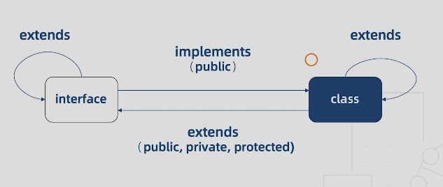

# 一、类型基础

> 强类型语言和弱类型语言

+ 强类型语言

  不允许改变变量的数据类型，除非进行强制类型转换

+ 弱类型语言

  变量可以被赋予不同的数据类型

> 静态类型语言和动态类型语言

+ 静态类型语言

  在编译阶段确定所有变量的类型

+ 动态类型语言

  在执行阶段确定所有变量的类型

## 1.1 基本类型

+ ES6 的数据类型
  1. Boolean
  2. Number
  3. String
  4. Array
  5. Function
  6. Object
  7. Symbol
  8. undefined
  9. null
+ TS 的数据类型
  1. 以上全部
  2. void
  3. any
  4. never
  5. 元组
  6. 枚举
  7. 高级类型

## 1.2 类型注解

+ 作用：相当于强类型语言中的类型声明

+ 语法：(变量/函数)：type

  ```ts
  // 原始类型
  let bool: boolean = true
  let num: number = 123
  let str: string = 'abc'
  // 多类型
  let str: string | number = 'abc'
  
  // 数组
  let arr1: number[] = [1, 2, 3]
  let arr2: Array<number> = [1, 2, 3]
  let arr2: Array<number | string> = [1, 2, 3] // 联合类型
  
  // 元组(特殊的数组，限定了数组元素的类型和个数)
  let tuple: [number, string] = [0, '1']
  
  // 函数
  let add = (x: number, y: string) => x + y
  let add = (x: number, y: string): number => x + y // 返回值类型
  // 1. 定义函数类型，但是没有具体的实现
  let compute = (x: number, y: number) => number
  // 2. 实现(实现时，形参可以与定义时不一样，并且不必指定类型了)
  compute = (a, b) => a + b
  
  // 对象
  let obj: object = {x:1, y: 2}
  obj.x = 3; // 这样的操作不允许，因为没有指定x的类型
  // 正确
  let obj: {x: number, y: number} = {x: 1, y: 2}
  obj.x = 3;
  
  // symbol
  let s1: symbol = Symbol()
  let s2 = Symbol()
  
  // undefined，null, 这两种类型是其它类型的子类型。可以赋值给其它类型
  // 要设置 strictNullChecks = false
  let un: undefined = undefined
  let nu: null = null
  
  // void
  let noReturn = () => {}
  
  // any 任意类型
  let x;
  x = 1;
  x = [];
  
  // never 永远不会有返回值的类型
  // 抛出错误
  let error = () => {
      throw new Error('error')
  }
  // 死循环
  let endless = () => {
      while(true) {}
  }
  ```

## 1.3 枚举类型

枚举：一组有名字的常量集合

反例：

```js
// 硬编码，用下面的枚举类型解决
function initByRole(role) {
    if (role === 1 || role === 2) {
        // do something
    } else if (role === 3 || role === 4) {
        // do something
    } else {role === 5} {
        // do..
    } else {
        // do...
    }
}
```


```tsx
// enum 声明枚举类型

// 数字枚举
enum Role {
    Reporter,
    // Reporter = 1, 设置默认值后，下面的会根据这个默认值递增
    Developer,
    Mainainer,
    Owner,
    Guest
}
console.log(Role.Reporter); // 0

// 字符串枚举
enum Message {
    Success = '恭喜你，成功了',
    Fail = '抱歉，失败了'
}

// 异构枚举
enum Answer {
    N,
    Y = 'yes'
}

// 枚举成员
enum Char {
    // 1. const常量枚举，常量枚举成员会在编译的时候计算出结果，以常量的形式出现在运行时环境
    a, // 1.1 没有初始值
    b = Char.a,	// 1.2. 对已有枚举成员的引用
    c = 1 + 3, // 1.3. 表达式
    // 2.computed 需要被计算的枚举成员，是一些非常量的表达式，值不会在编译阶段被计算，会保留到程序的执行阶段， 一定要有初始值
    d = Math.random(),
    e = '123'.length
}

// 常量枚举 const 声明 特性：在编译阶段被移除
const enum Month {
    Jan,
    Feb,
    Mar
}

// 枚举类型
enum E {a, b}
enum F {a = 0, b = 1}
enum G {a = 'apple', b = 'banana'}

let e: E = 3
let f: F = 3
// e === f 报错

let e1: E.a
let e2: E.b
// e1 === e2 报错
let e3: E.a
e1 === e3

let g1: G
let g2: G.a
```


# 二、接口

## 2.1 对象类型接口

```tsx
// 定义一个List接口，包含两个成员
interface List {
  id: number;
  name: string;
}
// 定义一个Result接口，成员是data，data的取值是List数组
interface Result {
  data: List[]
}

function render(result: Result) {
  result.data.forEach(value => {
    console.log(value.id, value.name)
  })
}
// --------1. 数据结构完全符合我们的定义
// let result = {
//   data: [
//     {id: 1, name: 'A'},
//     {id: 2, name: 'B'}
//   ]
// }

// render(result)

// --------2. 数据结构多了一个sex字段，此时也不会报错，满足了接口的必要条件
// let result = {
//   data: [
//     {id: 1, name: 'A', sex: 'male'},
//     {id: 2, name: 'B'}
//   ]
// }

// render(result)

// --------3. 2的例外，直接传入对象字面量，ts会对额外的字段进行检查，此时sex就会报错
render({
  data: [
    {id: 1, name: 'A', sex: 'male'},
    {id: 2, name: 'B'}
  ]
})
// 绕过类型检查
// 3.1. 将对象字面量赋值给变量，再传入render，例2
// 3.2. 使用类型断言, 明确告诉编译器对象的类型就是Result
render({
  data: [
    {id: 1, name: 'A', sex: 'male'},
    {id: 2, name: 'B'}
  ]
} as Result)
// 在React中会有歧义，不推荐
render(<Result>{
  data: [
    {id: 1, name: 'A', sex: 'male'},
    {id: 2, name: 'B'}
  ]
})
// 3.3 字符串索引签名
interface List {
  id: number;
  name: string;
  // 用任意的字符串去索引List 可以得到任意的结果，这样就支持多个属性
  [x: string]: any;
  // ? --> 可有可无的属性
  age?: number;
  // 只读属性
  readonly id: number;
}

// --------4. 不确定接口属性个数 使用可索引类型接口
// 4.1 数字索引接口
interface StringArray {
  // 用任意的数字去索引StringArray, 都会得到一个string，相当于声明了一个字符串类型的数组
  [index: number]: string
}
let chars: StringArray = ['A', 'B']
// 4.1 字符串索引接口
interface Names {
  // 用任意的字符串去索引Names，都会得到一个string
  [x: string]: string;
  // y: number; // 报错 number 和 string互斥
  [z: number]: string;
}
```

## 2.2 函数类型接口

```tsx
// 1. 用变量来定义函数类型
let add: (x:number, y:number) => number

// 2. 也可以用接口定义 等价于上面
interface Add {
  // 直接定义参数类型
  (x:number, y:number): number
}

// 3. 类型别名定义
type Add = (x:number, y:number) => number
// 实现具体函数
let add: Add = (a, b) => a + b

// 4. 混合类型接口
interface Lib {
  (): void;
  version: string;
  doSomething(): void;
}
let lib: Lib = (() => {}) as Lib;
lib.version = '1.0';
lib.doSomething = () => {};
// 想创建多个，用函数封装
function getLib() {
  let lib: Lib = (() => {}) as Lib;
  lib.version = '1.0';
  lib.doSomething = () => {};
  return lib
}
let lib1 = getLib();
lib1();
lib1.doSomething()
```


# 三、函数知识点

+ 函数定义

  ```js
  function add1(x:number, y:number) {
      return x + y
  }
  ```

+ 函数类型定义(未具体实现)

  ```js
  let add2: (x: number, y: number) => number
  
  type add3 = (x:number, y:number) => number
  
  interface add4 {
    (x:number, y:number): number
  }
  ```

+ ts 形参和实参必须一一对应

  ```tsx
  add1(1); //报错
  add1(1, 2);
  add1(1, 2, 3); //报错
  ```

+ 可选参数

  ```tsx
  // 可选参数必须位于必选参数之后
  function add5(x:number, y?:number) {
    return y ? x + y : x
  }
  ```

+ 为参数提供，默认值

  ```tsx
  function add6 (x:number, y=0, z:number, q=1) {
    return x + y + z + q
  }
  // 在必选参数前，默认参数是不可以省略的，明确传入undefined的才能取得默认值
  add6(1, undefined, 3)
  ```

+ 剩余参数

  ```ts
  function add7(x:number, ...rest: number[]) {
    return x + rest.reduce((pre, cur) => pre + cur)
  }
  ```

+ 函数重载

  ```ts
  function add8(...rest: number[]): number;
  function add8(...rest: string[]): string;
  function add8(...rest: any[]): any {
    let first = rest[0];
    if (typeof first === 'string') {
      return rest.join('')
    }
    if (typeof first === 'number') {
      return rest.reduce((pre, cur) => pre + cur)
    }
  }
  // 会查询重载列表,会依次匹配,容易匹配的写在前面
  console.log(add8(1, 2, 3))
  console.log(add8('a', 'b', 'c'))
  ```


# 四、类

## 4.1 类的修饰符

```ts
class Dog {
  constructor(name: string) {
    this.name = name
  }
  name: string
  // name?: string 可选
  // name: string = 'dog' 默认值
  run() {}
}
```

> 成员修饰符

+ 共有成员： `pbulic` 

  ```ts
  class Dog {
    constructor(name: string) {
      this.name = name
    }
    public name: string = 'dog'
    // 没写 默认 public
    name: string
    run() {}
  }
  ```

+ 私有成员：`private` 只能使用类去调用，不能使用实例去调用

  ```ts
  class Dog {
    constructor(name: string) {
      this.name = name
    }
    name: string
    run() {}
    private pri() {}
  }
  
  // 既不能被实例化 也不能被继承
  class Dog {
    private constructor(name: string) {
      this.name = name
    }
    name: string
    run() {}
  }
  
  class Dog {
    // 不能被实例化，只能被继承，相当于基类
    protected constructor(name: string) {
      this.name = name
    }
    name: string
    run() {}
    // 只能在类或者子类中访问,不能在类的实例中访问
    protected pro() {}
  }
  ```

+ 受保护成员

  ```ts
  class Dog {
    constructor(name: string) {
      this.name = name
    }
    name: string
    run() {}
    // 只能在类或者子类中访问,不能在类的实例中访问
    protected pro() {}
  }
  ```

+ 只读属性

  ```ts
  class Dog {
   constructor(name: string) {
      this.name = name
    }
    name: string
    run() {}
    readonly legs:number = 4
  }
  ```

+ 静态成员

  ```ts
  class Dog {
   constructor(name: string) {
      this.name = name
    }
    name: string
    run() {}
    // 只能通过类型调用
    static food: string = 'bones'
  }
  
  ```

  

## 4.2 抽象类和多态

```tsx
// 抽象类：abstract 声明
abstract class Animal {
  // 1. 在抽象类中定义一个具体方法，子类就不需要定义直接使用
  eat() {
    console.log('eat')
  }
  // 2. 定义一个抽象方法，子类可以有其他实现
  // 3. 抽象类可以实现多态：在父类中定义一个方法，在多个子类中对这个方法实现
  abstract sleep(): void
}
// 报错：抽象类无法被实例化，只能被继承
// let animal = new Animal();

class Dog extends Animal {
  constructor(name:string) {
    super()
    this.name = name
  }
  name: string
  run() {}
  // 2. 在子类中实现抽象方法
  sleep() {
    console.log('dog sleep')
  }
}
let dog = new Dog('wangwang');
// 1. 直接使用
dog.eat();

class Cat extends Animal {
  // 3. 多个子类都有实现这个方法
  sleep() {
    console.log('cat sleep')
  }
}
let cat = new Cat()
// 3. 每个实例都有不同的sleep
let animals: Animal[] = [dog, cat]
animals.forEach(i => i.sleep())
```

## 4.2 this 类型

方便链式调用

```ts
class WorkFlow {
  step1() {
    return this
  }
  step2() {
    return this
  }
}
// 实现链式调用
new WorkFlow().step1().step2()

class Myflow extends WorkFlow {
  next() {
    return this;
  }
}

new Myflow().next().step1().step2()
```


# 五、类和接口的关系

```ts
// 接口约束类成员有哪些属性和类型
// 接口只能约束类的共有成员(public)
interface Human {
  name: string;
  eat(): void;
}
// implements 关键字
// 类实现接口的时候必须声明接口中所有的属性
class Asian implements Human {
  constructor(name: string) {
    this.name = name
  }
  name: string
  eat() {}
  // 类可以多定义属性
  sleep() {}
}


// 接口的继承
// 一个接口可以继承多个接口
interface Man extends Human {
  run(): void
}
interface Child {
  cry(): void
}
interface Boy extends Man, Child {}
let boy: Boy = {
  name: '',
  run() {},
  eat() {},
  cry() {}
}


// 接口继承类
class Auto {
  state = 1
}
interface AutoInterface extends Auto {

}
class C implements AutoInterface {
  state = 1
}
class Bus extends Auto implements AutoInterface {}
```





# 六、泛型

定义：<font color=red> 不预先确定的数据类型 </font>，具体的类型再使用的时候才能确定

好处：

1. 函数和类可以轻松的支持多种类型，增强程序的扩展性
2. 不必写多条函数重载，冗长的联合类型声明
3. 灵活控制类型之间的约束

+ 泛型定义函数

  ```ts
  function log<T>(value: T): T {
    console.log(value)
    return value
  }
  // 两种调用方式
  log<string[]>(['a', 'b'])
  // 类型推断可省略类型
  log(['a', 'b'])
  ```

+ 泛型定义类型

  ```ts
  function log<T>(value: T): T {
    console.log(value)
    return value
  }
  
  type Log = <T>(value: T) => T
  // 泛型函数具体实现
  let myLog: Log = log
  ```

+ 泛型定义接口

  ```ts
  function log<T>(value: T): T {
    console.log(value)
    return value
  }
  // 1. 泛型仅仅约束函数
  interface Log {
    <T>(value: T): T
  }
  // 2. 泛型约束接口的所有成员
  interface Log<T> {
    (value: T): T
  }
  // 实现时必须制定类型
  let myLog: Log<number> = log
  myLog(1)
  // 默认类型
  interface Log<T = string> {
    (value: T): T
  }
  let myLog1: Log = log
  myLog1('1')
  ```

+ 泛型类

  ```ts
  class Log<T> {
    run(value: T) {
      console.log(value)
      return value
    }
  }
  // 实例化的时候显性的传入实例化的类型，实例的方法就会受到类型的约束
  let log1 = new Log<number>()
  log1.run(1)
  // 不指定类型参数的时候，value的值就可以是任意的值
  let log2 = new Log()
  log2.run({a: 1})
  ```

+ 泛型约束

  ```ts
  interface Length {
    length: number
  }
  
  function log<T extends Length>(value: T): T {
    // 打印value.length，没有length属性，所以声明一个接口，log继承他
    console.log(value, value.length)
    return value
  }
  // 传入的类型必须要有length属性
  log([1])
  log('123')
  log({length: 1})
  ```


# 七、类型检查机制

## 7.1 类型推断

不需要指定变量的类型(函数的返回值类型)，TypeScript 可以根据某些规则自动的为其推断出一个类型

+ 基础类型推断

  从右到左推断

  ```ts
  // let a: any
  let a
  // let b: number
  let b = 1
  // let c: any[]
  let c = []
  // let d: number[]
  let d = [1]
  // let e = (x?: number) => void
  let e = (x = 1) => {}
  // let f = (x?: number) => number
  let f = (x = 1) => x + 1
  ```

+ 最佳通用类型推断

  从右到左推断

  ```ts
  // let a: (number | null)[]
  let a = [1, null]
  ```

+ 上下文类型推断

  从左到右推断

  ```ts
  // 根据左边绑定的事件绑定来推断出右侧事件的类型
  // event被推断为 KeyboardEvent
  window.onkeydown = (event) => {
  
  }
  // 类型断言
  interface Foo {
    bar: number
  }
  // 这种方式检测不出没有bar属性
  let foo = {} as Foo
  let foo1: Foo = {
    bar: 1
  }
  ```

## 7.2 类型兼容性

定义：当一个类型 Y 可以被赋值给另一个类型 X 时，我们就可以说类型 X 兼容类型 Y

<font color=red> 源类型必须具备目标类型的全部属性 </font>

`X 兼容 Y : X（目标类型） = Y（源类型）`

口诀

1. 结构之间兼容：成员少的兼容成员多的
2. 函数之间的兼容：参数多的兼容参数少的

+ 接口兼容

  ```ts
  interface X {
    a: any;
    b: any;
  }
  
  interface Y {
    a: any;
    b: any;
    c: any;
  }
  
  let x: X = {
    a: 1, 
    b: 2
  }
  let y: Y = {
    a: 1,
    b: 2,
    c: 3
  }
  // 源类型必须具备目标类型的全部属性
  x = y
  y = x // 报错, 属性可多不可少
  ```

+ 函数兼容

  ```ts
  // 目标函数
  type Handler = (a: number, b: number) => void
  function hof(handler: Handler) {
    return handler
  }
  
  // 1. 参数个数 目标函数的参数个数一定要多于源函数的参数个数
  let handler1 = (a: number) => {} // 源函数
  hof(handler1)
  let handler2 = (a:number, b: number, c: number) => {}
  // hof(handler2) // 报错 源函数的参数个数多于目标函数
  
  // 可选参数和剩余参数
  let a = (p1: number, p2: number) => {}
  let b = (p1: number, p2?: number) => {}
  let c = (...args: number[]) => {}
  a = b
  a = c
  // b = c // 报错 strictFunctionTypes=false
  // b = a // 报错 strictFunctionTypes=false
  c = a
  c = b
  
  // 2. 参数类型必须要匹配
  // 基础类型
  let handler3 = (a: string) => {}
  // hof(handler3) // 报错
  
  // 对象类型
  interface Point3D {
    x: number;
    y: number;
    z: number;
  }
  interface Point2D {
    x: number;
    y: number;
  }
  
  let p3d = (point: Point3D) => {}
  let p2d = (point: Point2D) => {}
  p3d = p2d
  // p2d = p3d // 报错 strictFunctionTypes=false
  
  
  // 3. 返回值类型
  let f = () => ({name: 'Alice'})
  let g = () => ({name: 'Alice', location: 'Beijing'})
  f = g
  // g = f // 报错
  // 函数重载
  function overload(a: number, b: number): number
  function overload(a: string, b: string): string
  function overload(a: any, b: any): any
  
  
  // 枚举类型
  enum Fruit {Apple, Banana}
  enum Color {Red, Yellow}
  let fruit: Fruit.Apple = 3
  let no: number = Fruit.Apple
  // let color: Color.Red = Fruit.Apple // 报错
  
  // 类兼容性
  class A {
    constructor(p: number, q: number) {}
    id: number = 1
  }
  class B {
    static s = 1
    constructor(p: number) {}
    id: number = 2
  }
  let aa = new A(1, 2)
  let bb = new B(1)
  aa = bb
  bb = aa
  
  // 泛型兼容
  interface Empty<T> {
    value: T  // 加了成员就不兼容了
  } 
  let obj1: Empty<number> = {}
  let obj2: Empty<string> = {}
  obj1 = obj2
  obj2 = obj1
  
  // 泛型函数
  let log1 = <T>(x: T): T => {
    console.log('x')
    return x
  }
  let log2 = <U>(y: U): U => {
    console.log('y')
    return y
  }
  log1 = log2
  ```

  

  


## 7.3 类型保护


# 15丨类型检查机制（1）：类型推断.mp4 

# 16丨类型检查机制（2）：类型兼容性.mp4 

# 17丨类型检查机制（3）：类型保护.mp4 

# 18丨高级类型（1）：交叉类型与联合类型.mp4 

# 19丨高级类型（2）：索引类型.mp4 

# 20丨高级类型（3）：映射类型.mp4 

# 21丨高级类型（4）：条件类型.mp4 

# 22丨ES6与CommonJS的模块系统.mp4 

# 23丨使用命名空间.mp4 

# 24丨理解声明合并.mp4 

# 25丨如何编写声明文件.mp4 

# 26丨配置tsconfig.mp4 

# 27丨配置tsconfig.mp4 

# 28丨配置tsconfig.mp4 

# 29丨编译工具：从ts-loader到Bable.mp4 

# 30丨代码检查工具：从TSLint到ESLint.mp4 

# 31丨使用Jest进行单元测试.mp4 

# 32丨创建项目.mp4 

# 33丨组件与类型（1）：函数组件与类组件.mp4 

# 34丨组件与类型（2）：高阶组件与Hooks.mp4 

# 35丨事件处理与数据请求.mp4 

# 36丨列表渲染与路由.mp4 

# 37丨Redux与类型.mp4 

# 38丨服务端环境搭建.mp4 

# 39丨列表的CRUD.mp4 

# 40丨导出Excel.mp4 

# 41丨搭建Vue开发环境.mp4 

# 42丨组件封装.mp4 

# 43丨组件发布.mp4 

# 44丨共存策略.avi 

# 45丨宽松策略.mp4 

# 46丨严格策略.mp4 

# 47丨结束语.mp4 